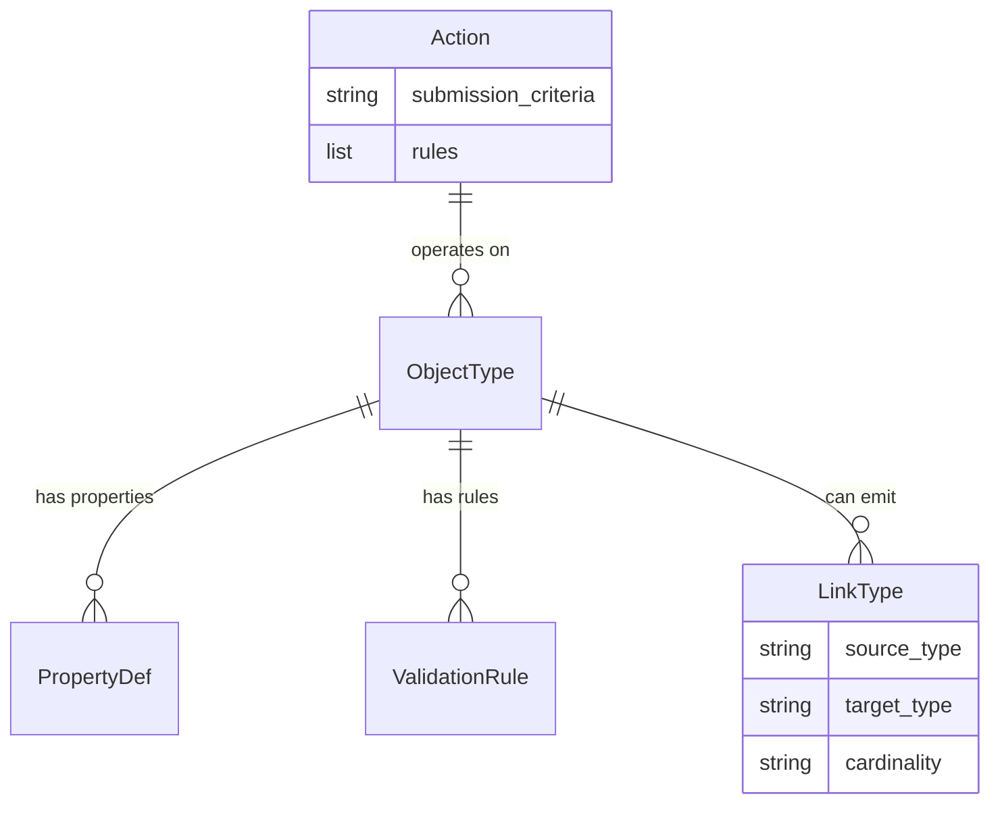

# MMS Ontology 定义 (docs/memory/ontology)

## 1. 模块定位
`docs/memory/ontology` 是 MMS 系统的**本体声明式 Schema 库 (Declarative Ontology Schema)**。它以 YAML 格式存储了系统所理解的所有概念、关系和规则，是 MMS 系统的静态蓝图。

## 2. 核心文件与目录结构

### `memory_schema.yaml`
定义了记忆节点（Markdown 文件）的 Front-matter 规范。
*   **核心约束**：规定了 `id` 的正则模式、`layer` 的枚举值（如 `L1_platform`, `L3_domain`）、以及 `cites_files` 等图关系字段的类型。

### `objects/`
存放 ObjectType 的定义。例如 `APIEndpoint.yaml`, `DatabaseTable.yaml`。
*   **内容**：定义了该对象的 `properties`（属性）、`related_link_types`（允许发出的边）以及 `validation_rules`（Python 表达式校验规则）。

### `links/`
存放 LinkType 的定义。例如 `implements.yaml`, `depends_on.yaml`。
*   **内容**：定义了边的 `source_type` 和 `target_type` 约束，以及边的基数（如 1:N）。

### `actions/`
存放允许对本体执行的变更动作定义。
*   **内容**：定义了动作的入参、`submission_criteria`（前置校验）以及 `rules`（执行的副作用，如创建节点）。

## 3. 数据结构关系图 (ER Diagram)

## 4. 与 `src/mms/ontology` 的区别

| 特性 | `docs/memory/ontology` | `src/mms/ontology` |
| :--- | :--- | :--- |
| **性质** | 数据 / 配置文件 (Data / Config) | 代码 / 执行引擎 (Code / Engine) |
| **语言** | YAML | Python |
| **角色** | **Schema 定义者**：描述了“世界是什么样的”。 | **Schema 解析器**：读取 YAML，提供查询 API。 |
| **修改频率** | 较高（新增业务概念时修改） | 极低（仅在底层解析逻辑变更时修改） |
| **类比** | 数据库的 DDL 脚本 | 数据库的查询引擎 (Query Parser) |

**总结**：`docs/memory/ontology` 是静态的蓝图，而 `src/mms/ontology` 是负责阅读和解释这张蓝图的机器。
