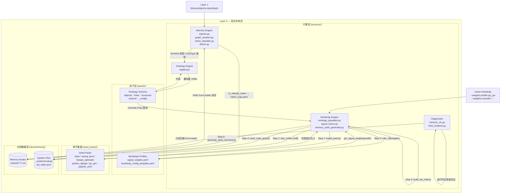
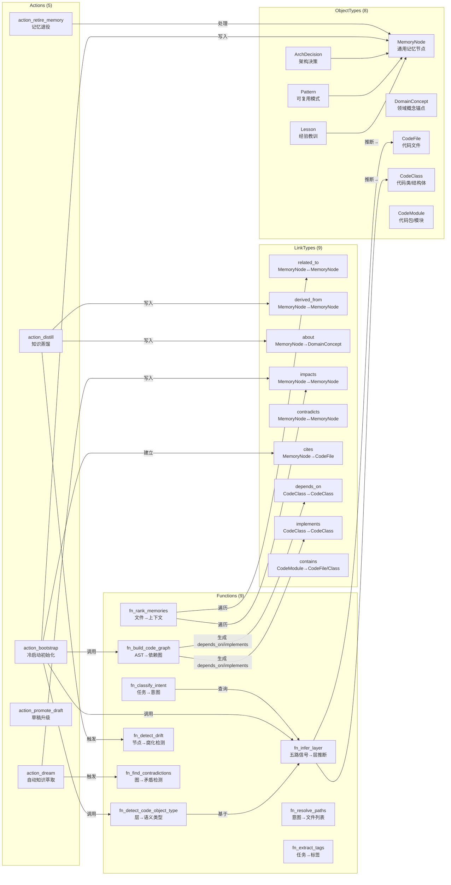
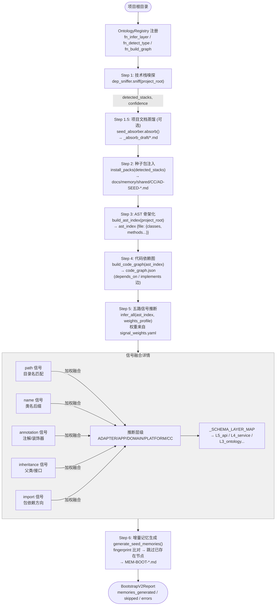

# Layer 2: 知识本体层 (Knowledge Ontology Layer)

> **最后更新**：2026-05-05 | commit `59cacde`

---

## 1. 架构定位

Layer 2 是 MMS 系统的"大脑皮层"，负责将散落的代码、文档和架构约束转化为机器可读、可计算的**有向知识图谱 (Knowledge Graph)**。它为 Layer 1（任务工程层）提供精准的上下文注入，并为其他分析和诊断层提供决策依据。

Layer 2 自身由四个子系统构成：


| 子系统                  | 目录                     | 职责                            |
| -------------------- | ---------------------- | ----------------------------- |
| **Memory Engine**    | `src/mms/memory/`      | 图谱操作 / 上下文注入 / 知识萃取 / 腐化检测    |
| **Ontology Engine**  | `src/mms/ontology/`    | Schema 解析 / 运行时校验 / 注册表       |
| **Bootstrap Engine** | `src/mms/bootstrap/`   | 冷启动 / AST 推断 / 种子包注入 / 初始记忆生成 |
| **Diagnostics**      | `src/mms/diagnostics/` | 图谱可视化诊断（HTML 自包含页面）           |


---

## 2. Layer 2 完整组件拓扑




---

## 3. 记忆分层体系

### 3.1 双层级分类架构

记忆分层采用**粗粒度组（9 组）+ 细粒度层（17 个）**的双层结构，存储在 `docs/memory/_system/routing/layers.yaml` v4.0。

```
层分类架构
├── L5_interface   (接口/适配层)   ── L5_frontend, L5_api
├── L4_application (应用服务层)   ── L4_service, L4_worker
├── L3_domain      (领域层)       ── L3_ontology, L3_data_pipeline
├── L2_infrastructure (基础设施层) ── L2_database, L2_messaging, L2_cache, L2_storage
├── L1_platform    (平台层)       ── L1_security
├── CC             (横切关注点)   ── CC_architecture, CC_testing, CC_governance
├── BIZ            (跨层业务流)   ── BIZ
├── Ops            (运维部署层)   ── Ops
└── Tooling_mms    (MMS工具层)    ── Tooling_mms
```

### 3.2 细粒度层与业务含义


| 细粒度层 ID            | 所属组               | 业务含义                                            |
| ------------------ | ----------------- | ----------------------------------------------- |
| `L5_frontend`      | L5_interface      | React 18 页面、路由、Zustand、Axios                    |
| `L5_api`           | L5_interface      | FastAPI Router、Request/Response Schema、API 版本控制 |
| `L4_service`       | L4_application    | Control/Query Service、CQRS 应用服务                 |
| `L4_worker`        | L4_application    | APScheduler、Ingestion/Indexing Worker           |
| `L3_ontology`      | L3_domain         | ObjectTypeDef/LinkTypeDef、本体场景、领域模型             |
| `L3_data_pipeline` | L3_domain         | Connector、SyncJob、DataCatalog、列映射               |
| `L2_database`      | L2_infrastructure | MySQL、SQLModel、Alembic 迁移                       |
| `L2_messaging`     | L2_infrastructure | Kafka、Avro、Schema Registry                      |
| `L2_cache`         | L2_infrastructure | Redis、`@cached`、分布式锁                            |
| `L2_storage`       | L2_infrastructure | MinIO/S3、Iceberg、流式 IO                          |
| `L1_security`      | L1_platform       | RBAC、SecurityContext、Audit、JWT                  |
| `CC_architecture`  | CC                | ADR、可追踪性、架构地图                                   |
| `CC_testing`       | CC                | Pytest / Vitest / MSW（横切测试）                     |
| `CC_governance`    | CC                | Quota、CR 变更审批、ACL                               |
| `BIZ`              | BIZ               | 端到端业务流程文档                                       |
| `Tooling_mms`      | Tooling_mms       | MMS 脚本 / DAG / dream 等元工具                       |
| `Ops`              | Ops               | K8s / Docker / 部署 / 迁移                          |


### 3.3 层分类在系统各组件中的对应关系

```
         用户意图任务
              │
     intent_classifier.py
     (fn_classify_intent)
              │ 输出 (layer, operation)
              ▼
     docs/memory/_system/routing/
     ├── layers.yaml      ← 细粒度层 ID（L5_api / L4_service...）
     ├── intent_map.yaml  ← layer × operation 路由规则
     └── operations.yaml  ← 15 种操作类型

              ▲
              │ 写入 layer 字段（细粒度 ID）
     signal_fusion.py
     (infer_layer → DDD五元组)
              │ 经 _SCHEMA_LAYER_MAP 映射
              ▼
     ADAPTER → L5_api
     APP     → L4_service
     DOMAIN  → L3_ontology
     PLATFORM→ L2_infrastructure
     CC      → CC_architecture

              │ 存储在 front-matter
     docs/memory/shared/{DDD_DIR}/MEM-BOOT-*.md
     (目录名仍用 ADAPTER/APP/DOMAIN，layer字段用细粒度ID)
```

---

## 4. 本体 Schema 拓扑

### 4.1 本体 Schema 完整关系图




### 4.2 ObjectTypes 字段清单


| ObjectType        | 关键字段                                                                                                                                                                                                                                                                                                                            | 继承         |
| ----------------- | ------------------------------------------------------------------------------------------------------------------------------------------------------------------------------------------------------------------------------------------------------------------------------------------------------------------------------- | ---------- |
| **MemoryNode**    | `id`, `type`(lesson/pattern/decision/anti-pattern/business-flow), `tier`(hot/warm/cold/archive), `layer`(细粒度ID), `tags`, `cites_files`, `about_concepts`, `impacts`, `contradicts`, `derived_from`, `related_to`, `ast_pointer`(file_path/class_name/fingerprint), `provenance`, `module`, `source_ep`, `created_at`, `version` | —          |
| **Lesson**        | `root_cause`, `trigger_ep`, `feedback_rounds`                                                                                                                                                                                                                                                                                   | MemoryNode |
| **Pattern**       | `pattern_category`, `applicability`, `code_example`, `anti_pattern_risk`                                                                                                                                                                                                                                                        | MemoryNode |
| **ArchDecision**  | `decision_context`, `rationale`, `decision_status`, `alternatives_considered`, `superseded_by`                                                                                                                                                                                                                                  | MemoryNode |
| **DomainConcept** | `id`, `label`, `layer_source`, `keywords`, `aliases`, `is_auto_generated`                                                                                                                                                                                                                                                       | —          |
| **CodeFile**      | `file_path`, `lang`, `package`, `fingerprint`, `inferred_layer`, `layer_confidence`, `drift_suspected`                                                                                                                                                                                                                          | —          |
| **CodeClass**     | `class_fqn`, `name`, `bases`, `annotations`, `methods`, `fingerprint`, `inferred_layer`, `inferred_object_type`, `signal_breakdown`, `linked_memory_id`                                                                                                                                                                         | —          |
| **CodeModule**    | `module_path`, `package_name`, `lang`, `file_count`, `class_count`, `inferred_layer`, `dominant_object_type`                                                                                                                                                                                                                    | —          |


### 4.3 LinkTypes 清单


| LinkType       | source_type → target_type   | cardinality | 存储字段                         | 自动填充触发                 |
| -------------- | --------------------------- | ----------- | ---------------------------- | ---------------------- |
| `related_to`   | MemoryNode ↔ MemoryNode     | M:N         | `related_to: [{id, reason}]` | 人工/dream               |
| `derived_from` | MemoryNode → MemoryNode     | N:M         | `derived_from: [id]`         | action_distill         |
| `about`        | MemoryNode → DomainConcept  | M:N         | `about_concepts: [label]`    | action_distill         |
| `impacts`      | MemoryNode → MemoryNode     | M:N         | `impacts: [id]`              | 可选自动（tags 重叠）          |
| `contradicts`  | MemoryNode ↔ MemoryNode     | M:N         | `contradicts: [id]`          | fn_find_contradictions |
| `cites`        | MemoryNode → CodeFile       | M:N         | `cites_files: [path]`        | action_bootstrap       |
| `depends_on`   | CodeClass → CodeClass       | M:N         | 代码图 JSON                     | fn_build_code_graph    |
| `implements`   | CodeClass → CodeClass       | M:N         | 代码图 JSON                     | fn_build_code_graph    |
| `contains`     | CodeModule → CodeFile/Class | 1:N         | 代码图 JSON                     | fn_build_code_graph    |


### 4.4 Functions 清单


| Function                     | 实现路径                                                  | 核心输入 → 输出                                                          |
| ---------------------------- | ----------------------------------------------------- | ------------------------------------------------------------------ |
| `fn_infer_layer`             | `mms.bootstrap.signal_fusion.infer_layer`             | CodeClass + weights → LayerInference(layer, confidence, breakdown) |
| `fn_detect_code_object_type` | `mms.bootstrap.signal_fusion.detect_code_object_type` | CodeClass + LayerInference → ObjectTypeMapping                     |
| `fn_build_code_graph`        | `mms.bootstrap.code_graph_builder`                    | ast_index + project_root → CodeGraph                               |
| `fn_classify_intent`         | `mms.memory.intent_classifier`                        | task_str → IntentResult(layer, operation, confidence)              |
| `fn_resolve_paths`           | `mms.memory.memory_functions`                         | IntentResult → [file_paths]                                        |
| `fn_rank_memories`           | `mms.memory.memory_functions`                         | files + seed_mems + task → context_str                             |
| `fn_extract_tags`            | `mms.memory.memory_functions`                         | task_description → [tags]                                          |
| `fn_detect_drift`            | `mms.memory.freshness_checker`                        | MemoryNode + ast_index → drift_suspected                           |
| `fn_find_contradictions`     | `mms.memory.graph_health`                             | memory_id + graph → contradiction_pairs                            |


### 4.5 Actions 清单


| Action                 | 触发方式                                              | 副作用                                           |
| ---------------------- | ------------------------------------------------- | --------------------------------------------- |
| `action_bootstrap`     | `mulan bootstrap` CLI / `bootstrap_project()` API | 写入 MEM-BOOT-*.md；更新 code_graph.json           |
| `action_distill`       | postcheck PASS 后异步执行                              | 写入 derived_from / about_concepts；生成 Lesson 节点 |
| `action_dream`         | distill 完成后或手动触发                                  | 发现矛盾；推断 impacts；写入新 Pattern 节点                |
| `action_promote_draft` | 人工 `mulan promote`                                | 移动 private/→shared/；更新 tier                   |
| `action_retire_memory` | GC 扫描 / 矛盾解决 / 人工                                 | 软删除（归档至 archive 目录）                           |


> **Rules 目录**：`assets/ontology_schema/rules/` 已创建，包含 `rule_bootstrap_pipeline.yaml`（Bootstrap 9 条执行规则）和 `rule_memory_quality.yaml`（7 条记忆质量治理规则），已从 Action 的内联 `rules:` 字段中提取独立。

---

## 5. 信号权重系统拓扑

### 5.1 五路信号与权重配置体系

```
用户项目代码
      │
      ├─── path 信号（目录名关键词）  ──┐
      ├─── name 信号（类名后缀/前缀）  ──┤
      ├─── annotation 信号（注解/装饰器）┤
      ├─── inheritance 信号（父类/接口）┤  加权融合
      └─── import 信号（导入包关键词） ──┘
                                          │
                  ┌───────────────────────┘
                  │ 权重来源（优先级从高到低）
                  ▼
      ┌─────────────────────────────────┐
      │ .mms/bootstrap_config.yaml      │  项目级配置（最高优先）
      │   signal_weights_profile: go_gin│
      │   signal_weights:               │
      │     annotation: 0.45            │
      └────────────┬────────────────────┘
                   │
                   ▼
      ┌─────────────────────────────────┐
      │ assets/bootstrap_profiles/      │  全局模板库
      │ signal_weights.yaml             │
      │   base / java_spring_boot /     │
      │   python_fastapi / go_gin ...   │
      └────────────┬────────────────────┘
                   │ get_signal_weights(profile, overrides)
                   ▼ ← 纯函数，无全局状态
      ┌─────────────────────────────────┐
      │ mms.bootstrap.signal_fusion     │
      │   infer_layer(weights=...)      │  权重以参数注入
      │   infer_all(weights_profile=...)│  无副作用
      └─────────────────────────────────┘
```

### 5.2 七个权重模板对比


| Profile              | path     | name     | annotation | inheritance | import | 适用场景                                  |
| -------------------- | -------- | -------- | ---------- | ----------- | ------ | ------------------------------------- |
| `base`               | 0.25     | 0.25     | **0.30**   | 0.10        | 0.10   | 通用基准，无框架偏好                            |
| `java_spring_boot`   | 0.20     | 0.20     | **0.45**   | 0.10        | 0.05   | 注解即声明（@RestController 确定层级）           |
| `python_fastapi`     | **0.40** | 0.25     | 0.15       | 0.12        | 0.08   | 目录结构规范，BaseModel 歧义需路径打破              |
| `python_django`      | 0.25     | **0.35** | 0.25       | 0.12        | 0.03   | ViewSet/Serializer 后缀强信号              |
| `go_gin`             | **0.45** | 0.25     | 0.03       | 0.12        | 0.15   | Go 无注解；包路径 + import 是主要信号             |
| `go_ddd`             | **0.55** | 0.20     | 0.02       | 0.13        | 0.10   | 严格 DDD 目录布局（interface/usecase/domain） |
| `clean_architecture` | **0.50** | 0.25     | 0.10       | 0.10        | 0.05   | 语言无关 Clean Arch / 六边形架构               |


### 5.3 DDD 内部术语 → 细粒度层 ID 映射

> 推断引擎内部使用 DDD 五元组（避免与业务层 ID 混淆），最终写入 MemoryNode 时转换为细粒度 ID。

```
signal_fusion 推断 (DDD)    _SCHEMA_LAYER_MAP    MemoryNode.layer (细粒度)
────────────────────────────────────────────────────────────────────────
ADAPTER                  →→→→→→→→→→→→→→→→→    L5_api
APP                      →→→→→→→→→→→→→→→→→    L4_service
DOMAIN                   →→→→→→→→→→→→→→→→→    L3_ontology
PLATFORM                 →→→→→→→→→→→→→→→→→    L2_infrastructure
CC                       →→→→→→→→→→→→→→→→→    CC_architecture
UNKNOWN (fallback)       →→→→→→→→→→→→→→→→→    CC_architecture

目录落地仍使用 DDD 名（保持向后兼容）：
docs/memory/shared/
├── ADAPTER/   (存 layer=L5_api 的节点)
├── APP/       (存 layer=L4_service 的节点)
├── DOMAIN/    (存 layer=L3_ontology 的节点)
├── PLATFORM/  (存 layer=L2_infrastructure 的节点)
└── CC/        (存 layer=CC_architecture 的节点)
```

---

## 6. 意图识别分类体系

### 6.1 意图识别架构

```
用户任务字符串 (task)
        │
        ▼
  ┌─────────────────────────────────────────┐
  │     阶段 0：本地关键词规则匹配            │
  │     fn_classify_intent (local)           │
  │                                          │
  │  intent_map.yaml (v4.0)                  │
  │  ├── defaults: {min_hit_ratio,           │
  │  │              min_hits,                │
  │  │              confidence_threshold}    │
  │  └── rules[]:                            │
  │       ├── id / priority                  │
  │       ├── layer (细粒度ID)               │
  │       ├── operation (15种)               │
  │       ├── keywords []                    │
  │       ├── min_hit_ratio / min_hits       │
  │       └── confidence_boost               │
  │                                          │
  │  评分算法：                               │
  │    hit_ratio = hits / len(keywords)      │
  │    base = min(hit_ratio * 2.0, 0.9)     │
  │    scale_bonus = min(hits/(min_hits+2),1)│
  │    score = base + scale_bonus + boost    │
  └──────────────┬──────────────────────────┘
                 │ confidence < threshold?
                 ▼
  ┌─────────────────────────────────────────┐
  │     阶段 1：LLM 兜底（可选）             │
  │     qwen/claude mini prompt              │
  │     输出：{layer, operation}             │
  │     不输出：路径/文件名                   │
  └──────────────────────────────────────────┘
                 │
                 ▼
       IntentResult {
         layer: 细粒度层ID,
         operation: 操作类型,
         confidence: float,
         entry_files_hint: []
       }
```

### 6.2 意图分类维度：layer × operation

```
                    操作类型 (operation，15 种)
                    ──────────────────────────────────────────────────────────
                    create modify_config modify_logic debug delete deploy
                    test review view_trace mms_synthesize mms_dag mms_distill
                    knowledge_query analyze refactor
层
│
├── L5_interface
│   ├── L5_frontend      → create / modify_logic / test / view_trace
│   └── L5_api           → create / modify_logic / debug / review
│
├── L4_application
│   ├── L4_service       → create / modify_logic / analyze / refactor
│   └── L4_worker        → create / modify_config / debug
│
├── L3_domain
│   ├── L3_ontology      → create / knowledge_query / analyze / review
│   └── L3_data_pipeline → create / modify_config / debug
│
├── L2_infrastructure
│   ├── L2_database      → create / modify_config / deploy / analyze
│   ├── L2_messaging     → create / modify_config / debug
│   ├── L2_cache         → modify_config / analyze
│   └── L2_storage       → create / modify_config
│
├── L1_platform
│   └── L1_security      → modify_config / review / analyze
│
└── CC
    ├── CC_architecture  → knowledge_query / analyze / review
    ├── CC_testing       → create / test / analyze
    └── CC_governance    → modify_config / review
```

---

## 7. Bootstrap 业务流程

### 7.1 完整业务流程图




### 7.2 增量 Bootstrap 逻辑

```
第 N 次 bootstrap 时：

1. 扫描 shared/**/MEM-BOOT-*.md，提取 {class_name: fingerprint}
2. 对每个 AST 扫描到的 class：
   a. 计算当前 fingerprint：SHA-256(sorted(method_name:signature))
   b. 若 class_name 在已有记录 且 fingerprint 相同 → SKIP（幂等）
   c. 否则 → 写入/覆盖 MEM-BOOT-*.md（新增或更新）

覆盖场景：
  ✅ 代码未变 → fingerprint 不变 → SKIP（幂等）
  ✅ 方法签名变更 → fingerprint 变 → 重新生成
  ✅ 新增类 → 不在已有记录 → 新建节点
  ✅ 新增方法 → fingerprint 变 → 重新生成
  ⚠️ 类被删除 → 旧节点孤立（当前不自动清理）
```

---

## 8. 整体数据流图

```mermaid
flowchart LR
    CODE[物理代码库] -->|AST 解析| BOOT(Bootstrap Engine<br/>signal_fusion + fingerprint)
    WPFL[(signal_weights.yaml<br/>7种权重模板)] -->|get_signal_weights| BOOT
    SP[(Seed Packs<br/>base/spring_boot/fastapi...)] -->|先验知识| BOOT
    BOOT -->|"MEM-BOOT-*.md<br/>layer=L5_api/L4_service..."| GRAPH

    SCHEMA[(Ontology Schema<br/>objects/links/functions/actions)] -->|懒加载| ONTO(Ontology Engine<br/>registry.py)

    TASK[Layer 1 任务] -->|inject(task)| MEM(Memory Engine<br/>intent_classifier → injector)
    MEM -->|fn_classify_intent| IMAP[(intent_map.yaml<br/>layer × operation)]
    MEM <-->|front-matter 读写| GRAPH[(Memory Graph<br/>docs/memory/shared/*.md)]
    MEM -->|Schema 校验| ONTO
    MEM -->|Prompt Context| TASK

    LOG[EP 执行日志] -->|异步| DREAM(Dream Engine<br/>dream.py)
    DREAM -->|derived_from / about | GRAPH
    DREAM -->|矛盾检测| GRAPH

    DIAG[Diagnostics CLI<br/>visualize_memory.py] -->|只读扫描| GRAPH
    DIAG -->|"隐式边推断<br/>cites_same_file"| HTML[记忆图谱 HTML<br/>3 Tab 可视化]
```


---

## 9. 组件解耦与通信协议

### 9.1 依赖方向（严格单向）

```
Layer 1 (任务工程层)
    │  Python API: MemoryInjector.inject(task: str)
    ▼
Memory Engine          Diagnostics (只读)
    │  ← Schema 校验       │
    ▼                      ▼
Ontology Engine    Memory Graph (docs/memory/shared/)
    │  ← YAML 懒加载       ▲
    ▼                      │ 写入 MEM-BOOT-*.md
Ontology Schema    Bootstrap Engine
(assets/)              │  ← 权重注入
                        ▼
                  signal_weights.yaml
                  + .mms/bootstrap_config.yaml
                  + CLI --weights-profile
```

### 9.2 通信协议汇总


| 协议                    | 载体                              | 方向                 | 说明                   |
| --------------------- | ------------------------------- | ------------------ | -------------------- |
| **YAML Front-matter** | `docs/memory/shared/*.md`       | Bootstrap → Memory | 写入/读取的核心数据格式，v4.0 规范 |
| **YAML Schema**       | `assets/ontology_schema/*.yaml` | 资产 → 引擎            | 声明式"世界观"，引擎懒加载解析     |
| **Python API**        | `MemoryInjector.inject(task)`   | Layer 1 → Layer 2  | 唯一跨层调用接口，内部黑盒        |
| **权重参数注入**            | `infer_layer(weights=dict)`     | 配置 → 推断            | 纯函数无全局状态，显式依赖注入      |
| **HTML 输出**           | `memory_viz.html`               | Diagnostics → 人类   | 单向输出，自包含，无需服务        |
| **JSON 缓存**           | `_system/code_graph.json`       | Bootstrap → 系统     | 代码依赖图快照，供后续分析复用      |


---

## 10. 目录结构

```text
src/mms/
├── memory/                 # 引擎：图谱操作与上下文注入（16 个模块）
│   ├── injector.py         # 主入口：MemoryInjector.inject()
│   ├── graph_resolver.py   # 图遍历（MemoryNode 加载与 _normalize_layer）
│   ├── intent_classifier.py # fn_classify_intent（两阶段：规则+LLM）
│   ├── dream.py            # 知识萃取（EP 执行后异步蒸馏）
│   ├── freshness_checker.py # fn_detect_drift（sha256 fingerprint 比对）
│   ├── graph_health.py     # fn_find_contradictions
│   ├── task_matcher.py     # 历史任务匹配
│   └── ...
├── ontology/               # 引擎：Schema 解析与内存注册表
│   └── registry.py         # ObjectTypeRegistry / FunctionRegistry / ActionRegistry
├── bootstrap/              # 引擎：冷启动与架构推断
│   ├── ontology_populator.py # action_bootstrap 完整实现（Step 1~6）
│   ├── signal_fusion.py    # infer_layer / infer_all（纯函数，无全局状态）
│   ├── memory_seed_generator.py # _render_memory_md + _compute_fingerprint
│   └── code_graph_builder.py # fn_build_code_graph
└── diagnostics/            # 诊断：记忆图谱可视化
    ├── memory_viz.py       # MemoryVizCollector（显式边+隐式同文件边）
    └── html_renderer.py    # 3 Tab HTML 渲染器

assets/
├── ontology_schema/        # 声明式本体定义（YAML）
│   ├── memory_schema.yaml  # 记忆节点 front-matter 规范 v4.0
│   ├── objects/            # 8 种 ObjectType
│   ├── links/              # 9 种 LinkType（含 related_to）
│   ├── functions/          # 9 种 Function（实现路径已修正）
│   ├── actions/            # 5 种 Action
│   └── _config/            # 图遍历路径配置
└── bootstrap_profiles/     # 信号权重模板库
    ├── signal_weights.yaml              # 7 种权重 Profile
    └── bootstrap_config_template.yaml   # 用户项目配置模板

docs/memory/                # 实例数据（当前项目）
├── shared/                 # 记忆节点（按层目录）
│   ├── ADAPTER/            # layer=L5_api 的节点
│   ├── APP/                # layer=L4_service 的节点
│   ├── DOMAIN/             # layer=L3_ontology 的节点
│   ├── PLATFORM/           # layer=L2_infrastructure 的节点
│   └── CC/                 # layer=CC_architecture 的节点
├── private/                # EP 私有草稿
└── _system/                # 系统运行时文件
    ├── routing/            # layers.yaml / intent_map.yaml / operations.yaml
    ├── ep_run/             # EP 执行记录
    └── code_graph.json     # 代码依赖图快照

seed_packs/                 # 框架种子包（YAML 驱动）
├── base/                   # 通用约束（always_inject=true）
├── spring_boot/            # 13 条 ast_overrides
├── fastapi_sqlmodel/       # 9 条 ast_overrides
├── python_django/          # 13 条 ast_overrides
├── go_gin/                 # Go Gin 约束
├── palantir_arch/          # Palantir 架构模式
└── react_zustand/          # 前端模式

scripts/
└── visualize_memory.py     # 记忆图谱可视化 CLI 入口
```

---

## 11. 记忆图谱可视化诊断

### 11.1 数据结构与边类型

```
NodeData {
    id, label, layer, tier, node_type, tags,
    file_path,          ← .md 文件路径
    ast_file,           ← 源码文件路径（用于隐式边推断）
    ast_class,          ← 源码类名
    ast_drift,          ← 腐化状态
    layer_confidence,   ← 推断置信度
    about_concepts      ← 语义概念标签
}

EdgeData {
    source, target, relation, label
}
边类型（relation）：
  ● related_to     灰色实线  显式语义关联（front-matter related_to 字段）
  ● impacts        红色实线  变更传播（front-matter impacts 字段）
  ● derived_from   绿色实线  知识来源（front-matter derived_from 字段）
  ● cites          蓝色实线  代码引用（front-matter cites_files 字段）
  ┄ cites_same_file 浅蓝虚线  同文件隐式共现（运行时推断，无 schema 约束）
```

> **注**：Bootstrap 新生成项目的 `related_to` / `impacts` 默认为空，这是**预期行为**——语义关联需人工/LLM 辅助填充（action_distill / action_dream）。`cites_same_file` 边由 Diagnostics 在运行时推断，展示同一源文件的多个记忆节点之间的共现关系。

### 11.2 使用方式

```bash
# 快速生成并打开（扫描当前项目 docs/memory/）
python3 scripts/visualize_memory.py --open

# 指定目标项目
python3 scripts/visualize_memory.py \
  --memory-root tests/fixtures/go-gin-demo/docs/memory \
  --output /tmp/viz_go.html --project "Go Gin Demo" --open

# 生成最新快照（三个示例项目）
python3 scripts/visualize_memory.py --memory-root tests/fixtures/python-fastapi-demo/docs/memory --output /tmp/viz_python.html --open
python3 scripts/visualize_memory.py --memory-root tests/fixtures/spring-boot-demo/docs/memory --output /tmp/viz_java.html --open
python3 scripts/visualize_memory.py --memory-root tests/fixtures/go-gin-demo/docs/memory --output /tmp/viz_go.html --open
```

---

## 12. 质量状态

### 12.1 测试覆盖率（2026-05-05，commit `59cacde`）

**测试用例总数：1584 个，全部通过（3 skipped, 2 xfailed）。**


| 引擎               | 关键文件                       | 覆盖率      |
| ---------------- | -------------------------- | -------- |
| Bootstrap Engine | `signal_fusion.py`         | 92%      |
|                  | `memory_seed_generator.py` | 99%      |
|                  | `ontology_populator.py`    | 86%      |
|                  | `code_graph_builder.py`    | 95%      |
| Ontology Engine  | `registry.py`              | 83%      |
| Memory Engine    | `memory_functions.py`      | 99%      |
|                  | `graph_resolver.py`        | 72%      |
|                  | `intent_classifier.py`     | 61%      |
|                  | `freshness_checker.py`     | 68%      |
| Diagnostics      | `memory_viz.py`            | 87%      |
|                  | `html_renderer.py`         | 99%      |
| **Layer 2 合计**   | —                          | **~75%** |


### 12.2 测试文件清单


| 测试文件                                  | 覆盖内容                                                   | 用例数 |
| ------------------------------------- | ------------------------------------------------------ | --- |
| `test_ontology_registry.py`           | ObjectTypeRegistry / FunctionRegistry / ActionRegistry | 41  |
| `test_bootstrap_on_python_fastapi.py` | FastAPI 全链路 bootstrap + Schema 合规                      | 18  |
| `test_bootstrap_on_spring_boot.py`    | Spring Boot E2E、幂等性、dry_run                            | 15  |
| `test_bootstrap_incremental_e2e.py`   | **增量 Bootstrap E2E（6 大场景，11 用例）**                      | 11  |
| `test_layer2_e2e.py`                  | 4 条 E2E 链路（Bootstrap→Memory→Schema）                    | 24  |
| `test_layer2_e2e_extended.py`         | 5 条链路（跨语言/Schema↔Memory）                               | 32  |
| `test_memory_engine_unit.py`          | Memory Engine 全模块单元测试                                  | 81  |
| `test_memory_engine_integration.py`   | 跨组件集成测试（6 条链路）                                         | 21  |
| `test_diagnostics.py`                 | Diagnostics（frontmatter/收集器/渲染器/CLI E2E）               | 41  |


---

## 13. 已知局限与后续计划

> 标记说明：✅ = 已实施  🔄 = 进行中  ⏳ = 待实施


| 优先级 | 状态  | 问题                                                                     | 处理结果 / 后续方向                                                                                                                     |
| --- | --- | ---------------------------------------------------------------------- | ------------------------------------------------------------------------------------------------------------------------------- |
| P0  | ✅   | `rules/` 目录缺失，Rule 散落在 Action 的 YAML 字段中                               | 已创建 `assets/ontology_schema/rules/`，含 `rule_bootstrap_pipeline.yaml`（9 条 Rule）和 `rule_memory_quality.yaml`（7 条 Rule）            |
| P1  | ✅   | `signal_weights.yaml` 中 `strong_path_patterns` 等 profile 专有字段尚未被推断引擎加载 | 新增 `get_strong_path_patterns()`；`_score_path()` 和 `infer_layer()` 增加 `strong_path_patterns` 参数；`infer_all()` 自动从 profile 加载并注入  |
| P1  | ✅   | Bootstrap 删除的类，其旧 MEM-BOOT-*.md 不会自动清理（孤立节点）                           | 新增 `_run_structural_gc()`：对比 `ast_index` 与现有 `MEM-BOOT-*.md`，将孤立节点软归档至 `_archived/`。**注：与 `entropy_scan` 的 LFU 访问频率清理是正交的独立机制** |
| P1  | ✅   | `codemap.py`（29%）主体扫描逻辑测试缺失                                            | 新增 `tests/test_codemap_unit.py`，25 个单元测试覆盖 `_should_ignore()`、`_build_tree()`、`generate_codemap()` 深度/最近文件/不存在目录等场景             |
| P2  | ⏳   | `cites_same_file` 边仅在可视化层存在，未建模为 LinkType                              | 评估是否需要持久化存储；当前已在 `assets/ontology_schema/rules/rule_memory_quality.yaml` 的 `rule_mq_02_no_orphan_links` 中声明了引用完整性约束             |
| P2  | ⏳   | Diagnostics 图可视化无 LLM 语义聚类                                             | 探索基于 embedding 的节点聚类，暂无优先级                                                                                                      |
| P3  | ⏳   | `fn_detect_drift` 的 sha256 fingerprint 仅覆盖方法签名，不感知类体实现变化               | 考虑结合内容哈希的混合指纹策略（方法签名 + 类级 docstring hash）                                                                                       |


### 关于 Bootstrap GC 与 LFU 清理的区别

这是两套正交的记忆清理机制，解决的问题层次不同：


| 维度       | Bootstrap 结构性 GC                          | entropy_scan LFU 频率清理             |
| -------- | ----------------------------------------- | --------------------------------- |
| **触发条件** | 源码中类被删除/重命名                               | 记忆节点 `access_count=0` 超过 60 天     |
| **判断标准** | `class_name` 是否在当前 AST index 中            | 查询频率是否低于阈值                        |
| **处理对象** | 仅 `MEM-BOOT-*.md` 节点                      | 所有类型的 MemoryNode                  |
| **孤立定义** | 代码锚点丢失（**结构性孤立**）                         | 从未被 Memory Engine 检索过（**使用性孤立**）  |
| **实现位置** | `ontology_populator._run_structural_gc()` | `entropy_scan.scan_zero_access()` |
| **触发时机** | 每次 Bootstrap 运行结束后自动执行                    | 手动运行 `entropy_scan.py` 或 CI       |
| **归档策略** | 移至同层 `_archived/`，添加原因注释                  | 候选列表输出，不自动移动                      |


两者都使用软删除（归档）而非物理删除，均需人工确认后才最终清理。

---

## 14. Schema v5.0 升级总结（feature/ontology-v5-schema-evolution）

> 本分支实施的完整 9 阶段升级（Phase 9 GraphAdapter 延后至 v6）。

### 14.1 核心变更清单

| Phase | 优先级 | 内容 | 文件/模块 |
|-------|--------|------|-----------|
| **0** | P0 | 本体设计原则文件 + CI 合规检查 | `assets/ontology_schema/_config/ontology_design_principles.yaml`<br/>`tests/test_ontology_principles.py` |
| **1** | P0 | Layer 字段去耦合：废除 `_SCHEMA_LAYER_MAP`，采用通用 9 层 | `assets/ontology_schema/_config/universal_layers.yaml`<br/>`scripts/migrate_layer_v4_to_v5.py` |
| **2** | P0 | MemoryNode God Object 拆分：→ 4 个聚焦 ObjectType | `assets/ontology_schema/objects/_memory_base.yaml`<br/>`pattern.yaml` / `decision.yaml` / `anti_pattern.yaml` / `business_flow.yaml`<br/>`scripts/migrate_memory_node_to_4_types.py` |
| **3** | P1 | Signal Fusion 第 6 路：method_signature 信号 | `src/mms/bootstrap/signal_fusion.py` — `_score_method_signature()`<br/>`assets/bootstrap_profiles/signal_weights.yaml` — `signature` 权重 |
| **4** | P1 | Evaluation DAG：Stage 1 短路 + Stage 2 冲突检测 | `assets/ontology_schema/_config/inference_rules.yaml`<br/>`signal_fusion.py` — `infer_layer()` Stage 2 实现 |
| **5** | P2 | 增量后置规则（Event-driven via rules） | `assets/ontology_schema/rules/rule_post_apply_incremental.yaml` |
| **6** | P1 | 真实项目压测矩阵（4 个 stack） | `tests/fixtures/typescript-nestjs-demo/`<br/>`tests/test_bootstrap_on_nestjs.py` |
| **7** | P1 | README 更新 + memory_viz ObjectType 双维度着色 | `layer2_readme.md`<br/>`src/mms/diagnostics/memory_viz.py` — `border_color` |
| **8** | P1 | Schema 演进反馈回路（jsonl + markdown） | `src/mms/bootstrap/schema_evolution.py`<br/>`assets/ontology_schema/rules/rule_memory_quality.yaml` 更新 |

### 14.2 本体设计原则（5 条）

| ID | 原则 | 针对的反模式 |
|----|------|-------------|
| `P1_density_over_completeness` | 信息密度优先于字段完备性（空值率 > 30% 必须重构） | God Object |
| `P2_typed_relations_over_text` | 类型化关系优先于文本描述（用 LinkType 而非 description） | 隐式关系 |
| `P3_universal_schema_per_project_config` | 通用 Schema + 项目特化配置严格分离 | System Silos |
| `P4_focused_object_types` | 每个 ObjectType 代表单一实体（禁止 type 字段切换语义） | God Object |
| `P5_schema_evolvable_with_migration` | 任何 Schema 变更必须附迁移脚本（幂等） | 手工迁移 |

### 14.3 Layer 字段 v4 → v5 迁移映射

| v4.x 项目特化 ID | v5.0 通用层 ID | 说明 |
|-----------------|---------------|------|
| `L5_api`, `L5_frontend` | `ADAPTER` | 接口/适配层 |
| `L4_service`, `L4_worker` | `APP` | 应用服务层 |
| `L3_ontology`, `L3_data_pipeline` | `DOMAIN` | 领域层 |
| `L2_database`, `L2_messaging`, `L2_cache`, `L2_storage`, `L2_infrastructure` | `PLATFORM` | 平台层 |
| `L1_security`, `L1_platform` | `PLATFORM` | 平台层（安全/配置） |
| `CC_architecture`, `Tooling_mms` | `CC` | 横切关注点 |
| `CC_testing` | `CC_testing` | 测试横切（保持不变） |
| `CC_governance` | `CC_governance` | 治理横切（保持不变） |
| `BIZ`, `Ops` | `BIZ`, `Ops` | 业务流/运维（保持不变） |

迁移脚本：`python3 scripts/migrate_layer_v4_to_v5.py --apply`

### 14.4 MemoryNode God Object 拆分详情

```
MemoryNode (God Object)
  ├─ type: pattern      → Pattern ObjectType       (前缀: PAT-* / MEM-BOOT-*)
  ├─ type: decision     → Decision ObjectType      (前缀: AD-*)
  ├─ type: anti-pattern → AntiPattern ObjectType   (前缀: ANTI-*)
  └─ type: business-flow → BusinessFlow ObjectType (前缀: BIZ-*)

共享基础 Schema: _memory_base.yaml（模拟 Palantir Interface 复用机制）
```

迁移脚本：`python3 scripts/migrate_memory_node_to_4_types.py --apply`

### 14.5 Signal Fusion v5.0 — 六路信号

```
┌─────────────────────────────────────────────────────────┐
│            Evaluation DAG (Phase 4)                     │
│  Stage 1: Short-circuit Rules (inference_rules.yaml)    │
│    命中即停止，返回高置信度层级（0.85~0.98）              │
│         ↓ 未命中                                        │
│  Stage 2: Conflict Detection                            │
│    gap < 0.15 + 已知冲突对 → Tiebreaker / AMBIGUOUS     │
│         ↓                                               │
│  Stage 3: Weighted Fallback (signal_weights.yaml)       │
│    path × wp + name × wn + annotation × wa              │
│    + inheritance × wi + import × wm + signature × ws    │
└─────────────────────────────────────────────────────────┘

第 6 路 signature 信号：
  - 默认权重 0.00（关闭）
  - Go 无注解项目推荐激活：go_gin profile 已设为 0.05
  - 方法名关键词（handle/execute/validate/query）→ 层级倾向
```

### 14.6 memory_viz 双维度 ObjectType 着色

节点视觉编码：

| 维度 | 编码方式 | 含义 |
|------|---------|------|
| **背景色** | tier 颜色（热=红/温=橙/冷=蓝/归档=灰） | 访问热度 |
| **边框色** | ObjectType 颜色 | 语义类型 |

ObjectType 边框颜色：

| ObjectType | 颜色 | 语义 |
|-----------|------|------|
| `pattern` | 紫色 `#7c3aed` | 正向架构模式（应该这样做） |
| `decision` | 青绿色 `#0f766e` | 架构决策 ADR（为什么这样选） |
| `anti-pattern` | 深红色 `#b91c1c` | 反模式警告（不要这样做） |
| `business-flow` | 深蓝色 `#1d4ed8` | 跨层业务流程 |