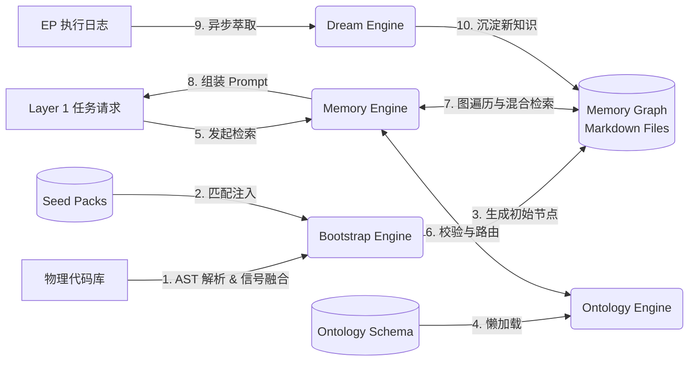

# Layer 2: 知识本体层 (Knowledge Ontology Layer)

## 1. 架构定位

Layer 2 是 MMS 系统的“大脑皮层”，负责将散落的代码、文档和架构约束转化为机器可读、可计算的**有向知识图谱 (Knowledge Graph)**。它为 Layer 1 (任务工程层) 提供精准的上下文注入，并为其他分析和应用层提供决策依据。

## 2. 组件架构与职责分布

Layer 2 采用“引擎 (Engine) - 资产 (Assets) - 实例数据 (Instance Data)”分离的三层架构设计。

### 2.1 组件架构图 (Mermaid)

```mermaid
graph TD
    subgraph Engine [引擎层 (src/mms/)]
        M[Memory Engine<br/>图谱操作/上下文注入]
        O[Ontology Engine<br/>Schema 解析/校验]
        B[Bootstrap Engine<br/>冷启动/架构推断]
    end

    subgraph Assets [资产与配置层]
        OS[Ontology Schema<br/>assets/ontology_schema/]
        SP[Seed Packs<br/>src/mms/bootstrap/seed_packs/]
    end

    subgraph Data [实例数据层]
        MD[Memory Nodes<br/>docs/memory/shared/*.md]
    end

    %% 依赖关系
    M -->|读取/写入| MD
    M -->|查询规则| O
    O -->|解析 YAML| OS
    B -->|注入先验知识| SP
    B -->|生成初始节点| MD
```


### 2.2 核心组件职责

- **Memory Engine (`src/mms/memory/`)**: 运行时操作核心。负责解析 Markdown 为图结构，在 EP 执行前进行上下文注入，以及后台的知识萃取与腐化检测。
- **Ontology Engine (`src/mms/ontology/`)**: Schema 的运行时代理。负责读取 YAML 格式的本体定义，提供内存注册表供 Memory 引擎校验。
- **Bootstrap Engine (`src/mms/bootstrap/`)**: 项目初始化引擎。通过 AST 分析自动推断架构层级，并结合 Seed Packs 生成初始记忆。
- **Ontology Schema (`assets/ontology_schema/`)**: 声明式的“世界观”定义（YAML），定义了系统支持的节点类型和边类型。
- **Seed Packs (`src/mms/bootstrap/seed_packs/`)**: 按技术栈划分的预制 Markdown 记忆文件，提供初始的“先验知识”。

## 3. 核心业务流程与数据流

### 3.1 Layer 2 整体数据流图 (Mermaid)




## 4. 目录结构设计原则 (Design Principles)

经过近期的架构重构，Layer 2 实现了严格的**高内聚与物理隔离**，当前的目录结构如下：

```text
src/mms/
├── memory/                 # 引擎：图谱操作与上下文注入
├── ontology/               # 引擎：Schema 解析与内存注册表
├── bootstrap/              # 引擎：冷启动与架构推断
│   └── seed_packs/         # 资产：作为 Bootstrap 的专属数据源，收敛在引擎内部

assets/                     # 资产：系统级静态资产
└── ontology_schema/        # 资产：全局本体 Schema 定义 (原 docs/memory/ontology)

docs/memory/                # 数据：明确边界，仅存放当前项目生成的实例数据
├── shared/                 # 数据：实际记忆节点 (*.md)
└── private/                # 数据：草稿与私有数据
```

**设计收益**：

1. **语义清晰**：将系统级的 Schema 配置 (`assets/ontology_schema`) 与项目级的实例数据 (`docs/memory`) 彻底分离，避免了原先混用在 `docs/` 目录下的语义歧义。
2. **高内聚**：将 `seed_packs` 移入 `src/mms/bootstrap/`，遵循了“谁使用谁管理”的原则，收敛了项目根目录，降低了开发者的认知负担。

## 5. 质量状态：测试覆盖率（2026-05-04 更新）

### 5.1 整体覆盖率概览

| 引擎 | 文件 | 覆盖率 | 状态 |
|------|------|--------|------|
| **Bootstrap Engine** | `code_graph_builder.py` | 95% | ✅ |
| | `memory_seed_generator.py` | 99% | ✅ |
| | `signal_fusion.py` | 92% | ✅ |
| | `ontology_populator.py` | 86% | ✅ |
| | `seed_packs/__init__.py` | 86% | ✅ |
| **Ontology Engine** | `registry.py` | 83% | ✅ |
| **Memory Engine** | `memory_functions.py` | 99% | ✅ |
| | `link_registry.py` | 84% | ✅ |
| | `graph_health.py` | 83% | ✅ |
| | `task_matcher.py` | 85% | ✅ |
| | `injector.py` | 76% | 良好 |
| | `repo_map.py` | 76% | 良好 |
| | `graph_resolver.py` | 72% | 良好 |
| | `freshness_checker.py` | 68% | 良好 |
| | `dream.py` | 63% | 中等 |
| | `intent_classifier.py` | 61% | 中等 |
| | `funcmap.py` | 60% | 中等 |
| | `memory_actions.py` | 56% | 中等 |
| | `entropy_scan.py` | 49% | 中等 |
| | `codemap.py` | 29% | 待完善 |
| | `template_lib.py` | 0% | 低优先级（模板库） |
| **Memory Engine 合计** | — | **63%** | 良好 |
| **Layer 2 合计** | — | **63%** | 良好 ↑ |

**测试用例总数：1532 个，全部通过（3 skipped, 2 xfailed）。**

### 5.2 已修复的关键 Bug

本轮工作修复了 2 个设计层面的正确性问题：

**Bug 1：MemoryNode Schema 双重不符合（已修复 `de4794f`）**

Bootstrap 引擎生成的节点与 `MemoryNode` ObjectType Schema 存在两处冲突：

| 字段 | 生成值（旧） | Schema 要求 | 修复方案 |
|------|------------|------------|---------|
| `id` | `MEM-BOOT-001` | 不在 pattern 允许前缀中 | `memory_node.yaml` 新增 `MEM-BOOT-` 前缀 |
| `layer` | `ADAPTER`/`APP`/`DOMAIN` | 不在 enum 允许值中 | 引入 `_SCHEMA_LAYER_MAP` 映射到规范值 |

层名映射规则：

```text
ADAPTER  → L5_interface      (HTTP controller / gRPC handler)
APP      → L4_application    (Application service / use case)
DOMAIN   → L3_domain         (Domain entity / repository)
PLATFORM → L2_infrastructure (Config / database client)
CC       → CC                (Cross-cutting)
```

**Bug 2：signal_fusion 推断缺陷（已修复 `de4794f`）**

| 场景 | 修复前 | 修复后 |
|------|--------|--------|
| `OmsOrderServiceImpl`（Java Impl 惯用） | UNKNOWN(0.19) | **APP(0.59)** |
| `OmsOrder`（`model/` 目录下 POJO） | UNKNOWN(0.10) | **DOMAIN(0.25)** |

修复方法：
1. `_NAME_SUFFIXES` 新增 Java Impl 系列后缀（`ServiceImpl`/`RepositoryImpl`/`DaoImpl` 等）
2. 引入 `_PATH_STRONG_PATTERNS`：`entity`/`model`/`repository` 等明确目录给出强信号（1.0），使路径单信号即可超过 0.25 推断阈值

### 5.3 新增测试覆盖

| 测试文件 | 覆盖内容 | 用例数 |
|---------|---------|--------|
| `test_ontology_registry.py` | ObjectTypeRegistry / FunctionRegistry / ActionRegistry 全面单测 | 41 |
| `test_bootstrap_on_python_fastapi.py` | Python FastAPI 项目全链路 bootstrap 验证 + Schema 合规性 | 18 |
| `test_layer2_e2e.py` | 4 条 E2E 链路（Bootstrap→Memory→Schema / Ontology / MemoryEngine / Layer1&2 联合） | 24 |
| `test_memory_engine_unit.py` | Memory Engine 全模块单元测试（TaskMatcher/IntentClassifier/entropy_scan/MemoryGraph/MemoryInjector/RepoMap/memory_actions/codemap/funcmap）| 81 |
| `test_memory_engine_integration.py` | Memory Engine 跨组件集成测试（6 条联动链路：Bootstrap→Graph→Injector→Matcher→Actions + 持久化） | 21 |
| `test_layer2_e2e_extended.py` | Layer 2 E2E 扩展测试（5 条链路：全链路 Prompt 组装 / 生命周期 / 跨语言一致性 / Schema↔Memory 双向一致性 / RepoMap+Graph 联合上下文）| 32 |

### 5.4 当前覆盖率缺口与优先级

Memory Engine 仍有以下待完善项：

1. **`codemap.py`（29%）**：主体扫描逻辑（`generate_codemap`）未覆盖，需补充带真实目录结构的测试
2. **`entropy_scan.py`（49%）**：`run_full_scan` 和 LFU/图健康相关的高阶函数未覆盖
3. **`memory_actions.py`（56%）**：真实写入路径（依赖 `dream._layer_to_dir`）需更完整的集成测试
4. **`template_lib.py`（0%）**：模板库，纯只读数据，低优先级

---

## 6. 架构解耦与通信协议分析

Layer 2 的设计是一次典型的领域驱动设计（DDD）落地，它不仅在物理目录上实现了隔离，在逻辑依赖和通信协议上也达到了极高的解耦标准。

### 5.1 分层解耦目标的实现

- **宏观解耦：Engine / Assets / Data 彻底分离**
  - **Engine (代码) 无状态化**：`src/mms/memory` 和 `src/mms/ontology` 的 Python 代码中，没有任何硬编码的业务概念（如 `APIEndpoint`, `depends_on` 等），完全退化为通用的执行器。
  - **Assets (资产) 声明化**：所有的业务规则、节点类型、图谱边关系全部收敛在 `assets/ontology_schema/` 的 YAML 文件中。修改系统行为无需改动一行 Python 代码。
  - **Data (数据) 纯文本化**：记忆实例数据作为纯文本 Markdown 存放在 `docs/memory/shared/`，不依赖任何特定的数据库服务。
- **微观解耦：引擎内部的零循环依赖**
  - **Ontology 引擎（绝对底层）**：`registry.py` 除了基础的 `utils` 外，不依赖任何其他 MMS 模块，是一个纯粹的、无状态的 Schema 解析器。
  - **Memory 引擎（高度独立）**：Memory 引擎完全不依赖 Ontology 引擎的复杂 Python 校验代码。例如 `graph_resolver.py` 只关心“图的连通性”，它通过自己的 `link_registry.py` 直接读取 YAML 配置，实现了与对象类型校验逻辑的解耦。
  - **Bootstrap 引擎（单向消费）**：作为高层编排者，它单向依赖 `ontology.registry` 获取对象类型，单向输出 Markdown 文件，不与 Memory 引擎产生直接的 Python 调用耦合。

### 5.2 核心通信协议

由于组件被高度解耦，它们之间的通信不再依赖于紧耦合的 Python 函数调用，而是建立在**清晰的契约（Protocols）**之上：

1. **引擎与资产的通信协议：YAML Schema**
  - **载体**：`assets/ontology_schema/` 下的 YAML 文件结构。
  - **机制**：Ontology 引擎和 Memory 引擎通过标准的 YAML 解析器读取资产。只要 YAML 格式合法（例如 `LinkType` 包含 `source_type` 和 `target_type`），引擎就能正确工作。
2. **引擎与数据的通信协议：Markdown Front-matter**
  - **载体**：`assets/ontology_schema/memory_schema.yaml`（定义了 Markdown 头部的字段规范）。
  - **机制**：
    - **生产者 (Bootstrap Engine)**：在生成初始记忆时，严格按照规范将 `id`, `layer`, `cites_files` 等字段写入 Markdown 的 Front-matter。
    - **消费者 (Memory Engine)**：`graph_resolver.py` 在构建内存图谱时，只解析 Front-matter 中的标准字段，而不关心 Markdown 的正文内容。
  - **意义**：Front-matter 成为了 Bootstrap 和 Memory 之间、以及人类开发者和系统之间最坚固的异步通信桥梁。
3. **跨层通信协议：极简 Python API**
  - **机制**：仅在跨层调用时发生。例如 Layer 1 的 `synthesizer` 调用 Layer 2 的 `MemoryInjector.inject(task_description)`。接口非常收敛，内部实现完全黑盒。

