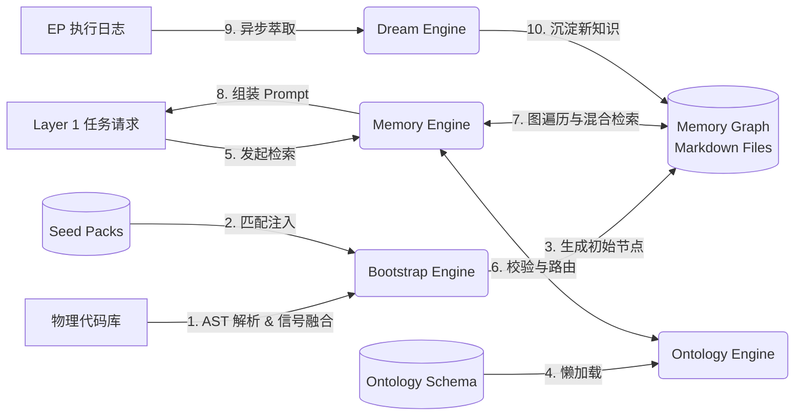

# Layer 2: 知识本体层 (Knowledge Ontology Layer)

## 1. 架构定位

Layer 2 是 MMS 系统的“大脑皮层”，负责将散落的代码、文档和架构约束转化为机器可读、可计算的**有向知识图谱 (Knowledge Graph)**。它为 Layer 1 (任务工程层) 提供精准的上下文注入，并为 Layer 3 (智能体应用层) 提供决策依据。

## 2. 组件架构与职责分布

Layer 2 采用“引擎 (Engine) - 资产 (Assets) - 实例数据 (Instance Data)”分离的三层架构设计。

### 2.1 组件架构图 (Mermaid)

```mermaid
graph TD
    subgraph Engine [引擎层 (src/mms/)]
        M[Memory Engine<br/>图谱操作/上下文注入]
        O[Ontology Engine<br/>Schema 解析/校验]
        B[Bootstrap Engine<br/>冷启动/架构推断]
    end

    subgraph Assets [资产与配置层]
        OS[Ontology Schema<br/>docs/memory/ontology]
        SP[Seed Packs<br/>seed_packs/]
    end

    subgraph Data [实例数据层]
        MD[Memory Nodes<br/>docs/memory/shared/*.md]
    end

    %% 依赖关系
    M -->|读取/写入| MD
    M -->|查询规则| O
    O -->|解析 YAML| OS
    B -->|注入先验知识| SP
    B -->|生成初始节点| MD
```


### 2.2 核心组件职责

- **Memory Engine (`src/mms/memory/`)**: 运行时操作核心。负责解析 Markdown 为图结构，在 EP 执行前进行上下文注入，以及后台的知识萃取与腐化检测。
- **Ontology Engine (`src/mms/ontology/`)**: Schema 的运行时代理。负责读取 YAML 格式的本体定义，提供内存注册表供 Memory 引擎校验。
- **Bootstrap Engine (`src/mms/bootstrap/`)**: 项目初始化引擎。通过 AST 分析自动推断架构层级，并结合 Seed Packs 生成初始记忆。
- **Ontology Schema (`docs/memory/ontology/`)**: 声明式的“世界观”定义（YAML），定义了系统支持的节点类型和边类型。
- **Seed Packs (`seed_packs/`)**: 按技术栈划分的预制 Markdown 记忆文件，提供初始的“先验知识”。

## 3. 核心业务流程与数据流

### 3.1 Layer 2 整体数据流图 (Mermaid)




## 4. 目录结构重构执行计划

基于内聚性分析，当前 `seed_packs/` 暴露在根目录，且 `docs/memory/ontology/` 存在语义歧义。为了实现上述架构图中清晰的“引擎-资产-数据”分离，建议执行以下目录重构计划：

### 4.1 重构目标结构

```text
src/mms/
├── memory/                 # 引擎：图谱操作
├── ontology/               # 引擎：Schema 解析
├── bootstrap/              # 引擎：冷启动
│   └── seed_packs/         # [移入] 作为 Bootstrap 的专属数据源

assets/                     # [新增] 系统级静态资产
└── ontology_schema/        # [移入] 原 docs/memory/ontology

docs/memory/                # [明确边界] 仅存放项目级实例数据
├── shared/                 # 实际记忆节点 (*.md)
└── private/                # 草稿与私有数据
```

### 4.2 详细执行步骤 (CLI Commands)

**步骤 1: 迁移 Seed Packs**

```bash
mv seed_packs src/mms/bootstrap/
```

*代码修改*：更新 `src/mms/bootstrap/seed_packs/__init__.py` 中的 `_ROOT` 路径解析逻辑，以及 `src/mms/bootstrap/ontology_populator.py` 中的导入路径。

**步骤 2: 迁移 Ontology Schema**

```bash
mkdir -p assets/ontology_schema
mv docs/memory/ontology/* assets/ontology_schema/
rm -rf docs/memory/ontology
```

*代码修改*：

1. 更新 `src/mms/ontology/registry.py` 中的 `_ONTOLOGY_DIR` 指向 `assets/ontology_schema`。
2. 更新 `src/mms/memory/link_registry.py` 中的路径。
3. 更新 `mms_config.py` 或相关路径常量文件。

**步骤 3: 测试验证**

```bash
# 运行单元测试，确保路径变更未破坏核心逻辑
python3 -m pytest tests/
# 运行一次空跑的 bootstrap 验证 seed_packs 注入
mms bootstrap --dry-run
```

**步骤 4: 提交变更**

```bash
git add src/mms/ assets/ docs/memory/
git commit -m "refactor(layer2): 重构 Layer 2 目录结构，实现引擎与资产分离"
```

