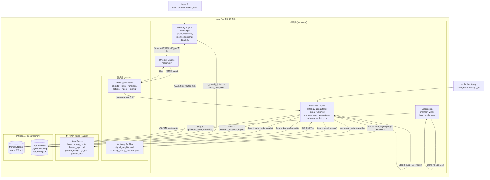
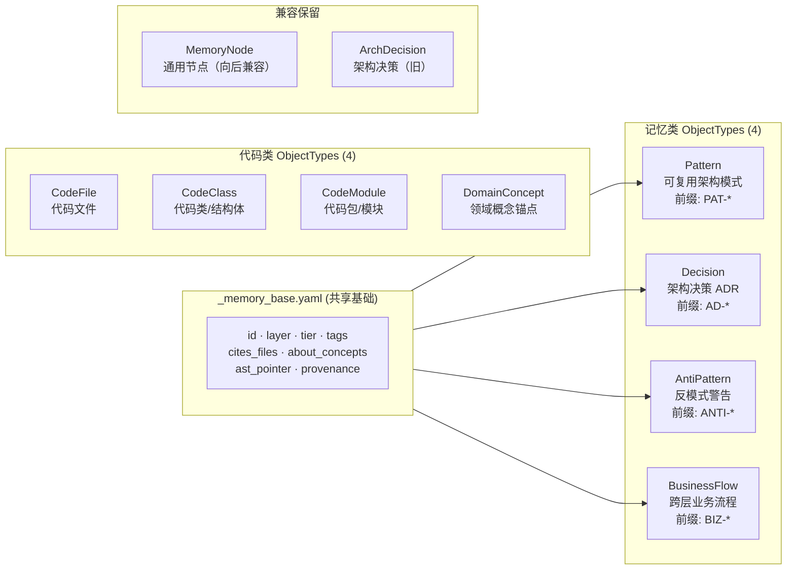

# Layer 2: 知识本体层 (Knowledge Ontology Layer)

> **最后更新**：2026-05-06 | Schema v5.0 | commit `146a19f`

---

## 1. 架构定位

Layer 2 是 MMS 系统的"大脑皮层"，负责将散落的代码、文档和架构约束转化为机器可读、可计算的**有向知识图谱 (Knowledge Graph)**。它为 Layer 1（任务工程层）提供精准的上下文注入，并为其他分析和诊断层提供决策依据。

**核心理念**：本体不是数据仓库，而是"高密度语义索引"——与其追求字段完整性，不如追求信息密度和检索效率，为小模型（<50B）在端侧闭域任务中提供精准上下文。

Layer 2 自身由四个子系统构成：

| 子系统                  | 目录                     | 职责                            |
| -------------------- | ---------------------- | ----------------------------- |
| **Memory Engine**    | `src/mms/memory/`      | 图谱操作 / 上下文注入 / 知识萃取 / 腐化检测    |
| **Ontology Engine**  | `src/mms/ontology/`    | Schema 解析 / 运行时校验 / 注册表       |
| **Bootstrap Engine** | `src/mms/bootstrap/`   | 冷启动 / AST 推断 / 种子包注入 / 初始记忆生成 |
| **Diagnostics**      | `src/mms/diagnostics/` | 图谱可视化诊断（HTML 自包含页面）           |

---

## 2. Layer 2 完整组件拓扑



---

## 3. 记忆分层体系

### 3.1 v5.0 通用层 ID（Universal Layer IDs）

Schema v5.0 采用**跨项目通用的 9 层 ID**，直接存储在 MemoryNode 的 `layer` 字段，定义于 `assets/ontology_schema/_config/universal_layers.yaml`。

```
v5.0 通用层 ID                       物理目录（docs/memory/shared/）
─────────────────────────────────────────────────────────
ADAPTER    接口/适配层                  shared/ADAPTER/
APP        应用服务层                  shared/APP/
DOMAIN     领域层                      shared/DOMAIN/
PLATFORM   平台基础设施层               shared/PLATFORM/
CC         横切关注点（架构/ADR）        shared/CC/
CC_testing  测试横切                   (CC 目录下)
CC_governance 治理横切                 (CC 目录下)
BIZ        跨层业务流程                 shared/BIZ/
Ops        运维/部署层                  shared/Ops/
```

> **v4.x 兼容**：历史节点的 `L5_api`、`L4_service`、`L3_ontology` 等细粒度 ID 仍受 validator 支持，可通过 `migrate_layer_v4_to_v5.py` 一键迁移。

### 3.2 GC 保护系数（各层淘汰难度）

```
docs/memory/shared/                      保护系数（GC 淘汰难度）
├── CC/          架构约束（ADR/反模式/红线）    0.5  ← 最难淘汰
├── PLATFORM/    横切平台能力（认证/鉴权/配置）  0.2
├── DOMAIN/      业务领域核心（实体/聚合根/规则） 0.3
├── APP/         应用用例编排（CQRS/Saga）     0.1
└── ADAPTER/     外部适配（REST/DB/MQ）        0.0  ← 最易淘汰
```

### 3.3 层分类在系统各组件中的对应关系

```
         用户意图任务
              │
     intent_classifier.py
     (fn_classify_intent)
              │ 输出 (layer, operation)
              ▼
     docs/memory/_system/routing/
     ├── layers.yaml      ← 层定义（兼容 v4.x 细粒度 ID）
     ├── intent_map.yaml  ← layer × operation 路由规则
     └── operations.yaml  ← 15 种操作类型

              ▲
              │ 直接写入 v5.0 通用层 ID
     signal_fusion.py + _DDD_TO_UNIVERSAL_LAYER
     (infer_layer → DDD五元组 → 通用层)
              │
              ▼
     ADAPTER → ADAPTER   (直接写入 front-matter)
     APP     → APP
     DOMAIN  → DOMAIN
     PLATFORM→ PLATFORM
     CC      → CC

              │ 存储在 front-matter
     docs/memory/shared/{DDD_DIR}/MEM-BOOT-*.md
     (目录名和 layer字段均使用通用层 ID)
```

---

## 4. 本体 Schema 拓扑（v5.0）

### 4.1 ObjectType 体系（v5.0 拆分后）

> Schema v5.0 将原来的 `MemoryNode` God Object 拆分为 4 个聚焦 ObjectType，共享 `_memory_base.yaml` 基础 Schema（模拟 Palantir Interface 复用机制）。`Lesson` 类型已废弃。



### 4.2 ObjectType 字段清单（v5.0）

| ObjectType        | 关键字段                                                    | 基础     |
| ----------------- | --------------------------------------------------------- | -------- |
| **Pattern**       | `pattern_category`, `applicability`, `code_example`, `anti_pattern_risk` | _memory_base |
| **Decision**      | `status`(proposed/accepted/deprecated), `context`, `decision`, `consequences`, `alternatives` | _memory_base |
| **AntiPattern**   | `symptoms`, `causes`, `consequences`, `refactoring_path` | _memory_base |
| **BusinessFlow**  | `steps_summary`, `involves_layers`, `actors`             | _memory_base |
| **MemoryNode**    | `type`(pattern/decision/anti-pattern/business-flow), `tier`, `layer`, `tags`, `ast_pointer`, `provenance` | —（向后兼容）|
| **ArchDecision**  | `decision_context`, `rationale`, `decision_status`, `alternatives_considered` | —（旧版）|
| **DomainConcept** | `concept_id`, `label`, `layer_source`, `keywords`, `aliases` | — |
| **CodeFile**      | `file_path`, `lang`, `fingerprint`, `inferred_layer`, `layer_confidence` | — |
| **CodeClass**     | `class_fqn`, `bases`, `annotations`, `methods`, `signal_breakdown` | — |
| **CodeModule**    | `module_path`, `lang`, `file_count`, `dominant_object_type` | — |

### 4.3 LinkTypes 清单（9 种）

| LinkType       | source_type → target_type   | cardinality | 存储字段                         | 自动填充触发                 |
| -------------- | --------------------------- | ----------- | ---------------------------- | ---------------------- |
| `related_to`   | MemoryNode ↔ MemoryNode     | M:N         | `related_to: [{id, reason}]` | 人工/dream               |
| `derived_from` | MemoryNode → MemoryNode     | N:M         | `derived_from: [id]`         | action_distill         |
| `about`        | MemoryNode → DomainConcept  | M:N         | `about_concepts: [label]`    | action_distill         |
| `impacts`      | MemoryNode → MemoryNode     | M:N         | `impacts: [id]`              | 可选自动（tags 重叠）          |
| `contradicts`  | MemoryNode ↔ MemoryNode     | M:N         | `contradicts: [id]`          | fn_find_contradictions |
| `cites`        | MemoryNode → CodeFile       | M:N         | `cites_files: [path]`        | action_bootstrap       |
| `depends_on`   | CodeClass → CodeClass       | M:N         | 代码图 JSON                     | fn_build_code_graph    |
| `implements`   | CodeClass → CodeClass       | M:N         | 代码图 JSON                     | fn_build_code_graph    |
| `contains`     | CodeModule → CodeFile/Class | 1:N         | 代码图 JSON                     | fn_build_code_graph    |

### 4.4 Functions 清单（9 种）

| Function                     | 实现路径                                                  | 核心输入 → 输出                                                          |
| ---------------------------- | ----------------------------------------------------- | ------------------------------------------------------------------ |
| `fn_infer_layer`             | `mms.bootstrap.signal_fusion.infer_layer`             | CodeClass + weights → LayerInference(layer, confidence, breakdown) |
| `fn_detect_code_object_type` | `mms.bootstrap.signal_fusion.detect_code_object_type` | CodeClass + LayerInference → ObjectTypeMapping                     |
| `fn_build_code_graph`        | `mms.bootstrap.code_graph_builder`                    | ast_index + project_root → CodeGraph                               |
| `fn_classify_intent`         | `mms.memory.intent_classifier`                        | task_str → IntentResult(layer, operation, confidence)              |
| `fn_resolve_paths`           | `mms.memory.memory_functions`                         | IntentResult → [file_paths]                                        |
| `fn_rank_memories`           | `mms.memory.memory_functions`                         | files + seed_mems + task → context_str                             |
| `fn_extract_tags`            | `mms.memory.memory_functions`                         | task_description → [tags]                                          |
| `fn_detect_drift`            | `mms.memory.freshness_checker`                        | MemoryNode + ast_index → drift_suspected                           |
| `fn_find_contradictions`     | `mms.memory.graph_health`                             | memory_id + graph → contradiction_pairs                            |

### 4.5 Actions 清单（5 种）

| Action                 | 触发方式                                              | 副作用                                           |
| ---------------------- | ------------------------------------------------- | --------------------------------------------- |
| `action_bootstrap`     | `mulan bootstrap` CLI / `bootstrap_project()` API | 写入 MEM-BOOT-*.md；Schema 演进报告               |
| `action_distill`       | postcheck PASS 后异步执行                              | 写入 derived_from / about_concepts              |
| `action_dream`         | distill 完成后或手动触发                                  | 发现矛盾；推断 impacts；写入新 Pattern/Decision 节点    |
| `action_promote_draft` | 人工 `mulan promote`                                | 移动 private/→shared/；更新 tier                   |
| `action_retire_memory` | GC 扫描 / 矛盾解决 / 人工                                 | 软删除（归档至 archive 目录）                           |

**Rules 目录**（`assets/ontology_schema/rules/`）：

| Rule 文件 | 内容 |
|-----------|------|
| `rule_bootstrap_pipeline.yaml` | Bootstrap 9 条执行规则（含 rule_08_structural_gc） |
| `rule_memory_quality.yaml` | 7 条记忆质量治理规则 |
| `rule_post_apply_incremental.yaml` | 7 条增量后置规则（action_apply 完成后事件驱动） |

---

## 5. 信号权重系统（v5.0 — 六路信号 + Evaluation DAG）

### 5.1 Evaluation DAG 推断架构

```
用户项目代码
      │
      ▼
┌─────────────────────────────────────────────────────────┐
│            Evaluation DAG (inference_rules.yaml)         │
│                                                         │
│  Stage 1: Short-circuit Rules（短路高置信度规则）          │
│    命中即停止，返回 confidence=0.85~0.98                   │
│    覆盖：Java @RestController / Python FastAPI / Go 路由  │
│    测试类/工具类等常见明确类型                              │
│         ↓ 未命中                                        │
│  Stage 2: Conflict Detection（冲突检测）                  │
│    gap < 0.15 且属于已知冲突对 (ADAPTER-DOMAIN, APP-DOMAIN)│
│    → 路径信号 tiebreaker / 标记 _ambiguous               │
│         ↓                                               │
│  Stage 3: Weighted Signal Fusion（六路信号加权）           │
│    ┌────────────┬───────┬──────────────────────────┐    │
│    │ 信号       │ 权重  │ 示例                      │    │
│    ├────────────┼───────┼──────────────────────────┤    │
│    │ 路径信号   │ 25%   │ controller/ → ADAPTER     │    │
│    │ 命名信号   │ 25%   │ *Service → APP            │    │
│    │ 注解信号   │ 30%   │ @Repository → DOMAIN      │    │
│    │ 继承信号   │ 10%   │ JpaRepository → DOMAIN    │    │
│    │ 导入信号   │ 10%   │ 高入度 → DOMAIN/PLATFORM  │    │
│    │ 方法签名   │  0%*  │ handle/execute → ADAPTER  │    │
│    └────────────┴───────┴──────────────────────────┘    │
│    * 默认关闭；go_gin profile 设为 0.05 激活             │
└─────────────────────────────────────────────────────────┘
```

### 5.2 权重配置体系

```
项目代码
      │
      ├─── 权重来源（优先级从高到低）
      ▼
.mms/bootstrap_config.yaml    ← 项目级配置（最高优先）
      ↓
assets/bootstrap_profiles/signal_weights.yaml  ← 全局模板库
      ↓ get_signal_weights(profile, overrides)
mms.bootstrap.signal_fusion   ← 纯函数，无全局状态
```

### 5.3 七个权重模板对比

| Profile              | path     | name     | annotation | inheritance | import | signature | 适用场景                                  |
| -------------------- | -------- | -------- | ---------- | ----------- | ------ | --------- | ------------------------------------- |
| `base`               | 0.25     | 0.25     | **0.30**   | 0.10        | 0.10   | 0.00      | 通用基准，无框架偏好                            |
| `java_spring_boot`   | 0.20     | 0.20     | **0.45**   | 0.10        | 0.05   | 0.00      | 注解即声明（@RestController 确定层级）           |
| `python_fastapi`     | **0.40** | 0.25     | 0.15       | 0.12        | 0.08   | 0.00      | 目录结构规范，BaseModel 歧义需路径打破              |
| `python_django`      | 0.25     | **0.35** | 0.25       | 0.12        | 0.03   | 0.00      | ViewSet/Serializer 后缀强信号              |
| `go_gin`             | **0.43** | 0.25     | 0.03       | 0.12        | 0.12   | 0.05      | Go 无注解；包路径+方法签名是主要信号                  |
| `go_ddd`             | **0.53** | 0.20     | 0.02       | 0.13        | 0.07   | 0.05      | 严格 DDD 目录布局（interface/usecase/domain） |
| `clean_architecture` | **0.50** | 0.25     | 0.10       | 0.10        | 0.05   | 0.00      | 语言无关 Clean Arch / 六边形架构               |

### 5.4 DDD 内部术语 → v5.0 通用层 ID 映射

> v5.0 废除了 `_SCHEMA_LAYER_MAP`（旧的项目特化 ID 映射），改为 `_DDD_TO_UNIVERSAL_LAYER`（通用层 ID 直接写入）。

```
signal_fusion 推断 (DDD)    _DDD_TO_UNIVERSAL_LAYER    MemoryNode.layer (v5.0)
────────────────────────────────────────────────────────────────────────
ADAPTER                  →→→→→→→→→→→→→→→→→           ADAPTER
APP                      →→→→→→→→→→→→→→→→→           APP
DOMAIN                   →→→→→→→→→→→→→→→→→           DOMAIN
PLATFORM                 →→→→→→→→→→→→→→→→→           PLATFORM
CC                       →→→→→→→→→→→→→→→→→           CC
UNKNOWN (fallback)       →→→→→→→→→→→→→→→→→           CC

目录落地使用相同名称（目录名=layer值）：
docs/memory/shared/
├── ADAPTER/
├── APP/
├── DOMAIN/
├── PLATFORM/
└── CC/
```

---

## 6. 意图识别分类体系

### 6.1 意图识别架构

```
用户任务字符串 (task)
        │
        ▼
  ┌─────────────────────────────────────────┐
  │     阶段 0：本地关键词规则匹配            │
  │     fn_classify_intent (local)           │
  │                                          │
  │  intent_map.yaml (v4.0)                  │
  │  ├── defaults: {min_hit_ratio,           │
  │  │              min_hits,                │
  │  │              confidence_threshold}    │
  │  └── rules[]:                            │
  │       ├── id / priority                  │
  │       ├── layer (兼容 v4.x/v5.0 ID)     │
  │       ├── operation (15种)               │
  │       ├── keywords []                    │
  │       ├── min_hit_ratio / min_hits       │
  │       └── confidence_boost               │
  └──────────────┬──────────────────────────┘
                 │ confidence < threshold?
                 ▼
  ┌─────────────────────────────────────────┐
  │     阶段 1：LLM 兜底（可选）             │
  │     qwen3-32b 判断                       │
  │     输出：{layer, operation}             │
  └──────────────────────────────────────────┘
                 │
                 ▼
       IntentResult {
         layer: 层ID,
         operation: 操作类型,
         confidence: float,
         entry_files_hint: []
       }
```

### 6.2 意图分类维度：layer × operation（15 种操作类型）

```
操作类型：create / modify_config / modify_logic / debug / delete / deploy /
         test / review / view_trace / mms_synthesize / mms_dag / mms_distill /
         knowledge_query / analyze / refactor

层 × 常见操作：
  ADAPTER (L5)    → create / modify_logic / debug / review
  APP (L4)        → create / modify_logic / analyze / refactor
  DOMAIN (L3)     → create / knowledge_query / analyze / review
  PLATFORM (L2)   → create / modify_config / deploy / analyze
  CC              → knowledge_query / analyze / review
```

---

## 7. Bootstrap 业务流程（v5.0）

### 7.1 完整业务流程图

```mermaid
flowchart TD
    START([项目根目录]) --> REG[OntologyRegistry 注册<br/>fn_infer_layer / fn_detect_type / fn_build_graph]
    REG --> S1

    S1["Step 1: 技术栈嗅探<br/>dep_sniffer.sniff(project_root)"]
    S1 -->|detected_stacks, confidence| S15

    S15["Step 1.5: 项目文档蒸馏 (可选)<br/>seed_absorber.absorb()<br/>→ _absorb_draft/*.md"]
    S15 --> S2

    S2["Step 2: 种子包注入<br/>install_packs(detected_stacks)<br/>→ docs/memory/shared/CC/AD-SEED-*.md"]
    S2 --> S3

    S3["Step 3: AST 骨架化<br/>build_ast_index(project_root)<br/>→ ast_index {file: {classes, methods...}}"]
    S3 --> S4

    S4["Step 4: 代码依赖图<br/>build_code_graph(ast_index)<br/>→ code_graph.json"]
    S4 --> S5

    S5["Step 5: 六路信号推断 + Evaluation DAG<br/>infer_all(ast_index, weights_profile)"]

    subgraph S5_DETAIL["Evaluation DAG 详情"]
        DAG1[Stage 1: Short-circuit Rules<br/>inference_rules.yaml]
        DAG2[Stage 2: Conflict Detection<br/>gap < 0.15 → tiebreaker]
        DAG3[Stage 3: Weighted Fusion<br/>path·name·annotation·inheritance·import·signature]
        DAG1 -->|未命中| DAG2
        DAG2 --> DAG3
        DAG3 --> LAYER[推断层级<br/>ADAPTER/APP/DOMAIN/PLATFORM/CC]
        LAYER --> UNI[_DDD_TO_UNIVERSAL_LAYER<br/>→ 直接写入 v5.0 通用层 ID]
    end

    S5 --> S5_DETAIL --> S6

    S6["Step 6: 增量记忆生成<br/>generate_seed_memories()<br/>fingerprint 比对 → 跳过已存在节点<br/>→ MEM-BOOT-*.md"]
    S6 --> GC[Structural GC<br/>_run_structural_gc()<br/>→ 软归档孤立节点至 _archived/]
    GC --> SE[Schema 演进反馈<br/>schema_evolution.py<br/>→ schema_evolution_log.jsonl<br/>→ schema_evolution_report.md]
    SE --> DONE([BootstrapV2Report])

    style S5_DETAIL fill:#f0f0f0,stroke:#999
```

### 7.2 增量 Bootstrap 逻辑

```
第 N 次 bootstrap 时：

1. 扫描 shared/**/MEM-BOOT-*.md，提取 {class_name: fingerprint}
2. 对每个 AST 扫描到的 class：
   a. 计算当前 fingerprint：SHA-256(sorted(method_name:signature))
   b. 若 class_name 在已有记录 且 fingerprint 相同 → SKIP（幂等）
   c. 否则 → 写入/覆盖 MEM-BOOT-*.md（新增或更新）
3. Structural GC：比对 ast_index 与现有 MEM-BOOT-*.md
   d. class_name 不再存在于 AST 中 → 软归档至 _archived/

覆盖场景：
  ✅ 代码未变 → fingerprint 不变 → SKIP（幂等）
  ✅ 方法签名变更 → fingerprint 变 → 重新生成
  ✅ 新增类 → 不在已有记录 → 新建节点
  ✅ 类被删除 → Structural GC 自动归档孤立节点
```

### 7.3 Schema 演进反馈回路

Bootstrap 每次运行结束后自动生成 Schema 演进报告（`schema_evolution.py`）：

```
schema_evolution_report.md    ← 可读摘要（高空字段率 / 模糊推断 / UNKNOWN 层统计）
schema_evolution_log.jsonl    ← 结构化日志（每次 Bootstrap 一行）
```

报告输出内容：
- **高空字段率**：某字段空值率 > 30% → 提示重构 ObjectType
- **模糊推断统计**：`_ambiguous` 标记的类数量 → 提示调整信号权重
- **UNKNOWN 层分布**：推断失败的类列表 → 提示补充 Override 规则

---

## 8. 整体数据流图

```mermaid
flowchart LR
    CODE[物理代码库] -->|AST 解析| BOOT(Bootstrap Engine<br/>六路信号 + EvalDAG)
    WPFL[(signal_weights.yaml<br/>7种权重模板)] -->|get_signal_weights| BOOT
    SP[(Seed Packs<br/>base/spring_boot/fastapi...)] -->|先验知识| BOOT
    BOOT -->|"MEM-BOOT-*.md<br/>layer=ADAPTER/APP/DOMAIN..."| GRAPH

    SCHEMA[(Ontology Schema<br/>objects/links/functions/actions/rules)] -->|懒加载| ONTO(Ontology Engine<br/>registry.py)

    TASK[Layer 1 任务] -->|inject(task)| MEM(Memory Engine<br/>intent_classifier → injector)
    MEM -->|fn_classify_intent| IMAP[(intent_map.yaml<br/>layer × operation)]
    MEM <-->|front-matter 读写| GRAPH[(Memory Graph<br/>docs/memory/shared/*.md)]
    MEM -->|Schema 校验| ONTO
    MEM -->|Prompt Context| TASK

    LOG[EP 执行日志] -->|异步| DREAM(Dream Engine<br/>dream.py)
    DREAM -->|derived_from / about | GRAPH
    DREAM -->|矛盾检测| GRAPH

    DIAG[Diagnostics CLI<br/>visualize_memory.py] -->|只读扫描| GRAPH
    DIAG -->|"隐式边推断<br/>cites_same_file"| HTML[记忆图谱 HTML<br/>3 Tab 可视化]
```

---

## 9. 组件解耦与通信协议

### 9.1 依赖方向（严格单向）

```
Layer 1 (任务工程层)
    │  Python API: MemoryInjector.inject(task: str)
    ▼
Memory Engine          Diagnostics (只读)
    │  ← Schema 校验       │
    ▼                      ▼
Ontology Engine    Memory Graph (docs/memory/shared/)
    │  ← YAML 懒加载       ▲
    ▼                      │ 写入 MEM-BOOT-*.md
Ontology Schema    Bootstrap Engine
(assets/)              │  ← 权重注入
                        ▼
                  signal_weights.yaml
                  + .mms/bootstrap_config.yaml
                  + inference_rules.yaml (EvalDAG)
                  + CLI --weights-profile
```

### 9.2 通信协议汇总

| 协议                    | 载体                              | 方向                 | 说明                   |
| --------------------- | ------------------------------- | ------------------ | -------------------- |
| **YAML Front-matter** | `docs/memory/shared/*.md`       | Bootstrap → Memory | 写入/读取的核心数据格式，v5.0 规范 |
| **YAML Schema**       | `assets/ontology_schema/*.yaml` | 资产 → 引擎            | 声明式"世界观"，引擎懒加载解析     |
| **Python API**        | `MemoryInjector.inject(task)`   | Layer 1 → Layer 2  | 唯一跨层调用接口，内部黑盒        |
| **权重参数注入**            | `infer_layer(weights=dict)`     | 配置 → 推断            | 纯函数无全局状态，显式依赖注入      |
| **HTML 输出**           | `memory_viz.html`               | Diagnostics → 人类   | 单向输出，自包含，无需服务        |
| **JSON 缓存**           | `_system/code_graph.json`       | Bootstrap → 系统     | 代码依赖图快照，供后续分析复用      |
| **JSONL 日志**          | `schema_evolution_log.jsonl`    | Bootstrap → 系统     | Schema 演进历史，结构化可查询    |

---

## 10. 目录结构

```text
src/mms/
├── memory/                 # 引擎：图谱操作与上下文注入（16 个模块）
│   ├── injector.py         # 主入口：MemoryInjector.inject()
│   ├── graph_resolver.py   # 图遍历（MemoryNode 加载与 _normalize_layer）
│   ├── intent_classifier.py # fn_classify_intent（两阶段：规则+LLM）
│   ├── dream.py            # 知识萃取（EP 执行后异步蒸馏）
│   ├── freshness_checker.py # fn_detect_drift（sha256 fingerprint 比对）
│   ├── graph_health.py     # fn_find_contradictions
│   ├── task_matcher.py     # 历史任务匹配
│   └── ...
├── ontology/               # 引擎：Schema 解析与内存注册表
│   └── registry.py         # ObjectTypeRegistry / FunctionRegistry / ActionRegistry
├── bootstrap/              # 引擎：冷启动与架构推断
│   ├── ontology_populator.py # action_bootstrap 完整实现（Step 1~6 + GC + Schema演进）
│   ├── signal_fusion.py    # infer_layer / infer_all（六路信号 + Evaluation DAG）
│   ├── memory_seed_generator.py # _render_memory_md + _compute_fingerprint
│   ├── code_graph_builder.py # fn_build_code_graph
│   └── schema_evolution.py # ★ Schema 演进反馈回路（BootstrapRunStats + JSONL报告）
└── diagnostics/            # 诊断：记忆图谱可视化
    ├── memory_viz.py       # MemoryVizCollector（显式边+隐式同文件边+ObjectType着色）
    └── html_renderer.py    # 3 Tab HTML 渲染器

assets/
├── ontology_schema/        # 声明式本体定义（YAML）
│   ├── memory_schema.yaml  # 记忆节点 front-matter 规范（兼容 v4.0/v5.0）
│   ├── objects/            # 10 种 ObjectType（含 v5.0 新增 4 种）
│   │   ├── _memory_base.yaml    # ★ 共享基础 Schema（模拟 Palantir Interface）
│   │   ├── pattern.yaml         # ★ 可复用架构模式
│   │   ├── decision.yaml        # ★ 架构决策 ADR
│   │   ├── anti_pattern.yaml    # ★ 反模式
│   │   ├── business_flow.yaml   # ★ 跨层业务流程
│   │   ├── memory_node.yaml     # 通用记忆节点（向后兼容）
│   │   ├── arch_decision.yaml   # 架构决策（旧版，向后兼容）
│   │   ├── code_class.yaml / code_file.yaml / code_module.yaml
│   │   └── domain_concept.yaml
│   ├── links/              # 9 种 LinkType
│   ├── functions/          # 9 种 Function（实现路径已修正）
│   ├── actions/            # 5 种 Action
│   ├── rules/              # ★ v5.0 新增：独立 Rule 定义
│   │   ├── rule_bootstrap_pipeline.yaml      # Bootstrap 9 条规则
│   │   ├── rule_memory_quality.yaml          # 记忆质量 7 条规则
│   │   └── rule_post_apply_incremental.yaml  # 增量后置 7 条规则
│   └── _config/            # ★ v5.0 新增：配置与约束
│       ├── universal_layers.yaml          # 9 个通用层 ID 定义
│       ├── ontology_design_principles.yaml # 5 条本体设计原则（CI 检查）
│       ├── inference_rules.yaml           # Evaluation DAG 规则
│       └── traversal_paths.yaml           # 图遍历路径配置
└── bootstrap_profiles/     # 信号权重模板库
    ├── signal_weights.yaml              # 7 种权重 Profile（含 signature 第6路）
    └── bootstrap_config_template.yaml   # 用户项目配置模板

docs/memory/                # 实例数据（当前项目）
├── shared/                 # 记忆节点（按层目录，v5.0 通用层 ID）
│   ├── ADAPTER/            # layer=ADAPTER 的节点
│   ├── APP/                # layer=APP 的节点
│   ├── DOMAIN/             # layer=DOMAIN 的节点
│   ├── PLATFORM/           # layer=PLATFORM 的节点
│   └── CC/                 # layer=CC 的节点
├── private/                # EP 私有草稿
└── _system/                # 系统运行时文件
    ├── routing/            # layers.yaml / intent_map.yaml / operations.yaml
    ├── schema_evolution_log.jsonl      # ★ Schema 演进历史日志
    ├── schema_evolution_report.md      # ★ Schema 演进可读摘要
    └── code_graph.json     # 代码依赖图快照

seed_packs/                 # 框架种子包（YAML 驱动）
├── base/                   # 通用约束（always_inject=true）
├── spring_boot/            # 13 条 ast_overrides
├── fastapi_sqlmodel/       # 9 条 ast_overrides
├── python_django/          # 13 条 ast_overrides
├── go_gin/                 # Go Gin 约束
├── palantir_arch/          # Palantir 架构模式
└── react_zustand/          # 前端模式

scripts/
├── visualize_memory.py            # 记忆图谱可视化 CLI 入口
├── migrate_layer_v4_to_v5.py      # ★ Layer ID 迁移脚本（v4→v5，幂等）
└── migrate_memory_node_to_4_types.py # ★ God Object 拆分迁移脚本（幂等）

tests/fixtures/             # Bootstrap 压测矩阵（4 个 stack）
├── spring-boot-demo/       # Java Spring Boot
├── python-fastapi-demo/    # Python FastAPI
├── go-gin-demo/            # Go Gin
└── typescript-nestjs-demo/ # ★ v5.0 新增 TypeScript/NestJS
```

---

## 11. 记忆图谱可视化诊断

### 11.1 数据结构与边类型

```
NodeData {
    id, label, layer, tier, node_type, tags,
    file_path,          ← .md 文件路径
    ast_file,           ← 源码文件路径（用于隐式边推断）
    ast_class,          ← 源码类名
    ast_drift,          ← 腐化状态
    layer_confidence,   ← 推断置信度
    about_concepts,     ← 语义概念标签
    border_color        ← ★ v5.0 新增：ObjectType 边框颜色
}

边类型（relation）：
  ● related_to     灰色实线  显式语义关联
  ● impacts        红色实线  变更传播
  ● derived_from   绿色实线  知识来源
  ● cites          蓝色实线  代码引用
  ┄ cites_same_file 浅蓝虚线  同文件隐式共现（运行时推断）
```

### 11.2 双维度 ObjectType 视觉编码

| 维度 | 编码方式 | 含义 |
|------|---------|------|
| **背景色** | tier 颜色（热=红/温=橙/冷=蓝/归档=灰） | 访问热度 |
| **边框色** | ObjectType 颜色 | 语义类型 |

| ObjectType | 边框颜色 | 语义 |
|-----------|---------|------|
| `pattern` | 紫色 `#7c3aed` | 正向架构模式 |
| `decision` | 青绿色 `#0f766e` | 架构决策 ADR |
| `anti-pattern` | 深红色 `#b91c1c` | 反模式警告 |
| `business-flow` | 深蓝色 `#1d4ed8` | 跨层业务流程 |

### 11.3 使用方式

```bash
# 快速生成并打开（扫描当前项目 docs/memory/）
python3 scripts/visualize_memory.py --open

# 指定目标项目
python3 scripts/visualize_memory.py \
  --memory-root tests/fixtures/go-gin-demo/docs/memory \
  --output /tmp/viz_go.html --project "Go Gin Demo" --open
```

---

## 12. 质量状态

### 12.1 测试覆盖率（2026-05-06，commit `146a19f`）

| 引擎               | 关键文件                       | 覆盖率      |
| ---------------- | -------------------------- | -------- |
| Bootstrap Engine | `signal_fusion.py`         | ~92%     |
|                  | `memory_seed_generator.py` | ~99%     |
|                  | `ontology_populator.py`    | ~86%     |
|                  | `code_graph_builder.py`    | ~95%     |
|                  | `schema_evolution.py`      | —（新增）    |
| Ontology Engine  | `registry.py`              | ~83%     |
| Memory Engine    | `memory_functions.py`      | ~99%     |
|                  | `graph_resolver.py`        | ~72%     |
|                  | `intent_classifier.py`     | ~61%     |
|                  | `freshness_checker.py`     | ~68%     |
| Diagnostics      | `memory_viz.py`            | ~87%     |
|                  | `html_renderer.py`         | ~99%     |
| **Layer 2 合计**   | —                          | **~75%** |

### 12.2 Bootstrap 压测矩阵（4 个 stack）

| 项目 | 语言 | Fixture | 关键断言 |
|------|------|---------|---------|
| Spring Boot Demo | Java | `spring-boot-demo/` | Controller→ADAPTER / Repository→DOMAIN / 幂等性 |
| FastAPI Demo | Python | `python-fastapi-demo/` | v5.0 universal layer ID 合规 |
| Go Gin Demo | Go | `go-gin-demo/` | go_gin profile / path 信号主导 |
| NestJS Demo | TypeScript | `typescript-nestjs-demo/` | ★ v5.0 新增 / @Controller/@Injectable/@Entity |

---

## 13. 已知局限与后续计划

> 标记说明：✅ = 已实施  🔄 = 进行中  ⏳ = 待实施

| 优先级 | 状态  | 问题                                                                     | 处理结果 / 后续方向 |
| --- | --- | ---------------------------------------------------------------------- | ----------- |
| P0  | ✅   | `rules/` 目录缺失，Rule 散落在 Action 的 YAML 字段中 | 已创建 `assets/ontology_schema/rules/`，3 个 Rule 文件 |
| P0  | ✅   | Layer 字段与项目强绑定（`_SCHEMA_LAYER_MAP`），跨项目不通用 | 废除 `_SCHEMA_LAYER_MAP`，改为 `universal_layers.yaml` + `_DDD_TO_UNIVERSAL_LAYER` |
| P0  | ✅   | `MemoryNode` God Object 反模式（type 字段切换语义） | 拆分为 4 个聚焦 ObjectType（Pattern/Decision/AntiPattern/BusinessFlow）+ `_memory_base.yaml` |
| P1  | ✅   | 信号推断缺少高置信度短路规则，频繁触发低效加权融合 | 实现 Evaluation DAG（Stage 1 短路 + Stage 2 冲突检测） |
| P1  | ✅   | 无方法签名信号，Go/TS 等无注解语言推断质量低 | 新增第 6 路 `signature` 信号，go_gin/go_ddd profile 默认激活 |
| P1  | ✅   | Bootstrap 删除的类，其旧 MEM-BOOT-*.md 不会自动清理 | 新增 `_run_structural_gc()`，软归档孤立节点至 `_archived/` |
| P1  | ✅   | Schema 缺乏演进反馈，不知道哪些字段空置率高、哪些推断模糊 | 新增 `schema_evolution.py`，每次 Bootstrap 后自动生成报告 |
| P1  | ✅   | `signal_weights.yaml` 中 `strong_path_patterns` 等 profile 专有字段尚未被推断引擎加载 | 新增 `get_strong_path_patterns()`；`infer_layer()` 增加 `strong_path_patterns` 参数 |
| P1  | ✅   | 缺少真实 TypeScript/NestJS 项目压测 | 新增 `typescript-nestjs-demo` fixture + `test_bootstrap_on_nestjs.py` |
| P2  | ⏳   | `cites_same_file` 边仅在可视化层存在，未建模为 LinkType | 评估是否需要持久化存储 |
| P2  | ⏳   | Diagnostics 图可视化无 LLM 语义聚类 | 探索基于 embedding 的节点聚类，暂无优先级 |
| P3  | ⏳   | `fn_detect_drift` 的 sha256 fingerprint 仅覆盖方法签名，不感知类体实现变化 | 考虑内容哈希混合指纹策略 |
| P9  | ⏳   | Memory Engine 直接操作文件系统，扩展性受限（延后至 v6） | GraphAdapter 内部抽象层，解耦物理存储 |

### Bootstrap 结构性 GC 与 LFU 清理的区别

两套正交机制，解决的问题层次不同：

| 维度       | Bootstrap 结构性 GC                          | entropy_scan LFU 频率清理             |
| -------- | ----------------------------------------- | --------------------------------- |
| **触发条件** | 源码中类被删除/重命名                               | 记忆节点 `access_count=0` 超过 60 天     |
| **判断标准** | `class_name` 是否在当前 AST index 中            | 查询频率是否低于阈值                        |
| **处理对象** | 仅 `MEM-BOOT-*.md` 节点                      | 所有类型的 MemoryNode                  |
| **孤立定义** | 代码锚点丢失（**结构性孤立**）                         | 从未被 Memory Engine 检索过（**使用性孤立**）  |
| **实现位置** | `ontology_populator._run_structural_gc()` | `entropy_scan.scan_zero_access()` |
| **触发时机** | 每次 Bootstrap 运行结束后自动执行                    | 手动运行 `entropy_scan.py` 或 CI       |
| **归档策略** | 移至同层 `_archived/`，添加原因注释                  | 候选列表输出，不自动移动                      |

---

## 14. Schema v5.0 升级总结（feature/ontology-v5-schema-evolution）

> 本分支实施的完整 9 阶段升级（Phase 9 GraphAdapter 延后至 v6）。

### 14.1 核心变更清单

| Phase | 优先级 | 内容 | 文件/模块 |
|-------|--------|------|-----------|
| **0** | P0 | 本体设计原则文件 + CI 合规检查 | `assets/ontology_schema/_config/ontology_design_principles.yaml`<br/>`tests/test_ontology_principles.py` |
| **1** | P0 | Layer 字段去耦合：废除 `_SCHEMA_LAYER_MAP`，采用通用 9 层 | `assets/ontology_schema/_config/universal_layers.yaml`<br/>`scripts/migrate_layer_v4_to_v5.py` |
| **2** | P0 | MemoryNode God Object 拆分：→ 4 个聚焦 ObjectType | `assets/ontology_schema/objects/_memory_base.yaml`<br/>`pattern.yaml` / `decision.yaml` / `anti_pattern.yaml` / `business_flow.yaml`<br/>`scripts/migrate_memory_node_to_4_types.py` |
| **3** | P1 | Signal Fusion 第 6 路：method_signature 信号 | `src/mms/bootstrap/signal_fusion.py` — `_score_method_signature()`<br/>`assets/bootstrap_profiles/signal_weights.yaml` — `signature` 权重 |
| **4** | P1 | Evaluation DAG：Stage 1 短路 + Stage 2 冲突检测 | `assets/ontology_schema/_config/inference_rules.yaml`<br/>`signal_fusion.py` — `infer_layer()` Stage 2 实现 |
| **5** | P2 | 增量后置规则（Event-driven via rules） | `assets/ontology_schema/rules/rule_post_apply_incremental.yaml` |
| **6** | P1 | 真实项目压测矩阵（NestJS/TypeScript） | `tests/fixtures/typescript-nestjs-demo/`<br/>`tests/test_bootstrap_on_nestjs.py` |
| **7** | P1 | README 更新 + memory_viz ObjectType 双维度着色 | `layer2_readme.md`<br/>`src/mms/diagnostics/memory_viz.py` — `border_color` |
| **8** | P1 | Schema 演进反馈回路（jsonl + markdown） | `src/mms/bootstrap/schema_evolution.py` |

### 14.2 本体设计原则（5 条，CI 强制执行）

| ID | 原则 | 针对的反模式 |
|----|------|-------------|
| `P1_density_over_completeness` | 信息密度优先于字段完备性（空值率 > 30% 必须重构） | God Object |
| `P2_typed_relations_over_text` | 类型化关系优先于文本描述（用 LinkType 而非 description） | 隐式关系 |
| `P3_universal_schema_per_project_config` | 通用 Schema + 项目特化配置严格分离 | System Silos |
| `P4_focused_object_types` | 每个 ObjectType 代表单一实体（禁止 type 字段切换语义） | God Object |
| `P5_schema_evolvable_with_migration` | 任何 Schema 变更必须附迁移脚本（幂等） | 手工迁移 |

### 14.3 Layer 字段 v4 → v5 迁移映射

| v4.x 项目特化 ID | v5.0 通用层 ID | 说明 |
|-----------------|---------------|------|
| `L5_api`, `L5_frontend` | `ADAPTER` | 接口/适配层 |
| `L4_service`, `L4_worker` | `APP` | 应用服务层 |
| `L3_ontology`, `L3_data_pipeline` | `DOMAIN` | 领域层 |
| `L2_database`, `L2_messaging`, `L2_cache`, `L2_storage` | `PLATFORM` | 平台层 |
| `L1_security`, `L1_platform` | `PLATFORM` | 平台层（安全/配置） |
| `CC_architecture`, `Tooling_mms` | `CC` | 横切关注点 |
| `CC_testing` | `CC_testing` | 测试横切（保持不变） |
| `CC_governance` | `CC_governance` | 治理横切（保持不变） |

迁移脚本：`python3 scripts/migrate_layer_v4_to_v5.py --apply`

### 14.4 记忆节点 Front-matter 标准格式（v5.0）

```yaml
---
id: PAT-001                  # Pattern: PAT-* / Decision: AD-* / AntiPattern: ANTI-* / BusinessFlow: BIZ-*
object_type: pattern         # pattern / decision / anti-pattern / business-flow
layer: DOMAIN                # v5.0 通用层 ID（ADAPTER/APP/DOMAIN/PLATFORM/CC...）
tier: warm                   # hot / warm / cold / archive
tags: [ddd, repository-pattern]
cites_files:
  - backend/domain/user_repository.py
about_concepts:
  - repository
  - domain-driven-design
ast_pointer:
  file_path: backend/domain/user_repository.py
  class_name: UserRepository
  fingerprint: sha256:abc123
  drift: false
provenance:
  trigger_type: bootstrap_v2
  generated_at: 2026-05-06
  layer_confidence: 0.92
version: 1
created_at: 2026-05-06
---
```
