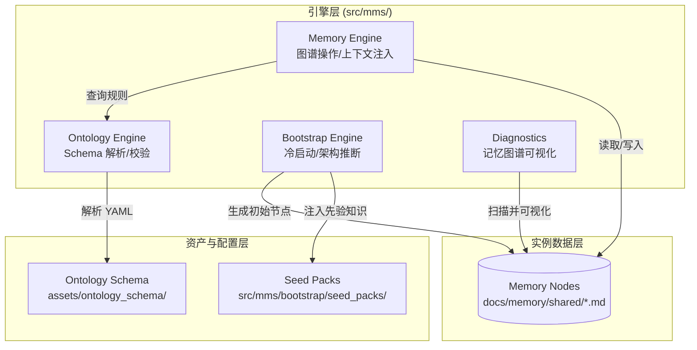
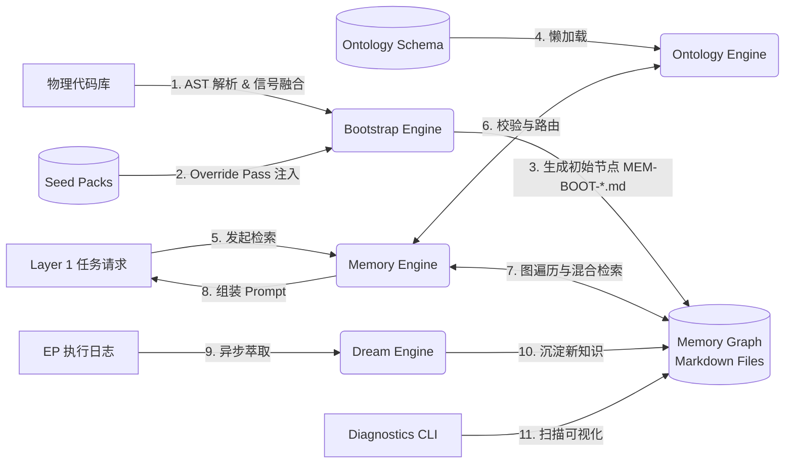

# Layer 2: 知识本体层 (Knowledge Ontology Layer)

> **最后更新**：2026-05-05 | commit `cf0023d`

## 1. 架构定位

Layer 2 是 MMS 系统的"大脑皮层"，负责将散落的代码、文档和架构约束转化为机器可读、可计算的**有向知识图谱 (Knowledge Graph)**。它为 Layer 1（任务工程层）提供精准的上下文注入，并为其他分析和诊断层提供决策依据。

Layer 2 自身由四个子系统构成：

| 子系统 | 目录 | 职责 |
|--------|------|------|
| **Memory Engine** | `src/mms/memory/` | 图谱操作 / 上下文注入 / 知识萃取 / 腐化检测 |
| **Ontology Engine** | `src/mms/ontology/` | Schema 解析 / 运行时校验 / 注册表 |
| **Bootstrap Engine** | `src/mms/bootstrap/` | 冷启动 / AST 推断 / 种子包注入 / 初始记忆生成 |
| **Diagnostics** | `src/mms/diagnostics/` | 图谱可视化诊断（HTML 自包含页面，Layer 4 功能归属 Layer 2 数据） |

---

## 2. 组件架构与职责分布

Layer 2 采用"引擎 (Engine) - 资产 (Assets) - 实例数据 (Instance Data)"分离的三层架构设计。

### 2.1 组件架构图



### 2.2 核心组件职责

- **Memory Engine (`src/mms/memory/`)**：运行时操作核心。负责解析 Markdown 为图结构，在 EP 执行前进行上下文注入，以及后台的知识萃取（dream）与腐化检测（entropy_scan）。共 16 个模块。
- **Ontology Engine (`src/mms/ontology/`)**：Schema 的运行时代理。负责读取 YAML 格式的本体定义，提供 ObjectType/Function/Action/LinkType 内存注册表。
- **Bootstrap Engine (`src/mms/bootstrap/`)**：项目初始化引擎。通过 AST 分析 + YAML Override Pass + 五路信号融合，自动推断架构层级，并结合 Seed Packs 生成初始记忆。
- **Diagnostics (`src/mms/diagnostics/`)**：记忆图谱诊断可视化。扫描所有记忆文件，生成自包含 HTML（3 Tab：图谱拓扑 / AST 文件树 / AST↔记忆映射表）。
- **Ontology Schema (`assets/ontology_schema/`)**：声明式的"世界观"（YAML），定义系统支持的节点类型、边类型、Action、Function。
- **Seed Packs (`src/mms/bootstrap/seed_packs/`)**：按技术栈划分的预制记忆文件，提供初始的"先验知识"（含 ast_overrides 规则）。

---

## 3. 核心业务流程与数据流

### 3.1 Layer 2 整体数据流图



---

## 4. 目录结构设计原则

经过架构重构，Layer 2 实现了严格的**高内聚与物理隔离**：

```text
src/mms/
├── memory/                 # 引擎：图谱操作与上下文注入（16 个模块）
├── ontology/               # 引擎：Schema 解析与内存注册表（1 个核心文件）
├── bootstrap/              # 引擎：冷启动与架构推断（4 个模块）
│   └── seed_packs/         # 资产：Bootstrap 专属先验知识库
├── diagnostics/            # ★ 诊断：记忆图谱可视化（Layer 4 诊断工具）
│   ├── memory_viz.py       # 数据收集器
│   └── html_renderer.py    # HTML 渲染器

assets/
└── ontology_schema/        # 资产：全局本体 Schema 定义（YAML，无业务代码）
    ├── memory_schema.yaml  # 记忆节点 front-matter 规范（v4.0）
    ├── objects/            # ObjectType 定义（8 种）
    ├── links/              # LinkType 定义（8 种）
    ├── functions/          # Function 定义（9 种）
    ├── actions/            # Action 定义（5 种）
    └── _config/            # 图遍历路径配置

docs/memory/                # 数据：仅存放当前项目的实例数据
├── shared/                 # 记忆节点（按层分目录：CC / PLATFORM / DOMAIN / APP / ADAPTER）
│   └── *.md                # 标准 front-matter v4.0 格式
├── private/                # EP 私有草稿与诊断数据
└── _system/                # 系统运行时文件（routing / ast_index.json 等）

seed_packs/                 # ★ 框架种子包（YAML 驱动，含 ast_overrides）
├── base/                   # 通用约束（always_inject=true）
├── spring_boot/            # 13 条 ast_overrides（@RestController/JpaRepository 等）
├── fastapi_sqlmodel/       # 9 条 ast_overrides（SQLModel/BaseSettings 等）
├── python_django/          # 13 条 ast_overrides（models.Model/APIView 等）
├── go_gin/
├── palantir_arch/
└── react_zustand/

scripts/
└── visualize_memory.py     # ★ 记忆图谱可视化 CLI 入口
```

**设计收益**：

1. **语义清晰**：`assets/ontology_schema`（Schema 定义）与 `docs/memory/shared`（实例数据）彻底分离。
2. **高内聚**：`seed_packs` 移入 `src/mms/bootstrap/`（谁使用谁管理）；项目根目录的 `seed_packs/` 是面向框架适配的独立资产包。
3. **无侵入诊断**：`diagnostics/` 以只读方式扫描数据层，不修改任何记忆文件，纯输出 HTML。

---

## 5. 记忆架构元数据（路由系统）

Layer 2 的元数据规范文件位于 `docs/memory/_system/routing/`，当前状态：

### 5.1 层分类体系（layers.yaml）

| 层 ID | 类型 | 说明 |
|-------|------|------|
| `L1_platform` ~ `L5_interface` | 业务技术层 | Clean Architecture 五层 |
| `BIZ` | 横切业务流 | 跨层端到端业务场景文档（如"用户注册流"、"数据同步管道"） |
| `CC_architecture` | 横切架构层 | ADR、全链路追踪文档 |
| `CC_testing` | 横切测试层 | Pytest / Vitest / MSW 等（从 `L5_testing` 重命名，测试是横切关注点） |
| `CC_governance` | 横切治理层 | Quota 配额、CR 变更审批、ACL（从 `L3_governance` 提升） |
| `Tooling_mms` | MMS 工具层 | MMS 自身的 AI 工程工具集（从 `L0_mms` 重命名） |
| `Ops` | 运维部署层 | K8s / Docker / Alembic |

### 5.2 操作类型（operations.yaml）

新增三种操作类型（EP-129）：

| 操作 ID | 说明 |
|---------|------|
| `knowledge_query` | 查询记忆图谱 / 本体结构（不修改代码） |
| `analyze` | 静态分析：架构检查 / 层级违规检测 / AST 分析 |
| `refactor` | 代码重构 / 目录迁移 / 模块解耦 |

---

## 6. 质量状态：测试覆盖率（2026-05-05 更新）

**测试用例总数：1573 个，全部通过（3 skipped, 2 xfailed）。**

### 6.1 整体覆盖率概览

| 引擎 | 文件 | 覆盖率 | 状态 |
|------|------|--------|------|
| **Bootstrap Engine** | `code_graph_builder.py` | 95% | ✅ |
| | `memory_seed_generator.py` | 99% | ✅ |
| | `signal_fusion.py` | 92% | ✅ |
| | `ontology_populator.py` | 86% | ✅ |
| | `seed_packs/__init__.py` | 83% | ✅ |
| **Ontology Engine** | `registry.py` | 83% | ✅ |
| **Memory Engine** | `memory_functions.py` | 99% | ✅ |
| | `link_registry.py` | 84% | ✅ |
| | `graph_health.py` | 83% | ✅ |
| | `task_matcher.py` | 85% | ✅ |
| | `injector.py` | 76% | 良好 |
| | `repo_map.py` | 76% | 良好 |
| | `graph_resolver.py` | 72% | 良好 |
| | `freshness_checker.py` | 68% | 良好 |
| | `dream.py` | 63% | 中等 |
| | `intent_classifier.py` | 61% | 中等 |
| | `funcmap.py` | 60% | 中等 |
| | `memory_actions.py` | 56% | 中等 |
| | `entropy_scan.py` | 49% | 中等 |
| | `codemap.py` | 29% | 待完善 |
| | `template_lib.py` | 78% | 良好 |
| | `private.py` | — | 低优先级 |
| **Diagnostics** | `memory_viz.py` | 87% | ✅ |
| | `html_renderer.py` | 99% | ✅ |
| **Memory Engine 合计** | — | **63%** | 良好 |
| **Layer 2 合计** | — | **~75%** | 良好 ↑ |

### 6.2 已修复的关键 Bug

**Bug 1：MemoryNode Schema 双重不符合（已修复 `de4794f`）**

Bootstrap 引擎生成的节点与 `MemoryNode` ObjectType Schema 存在两处冲突：

| 字段 | 生成值（旧） | Schema 要求 | 修复方案 |
|------|------------|------------|---------|
| `id` | `MEM-BOOT-001` | 不在 pattern 允许前缀中 | `memory_node.yaml` 新增 `MEM-BOOT-` 前缀 |
| `layer` | `ADAPTER`/`APP`/`DOMAIN` | 不在 enum 允许值中 | 引入 `_SCHEMA_LAYER_MAP` 映射到规范值 |

层名映射规则：

```text
ADAPTER  → L5_interface      (HTTP controller / gRPC handler)
APP      → L4_application    (Application service / use case)
DOMAIN   → L3_domain         (Domain entity / repository)
PLATFORM → L2_infrastructure (Config / database client)
CC       → CC                (Cross-cutting)
```

**Bug 2：signal_fusion 推断缺陷（已修复 `de4794f`）**

| 场景 | 修复前 | 修复后 |
|------|-------|-------|
| `OmsOrderServiceImpl`（Java Impl 惯用） | UNKNOWN(0.19) | **APP(0.59)** |
| `OmsOrder`（`model/` 目录下 POJO） | UNKNOWN(0.10) | **DOMAIN(0.25)** |

修复方法：
1. `_NAME_SUFFIXES` 新增 Java Impl 系列后缀（`ServiceImpl`/`RepositoryImpl`/`DaoImpl` 等）
2. 引入 `_PATH_STRONG_PATTERNS`：`entity`/`model`/`repository` 等明确目录给出强信号（1.0）

### 6.3 当前测试文件清单

| 测试文件 | 覆盖内容 | 用例数 |
|----------|----------|--------|
| `test_ontology_registry.py` | ObjectTypeRegistry / FunctionRegistry / ActionRegistry 全面单测 | 41 |
| `test_bootstrap_on_python_fastapi.py` | Python FastAPI 全链路 bootstrap + Schema 合规性 | 18 |
| `test_bootstrap_on_spring_boot.py` | Spring Boot fixture 端到端、幂等性、dry_run | 15 |
| `test_bootstrap_e2e.py` | Bootstrap E2E 综合测试 | — |
| `test_layer2_e2e.py` | 4 条 E2E 链路（Bootstrap→Memory→Schema / MemoryEngine / Layer1&2） | 24 |
| `test_memory_engine_unit.py` | Memory Engine 全模块单元测试 | 81 |
| `test_memory_engine_integration.py` | 跨组件集成测试（6 条联动链路） | 21 |
| `test_layer2_e2e_extended.py` | Layer 2 E2E 扩展（5 条链路：Prompt / 生命周期 / 跨语言 / Schema↔Memory） | 32 |
| `test_diagnostics.py` | Diagnostics 模块（frontmatter 解析 / 收集器 / 渲染器 / CLI E2E） | 41 |

### 6.4 当前覆盖率缺口与优先级

Memory Engine 仍有以下待完善项：

1. **`codemap.py`（29%）**：主体扫描逻辑（`generate_codemap`）未覆盖，需补充带真实目录结构的测试
2. **`entropy_scan.py`（49%）**：`run_full_scan` 和 LFU/图健康相关的高阶函数未覆盖
3. **`memory_actions.py`（56%）**：真实写入路径（依赖 `dream._layer_to_dir`）需更完整的集成测试
4. **`dream.py`（63%）**：EP 完整蒸馏流程需 LLM mock，当前仅测试纯函数路径

---

## 7. 架构解耦与通信协议分析

Layer 2 的设计在物理目录、逻辑依赖和通信协议三个维度均实现了高度解耦。

### 7.1 分层解耦目标的实现

- **Engine / Assets / Data 彻底分离**
  - **Engine（代码）无状态化**：`src/mms/memory` 和 `src/mms/ontology` 的 Python 代码中无任何硬编码业务概念，完全退化为通用执行器。
  - **Assets（资产）声明化**：所有的业务规则、节点类型、图谱边关系全部收敛在 `assets/ontology_schema/` 的 YAML 文件中。修改系统行为无需改动一行 Python 代码。
  - **Data（数据）纯文本化**：记忆实例数据作为纯文本 Markdown 存放在 `docs/memory/shared/`，不依赖任何特定的数据库服务。

- **引擎内部的零循环依赖**
  - **Ontology 引擎（绝对底层）**：`registry.py` 除了基础的 `utils` 外，不依赖任何其他 MMS 模块。
  - **Memory 引擎（高度独立）**：`graph_resolver.py` 只关心"图的连通性"，通过自己的 `link_registry.py` 直接读取 YAML 配置，不依赖 Ontology Engine 的校验逻辑。
  - **Bootstrap 引擎（单向消费）**：单向依赖 `ontology.registry` 获取对象类型，单向输出 Markdown 文件。
  - **Diagnostics（纯只读）**：只读扫描 Markdown 文件，不调用任何 Memory/Ontology 引擎方法。

### 7.2 核心通信协议

| 协议 | 载体 | 方向 | 说明 |
|------|------|------|------|
| **YAML Schema** | `assets/ontology_schema/*.yaml` | 引擎 ← 资产 | Ontology Engine 和 Memory Engine 通过标准 YAML 读取业务规则 |
| **Markdown Front-matter** | `docs/memory/shared/*.md` | Bootstrap → Memory | Bootstrap 写入、Memory Engine 读取；人类开发者可直接编辑 |
| **Python API（极简）** | `MemoryInjector.inject(task)` | Layer 1 → Layer 2 | 跨层调用接口高度收敛，内部实现完全黑盒 |
| **HTML 输出** | `memory_viz.html` | Diagnostics → 人类 | 单向输出，供开发者浏览器打开检视 |

---

## 8. 记忆图谱可视化诊断（Diagnostics）

### 8.1 功能概述

`src/mms/diagnostics/` 提供记忆图谱的可视化诊断能力，输出为**自包含的 HTML 文件**（无需后端服务），可直接在浏览器中打开。

**三个标签页**：

| Tab | 内容 | 技术 |
|-----|------|------|
| 📊 记忆图谱 | vis-network 交互式图，可按 layer/tier/关键词过滤，点击节点查看详情 | vis-network 9.1.9 (CDN) |
| 🌳 AST 文件视图 | 按源码文件分组的树状视图，展示类名 → 记忆节点映射，drift 高亮 | 纯 HTML/CSS |
| 🔗 AST↔记忆映射 | 完整映射表，含置信度、tier、layer、drift 状态 | 纯 HTML/CSS |

### 8.2 使用方式

```bash
# 快速生成并打开（默认扫描 docs/memory/）
python3 scripts/visualize_memory.py --open

# 指定参数
python3 scripts/visualize_memory.py -o /tmp/viz.html --project MyApp

# 在非项目根目录使用
python3 scripts/visualize_memory.py --memory-root /path/to/docs/memory --project TargetProject
```

### 8.3 数据收集逻辑

`MemoryVizCollector.collect()` 扫描所有 `.md` 文件（排除 `_system/`），从 YAML front-matter 中提取：

- **节点属性**：`id`、`layer`、`tier`、`type`、`tags`、`about_concepts`
- **AST 指针**：`ast_pointer.file_path`、`ast_pointer.class_name`、`ast_pointer.drift`、`provenance.layer_confidence`
- **图关系**：`related_to`、`impacts`、`derived_from`（生成有向边）

---

## 9. 已知局限与后续计划

| 优先级 | 问题 | 后续方向 |
|--------|------|---------|
| P1 | `codemap.py`（29%）主体扫描逻辑测试缺失 | 补充真实目录 fixture 集成测试 |
| P1 | `entropy_scan.py`（49%）`run_full_scan` 未覆盖 | 补充高阶函数测试 |
| P2 | Diagnostics 图可视化仅基于 front-matter，无 LLM 语义聚类 | 探索基于 embedding 的节点聚类 |
| P2 | 记忆节点之间的 `cites_files` 边尚未转为可视化边（目前只做 `related_to/impacts/derived_from`） | 扩展 `memory_viz.py` 收集逻辑 |
| P3 | Bootstrap 信号融合的 TypeScript / Go 强模式补充 | 扩展 `_PATH_STRONG_PATTERNS` 和 `_NAME_SUFFIXES` |
