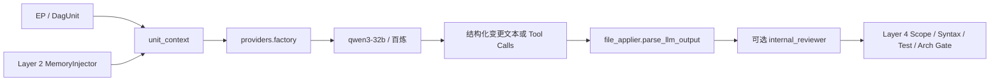

# Layer 3：代码生成层（Code Generation）

> **最后更新**：2026-07-19 | 全阶段 `qwen3-32b` | Claude 运行时路径已停用

## 1. 架构定位

Layer 3 把 Layer 1 的 EP / DagUnit 与 Layer 2 注入的知识上下文转换为可验证的代码变更。它负责模型路由、Prompt/消息组装、代码生成协议和可选内部评审；文件写入与最终质量判定仍由 Layer 4 控制。

核心边界：

- 上游只提交结构化任务和受控上下文，不直接拼接 Provider HTTP 请求
- 所有生成任务通过 `mms.providers.factory` 获取 Provider
- 模型输出必须经过 `file_applier` 协议解析与 Scope Guard，不能直接写盘
- 向量模型 `text-embedding-v3` 只服务检索，不参与代码生成

## 2. 当前模型策略

| 任务 | Provider ID | 默认模型 |
| --- | --- | --- |
| 意图合成 / 通用推理 | `bailian_plus` | `qwen3-32b` |
| 意图分类兜底 | `bailian_plus` | `qwen3-32b` |
| DAG 编排 | `bailian_plus` | `qwen3-32b` |
| 简单/复杂代码生成 | `bailian_plus` | `qwen3-32b` |
| 代码评审 | `bailian_plus` | `qwen3-32b` |
| 知识蒸馏 / 上下文压缩 | `bailian_plus` | `qwen3-32b` |
| 向量检索 | `BailianEmbedProvider` | `text-embedding-v3` |

Provider 降级链：

```text
bailian_plus(qwen3-32b)
  → bailian_coder(qwen3-32b，备援；可由 DASHSCOPE_MODEL_CODING 覆盖)
  → AllProvidersUnavailableError
```

`ClaudeProvider` 源码仍保留，但未导入、未注册，也不在 fallback chain 中。百炼不可用时系统直接报错，不会生成 Pending Prompt。

## 3. 模块结构

```text
src/mms/providers/
├── base.py                 LLMProvider 抽象与统一异常
├── factory.py              任务 → Provider 路由；环境变量覆盖；降级链
├── bailian.py              OpenAI 兼容 chat / messages / tools / embedding
├── claude.py               已停用的 Pending 实现（仅保留源码）
├── gemini.py               备用适配器（不在默认工厂）
└── ollama.py               本地 OpenAI 兼容适配器（不在默认工厂）

src/mms/execution/
├── unit_context.py         代码摘要 + Layer 契约 + 记忆片段的预算化上下文
├── unit_generate.py        EP → DAG JSON（dag_orchestration）
├── unit_runner.py          DagUnit → 代码变更（code_generation）
├── autonomous_runner.py    qwen3-32b Tool-Calling ReAct
├── internal_reviewer.py    可选双角色语义评审
└── file_applier.py         生成协议解析；属于 Layer 3/4 边界
```

## 4. 生成数据流



Track A 使用 `complete()` 生成 `MMS_FILE_CHANGES_BEGIN/END` 协议块；Track B 使用 `complete_with_tools()` 产生 Tool Calls 和 Observation 循环。

## 5. 配置

`.env.memory`：

```bash
DASHSCOPE_API_KEY=sk-...
DASHSCOPE_MODEL_REASONING=qwen3-32b
DASHSCOPE_MODEL_CODING=qwen3-32b
# DASHSCOPE_MODEL_EMBEDDING=text-embedding-v3
```

可通过以下变量临时覆盖单项任务路由：

```bash
MMS_TASK_MODEL_OVERRIDE=code_generation:bailian_coder
```

`docs/memory/_system/config.yaml`：

```yaml
agent:
  execution_mode: pipeline       # pipeline | autonomous | auto
  autonomous_models: [qwen3-32b]

runner:
  enable_internal_review: false
```

## 6. 失败语义

- 缺少 `DASHSCOPE_API_KEY`：Provider 不可用，工厂尝试百炼备援后抛错
- API/解析错误：Track A 返回结构化失败并进入 3-Strike；Track B 写入 Observation 供下一轮纠正
- 输出越界或语法非法：由 Layer 4 拒绝，禁止落盘或触发回滚
- 模型切换：通过 Provider ID / 环境变量完成，不允许调用方硬编码模型 URL

## 7. 验证

```bash
pytest tests/test_unit_runner.py tests/test_bailian_provider.py -q
pytest tests/test_autonomous_runner_control.py -q
pytest tests/test_file_applier.py -q
```

实际测试文件以仓库现状为准；CI 还会在 Python 3.9/3.11 上执行主测试矩阵。
