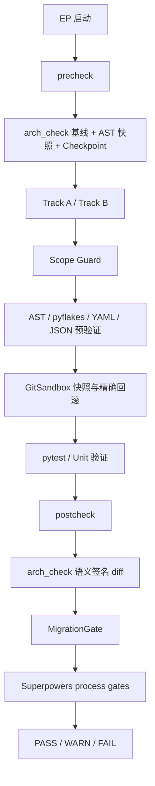

# Layer 4：安全验证层（Safety & Validation）

> **最后更新**：2026-07-19 | 统一 pre/post-check | Superpowers 流程门禁已接入

## 1. 架构定位

Layer 4 是所有代码变更的强制质量边界。无论 Layer 1 选择 Track A 还是 Track B，执行都只能发生在 `precheck` 与 `postcheck` 之间；生成结果必须经过范围、语法、测试、架构和迁移门控。

本层遵循两条原则：

1. **验证证据先于完成声明**：没有真实命令输出，不能把 Unit/EP 标记为完成（`PAT-SP-004`）
2. **纵深防御**：非法数据应在 Entry / Business / Environment / Debug 多层被阻断（`PAT-SP-002`）

## 2. 安全门控链



## 3. 模块结构

```text
src/mms/workflow/
├── precheck.py             前置环境/基线/AST/架构快照
├── postcheck.py            测试、架构 diff、迁移门控、流程门禁提示
└── migration_gate.py       数据库 Schema 变更与迁移文件一致性

src/mms/execution/
├── sandbox.py              内存快照、精准 git add、失败回滚
├── file_applier.py         Scope Guard + 语法预验证 + 安全写入
└── sandboxed_runner.py     临时代码片段的隔离 pytest

src/mms/analysis/
├── arch_check.py           分层、安全上下文、审计、Envelope、Worker Scope
├── ast_diff.py             代码契约变化
├── doc_drift.py            文档漂移
└── parsers/                Python ast；Java/Go/TS Tree-sitter + Regex fallback

src/mms/core/
├── sanitize.py             API Key / JWT / IP 脱敏
├── writer.py               原子写入
└── indexer.py              Schema v5 索引一致性

src/mms/observability/      告警、Incident、审计
src/mms/resilience/         熔断、重试、Checkpoint
src/mms/trace/              EP 级 LLM / 文件操作诊断
```

## 4. Superpowers 原始门禁

来源：`docs/memory/seed_packs/superpowers_sdlc/constraints.yaml`。

| 规则 | 类型 | 含义 | 当前挂钩 |
| --- | --- | --- | --- |
| `SP-GATE-001` | process | 功能改动前先设计 | synthesize / 计划流程的原始记忆 |
| `SP-GATE-002` | process | 完成前运行真实验证 | `postcheck` 输出 |
| `SP-GATE-003` | process | 先查根因再修复 | trace / 调试记忆 |
| `SP-TEST-001` | testing | 测真实行为，不测 mock 占位 | `postcheck` 输出 |
| `SP-SEC-001` | security | Entry/Business/Env 多层校验 | `postcheck` 输出；供 arch_check 扩展 |
| `SP-LEARN-001` | learning | 记忆必须具体可执行可测 | Layer 5 dream |

这些规则中，静态可判定部分可逐步下沉到 `arch_check`；流程类规则目前作为 `always_inject` 记忆与 postcheck 提示，不伪装成正则扫描。

## 5. Tree-sitter 与契约稳定性

- Python 使用标准库 `ast`
- Java / Go / TypeScript / TSX 默认使用 Tree-sitter
- Tree-sitter 不可用时降级到 `RegexFallbackParser`
- 两条解析路径共享 parser-independent fingerprint，避免切换解析器造成全量漂移
- CI 单独执行 parser dispatch、提取 parity 与 fingerprint stability 测试

## 6. Sandbox 边界

- 只允许修改 `unit.files` 和显式登记的新文件
- `git add -- <精准路径>`，禁止 `git add -A`
- 写入前建立内存快照；验证失败恢复原内容并删除新文件
- 生产代码不得绕过 Repository 直接改写 `docs/memory/shared/`
- 敏感内容在 Markdown 正式写入前经过 SanitizationGate

## 7. Postcheck 返回语义

| 返回码 | 状态 | 含义 |
| --- | --- | --- |
| `0` | PASS | 测试、架构、迁移检查均通过 |
| `1` | WARN | 无阻断失败，但存在需要关注的警告 |
| `2` | FAIL | 至少一个阻断项失败或验证工具异常 |

`postcheck` 在 PASS/WARN 后显示蒸馏建议和 `always_inject` 流程门禁；它不会把提示性流程规则错误地计入测试失败。

## 8. 验证命令

```bash
python arch_check.py --ci
pytest tests/test_no_bypass_writes.py -q
pytest tests/test_tree_sitter_extraction.py tests/test_fingerprint_stability.py -q
pytest tests/ -m "not slow and not integration and not benchmark" -q
```
