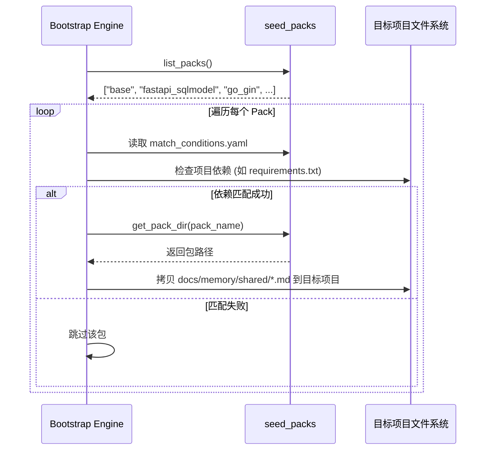

# MMS 种子包 (seed_packs)

## 1. 模块定位

`seed_packs` 是 MMS 系统的**初始知识模板库 (Initial Knowledge Templates)**。它提供了一系列预定义的记忆节点集合，用于在新项目初始化（Bootstrap）时，快速注入特定技术栈的最佳实践和架构约束。

## 2. 核心机制与代码文件

### `__init__.py`

种子包的注册中心。

- `**get_pack_dir(pack_name)`**: 返回指定种子包的绝对路径。
- `**list_packs()**`: 扫描目录，列出所有可用的种子包。

### 种子包目录结构 (Everything is a file)

每个种子包（如 `fastapi_sqlmodel/`）是一个独立的目录，包含：

- `**match_conditions.yaml**`: 嗅探规则。定义了当项目中存在哪些文件或依赖时，自动激活该包（例如存在 `requirements.txt` 且包含 `fastapi`）。
- `**docs/memory/shared/**`: 预制的 Markdown 记忆文件。在激活时，这些文件会被直接 `shutil.copytree` 到目标项目中。

## 3. 现有种子包

- `base/`: 通用基础约束，所有项目默认注入（如基本的架构分层规范）。
- `fastapi_sqlmodel/`: Python FastAPI + SQLModel 后端栈的规范。
- `react_zustand/`: React + Zustand 前端栈的规范。
- `go_gin/`: Go Gin 框架的规范。
- `spring_boot/`: Java Spring Boot 框架的规范。
- `palantir_arch/`: Palantir 风格的本体架构约束。

## 4. 业务流程图

### 4.1 种子包注入流程 (Mermaid)

