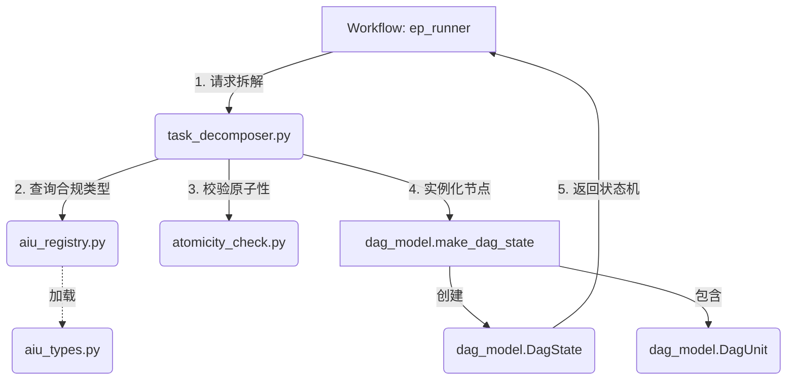

# DAG 层 (Directed Acyclic Graph)

## 1. 架构定位

DAG 层是木兰 (Mulan) 任务工程层 (Layer 1) 的核心数据结构与任务拆解模块。它负责将高层级的执行计划 (EP) 转化为机器可读的、带有依赖关系的原子任务图 (DAG)。
在木兰系统中，大模型不直接处理模糊的宏观需求，而是由 DAG 层将其拆解为一系列确定性的 **AIU (Atomic Intent Unit, 原子意图单元)**，从而实现“大任务拆小，小任务确定化”。

---

## 2. 核心文件结构与主要函数

### 2.1 状态与模型定义 (`dag_model.py`)
定义了 DAG 的核心数据结构和状态流转逻辑，是整个执行过程的状态机持久化载体。

- **`class DagUnit`**: 代表 DAG 图中的单个节点。
  - **核心属性**: `id` (如 U1), `title`, `files` (涉及文件), `depends_on` (依赖的 Unit ID 列表), `status` (当前状态: pending/in_progress/done/skipped/failed), `model_hint` (建议使用的模型)。
  - **`is_executable(self, done_ids: List[str]) -> bool`**: 核心业务逻辑，判断当前节点的所有前置依赖是否都已在 `done_ids` 中，决定该节点是否可被调度执行。
- **`class DagState`**: 代表整个 EP 的执行状态机图。
  - **核心属性**: `ep_id`, `units` (所有 DagUnit 列表), `overall_status`。
  - **`done_ids(self) -> List[str]`**: 获取所有状态为 `done` 的 Unit ID。
  - **`mark_done(self, unit_id: str, commit_hash: str)`**: 标记节点完成，并自动更新 `overall_status`。
  - **`to_dict()` / `from_dict()`**: 状态的序列化与反序列化，保存在 `docs/memory/_system/dag/` 下。
- **`make_dag_state(...) -> DagState`**: 工厂方法，将字典列表转化为强类型的 `DagState` 对象。

### 2.2 任务拆解引擎 (`task_decomposer.py`)
负责将自然语言的 EP Markdown 转化为结构化的 DAG 节点。

- **`class TaskDecomposer`**:
  - **`decompose(self, ep_doc: EpDocument) -> DagState`**: 核心入口。接收解析好的 EP 文档，调用大模型（或基于规则）将宏观的 Scope 步骤转化为标准的 AIU 序列，并推导它们之间的依赖关系（构建 DAG 边）。

### 2.3 原子意图单元定义 (`aiu_types.py` & `aiu_registry.py`)
定义了系统中所有合法的 AIU 类型及其严格的 Schema 约束。

- **`aiu_types.py`**:
  - **`class AIUType(str, Enum)`**: 枚举了木兰预定义的 9 族 43 种 AIU（如 `SCHEMA_ADD_FIELD`, `ENDPOINT_ADD`, `REFACTOR_EXTRACT_METHOD`）。
  - **`class AIUStep` / `class AIUPlan`**: Pydantic 数据模型，用于强类型校验大模型输出的执行步骤。
- **`aiu_registry.py`**:
  - **`class AIURegistry`**: 全局注册表。负责加载和提供特定 AIU 类型的验证规则、Prompt 模板和 Schema 定义，确保大模型生成的意图合法。

### 2.4 辅助分析模块
- **`atomicity_check.py`**: 
  - **`check_atomicity(unit: DagUnit)`**: 验证生成的 Unit 是否符合原子性要求（例如：单次修改的文件数量是否超标，逻辑是否过于复杂）。如果超标，会触发重新拆解。
- **`aiu_cost_estimator.py`**: 估算特定 AIU 执行所需的 Token 消耗和时间成本。
- **`aiu_feedback.py`**: 收集 AIU 执行成功/失败的反馈，用于后续优化拆解策略。

---

## 3. 模块间调用关系与数据流

### 3.1 数据流转 (Data Flow)
1. **输入**: `EpDocument` (来自 `workflow/ep_parser.py` 解析的 EP Markdown)。
2. **拆解**: `TaskDecomposer` 接收 `EpDocument`，结合 `AIURegistry` 中的约束，生成一组符合原子性要求的任务描述。
3. **校验**: 通过 `atomicity_check.py` 验证这些任务是否足够“原子”。
4. **建图**: 调用 `dag_model.make_dag_state()`，将任务列表转化为带有拓扑依赖的 `DagState` 对象。
5. **输出**: `DagState` 被持久化为 JSON，供 `workflow/ep_runner.py` 调度使用。

### 3.2 内部调用关系图

## 4. 状态流转机制

每个 `DagUnit` 在 `dag_model.py` 中具有以下严格的状态流转，驱动整个任务的断点续跑：

- `pending`: 初始状态。如果 `depends_on` 中的前置节点未全部 `done`，则保持此状态。
- `in_progress`: 被 `ep_runner` 选中并正在由 `Execution` 层执行。
- `done`: 执行成功，且通过了所有的独立验证。
- `skipped`: 被用户显式跳过，或在断点续跑时被预过滤。
- `failed`: 执行失败，且耗尽了重试次数（3-Strike）。