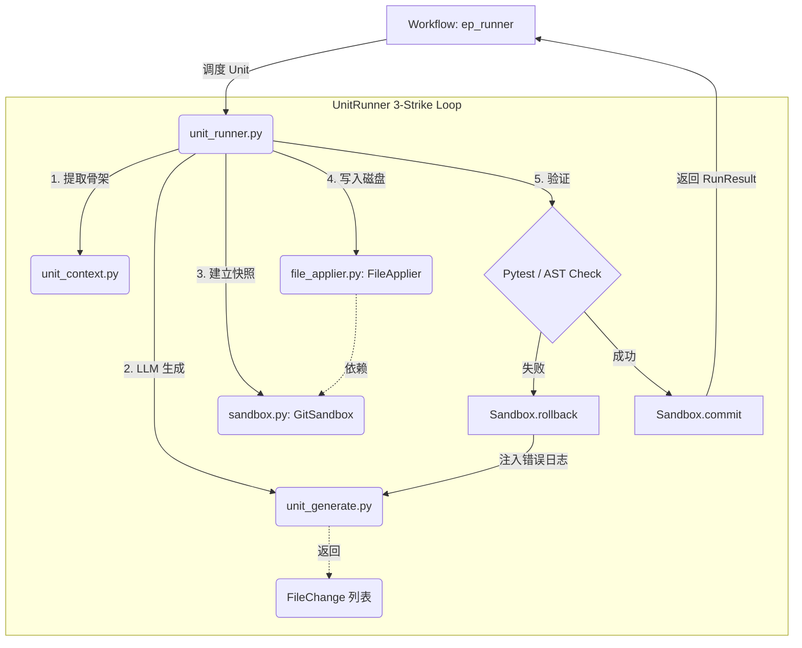

# 执行层 (Execution Layer)

## 1. 架构定位

执行层是木兰 (Mulan) 任务工程层 (Layer 1) 的“动作执行器”。它接收来自 DAG 层的 `DagUnit`，并在安全的沙箱环境中驱动大模型完成代码的生成、应用和验证。
执行层实现了“双轨执行引擎”（Track A 串行流水线和 Track B 自治循环），并提供了基于内存快照的轻量级沙箱隔离机制。

---

## 2. 核心文件结构与主要函数

### 2.1 双轨执行引擎
执行层根据模型能力，提供两条平行的执行轨道：

#### Track A: 串行流水线 (`unit_runner.py`)
面向小模型的确定性执行轨道，严格按照 DAG 拓扑顺序执行。
- **`class UnitRunner`**: 核心执行器，负责单个 DAG 节点的完整生命周期。
  - **`run(self) -> RunResult`**: 执行入口。内部实现了 **3-Strike 失败重试循环**。
  - **`_build_context(self) -> str`**: 组装上下文。调用 `unit_context.py` 提取目标文件的 AST 骨架和相关代码。
  - **`_generate_code(self) -> AiuOutputCarry`**: 调用 `unit_generate.py` 驱动 LLM 生成代码变更。
  - **`_apply_and_verify(self) -> Tuple[bool, str]`**: 调用 `FileApplier` 写入文件，并运行 Pytest 和 AST 检查。如果失败，提取错误日志供下一次 Strike 修复。
- **`class RunResult`**: 记录单次 Unit 执行的最终结果（成功/失败、耗时、错误日志）。

#### Track B: 自治循环 (`autonomous_runner.py`)
面向顶级大模型（如 Claude 3.5 Sonnet, Qwen 32B）的高自由度执行轨道。
- **`def run_autonomous(ep_id, model, ...) -> AutonomousResult`**: 启动 ReAct (Reason + Act) 循环。
- **`class AutonomousResult`**: 记录自治执行的最终状态。
- **`class MaxTurnsExceededError`**: 安全边界。当大模型调用工具陷入死循环，超过最大轮次（如 15 轮）时抛出，强制熔断。

### 2.2 沙箱与文件应用
保证 AI 生成的代码在验证通过前不污染主干工作区。

#### 文件应用器 (`file_applier.py`)
- **`class FileChange`**: 数据类，描述单个文件的变更（全量替换或 Diff 补丁）。
- **`class FileApplier`**:
  - **`apply(self, changes: List[FileChange], sandbox: GitSandbox) -> ApplyResult`**: 核心方法。接收 LLM 生成的变更，将其安全地写入本地文件系统。支持 AST 级别的 Diff 合并和正则替换。如果发生冲突，抛出异常交由 3-Strike 处理。

#### 内存沙箱 (`sandbox.py`)
提供基于内存快照的轻量级回滚机制，不依赖 `git stash`。
- **`class GitSandbox`**:
  - **`snapshot(self)`**: 在修改文件前，将目标文件的原始内容读取到内存字典 `_snapshot` 中。
  - **`rollback(self)`**: 验证失败时调用。将文件内容从内存恢复到磁盘，并删除期间新建的文件。
  - **`commit(self, message)`**: 验证通过时调用，将变更真正提交到 Git。

#### 物理沙箱（Phase 4 规划） (`sandboxed_runner.py`)
- **`class SandboxedCodeRunner`**: 当前提供轻量级的语法检查 (`ast.parse`) 和超时控制。未来将升级为完整的基于 Git Worktree 的物理目录隔离执行器。

### 2.3 辅助生成模块
- **`unit_context.py`**: 
  - **`build_unit_context()`**: 负责在 `UnitRunner` 执行前，收集极度压缩的上下文（如仅保留函数签名的 AST 骨架），避免撑爆小模型的 Context Window。
- **`unit_generate.py`**:
  - **`generate_unit_code()`**: 封装了与底层 LLM Provider 的交互逻辑，处理 Prompt 组装和 JSON/Markdown 解析。

---

## 3. 模块间调用关系与数据流

### 3.1 数据流转 (Track A 视角)
1. **输入**: `DagUnit` (包含要修改的文件和意图) + 当前代码库状态。
2. **上下文组装**: `UnitRunner` 调用 `unit_context` 提取相关代码。
3. **代码生成**: 调用 `unit_generate`，LLM 返回 `FileChange` 列表。
4. **沙箱快照**: `GitSandbox.snapshot()` 备份目标文件。
5. **文件应用**: `FileApplier.apply()` 将 `FileChange` 写入磁盘。
6. **验证**: 运行 Pytest 和 AST 检查。
   - 若失败：`GitSandbox.rollback()` 恢复文件，进入下一次 Strike。
   - 若成功：`GitSandbox.commit()` 固化变更。
7. **输出**: `RunResult` 返回给 Workflow 层。

### 3.2 内部调用关系图

