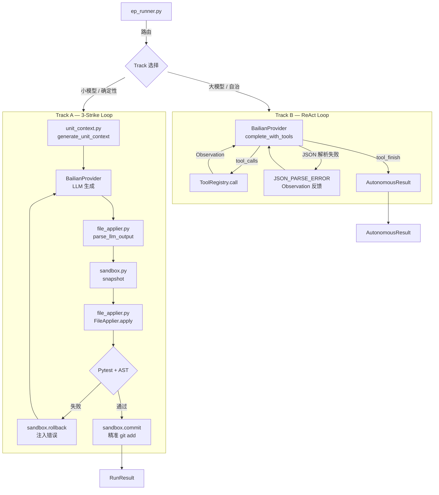

# 执行层 (Execution Layer)

> 最后更新：2026-05-04 | 状态：**生产就绪**（2 个关键 Bug 已修复，125 测试全通过）

---

## 1. 架构定位

执行层是木兰 (Mulan) 系统的"动作执行器"，位于任务工程层 (Layer 1) 的最底端。它接收来自 DAG 层的 `DagUnit`，在安全的沙箱环境中驱动大模型完成代码的生成、应用与验证。

**核心设计原则**：确定性约束下的全自动执行。

- 所有文件操作被精确约束在 `unit.files` 声明范围内（Scope Guard）
- 所有写操作在验证通过前可完整回滚（内存快照 Sandbox）
- 所有 LLM 交互错误被转化为结构化 Observation 而非异常崩溃

---

## 2. 模块全景


| 模块文件                   | 定位                      | 主要类/函数                                              |
| ---------------------- | ----------------------- | --------------------------------------------------- |
| `unit_runner.py`       | Track A：串行流水线核心         | `UnitRunner`, `BatchRunner`, `RunResult`            |
| `autonomous_runner.py` | Track B：自治 ReAct 循环     | `run_autonomous()`, `AutonomousResult`              |
| `sandbox.py`           | 内存快照沙箱                  | `GitSandbox`, `is_git_clean()`                      |
| `file_applier.py`      | 文件写入 + 守卫               | `FileApplier`, `validate_scope()`, `pre_validate()` |
| `unit_context.py`      | 上下文组装                   | `generate_unit_context()`, `extract_file_summary()` |
| `unit_generate.py`     | DAG 生成                  | `run_unit_generate()`                               |
| `internal_reviewer.py` | 双角色自评审（Feature Flag 控制） | `maybe_review()`, `_review_enabled()`               |
| `sandboxed_runner.py`  | 轻量语法检查沙箱                | `SandboxedCodeRunner`                               |


---

## 3. 双轨执行引擎

执行层根据模型能力自动路由到两条平行的执行轨道：

### Track A：串行流水线（`unit_runner.py`）

面向小模型（Qwen 8B/16B 等）的确定性执行轨道，严格按 DAG 拓扑顺序执行。

**核心类：`UnitRunner`**

```
UnitRunner.run(ep_id, unit_id, model, dry_run, confirm, save_output, project_root) -> RunResult
```

> **架构升级 (2026-05)**：已完成全局路径解耦，`UnitRunner` 和 `BatchRunner` 现接受 `project_root` 参数，不再依赖全局硬编码路径。

内部实现 **3-Strike 失败重试循环**：

```
[加载 Unit] → [组装上下文] → [LLM 生成代码] → [沙箱快照]
     ↓                                               ↓
[写入文件] → [Pytest + AST 验证]  →（通过）→ [git commit] → RunResult
                    ↓（失败）
              [rollback + 注入错误日志] → 下一次 Strike（最多 3 次）
```

- `_generate_unit_context()` / `_generate_unit_context_with_budget()`：组装极度压缩的上下文（仅函数签名 + docstring），避免超出小模型 Context Window。
- `_call_llm()`：调用 BailianProvider，返回 `(content, usage)` 元组。
- `_quick_syntax_check()`：写入前快速 AST 语法检查。
- `_run_arch_check()`：调用架构检查工具（可选）。
- `_run_tests()`：运行声明的 Pytest 测试文件，解析通过/失败。
- `_aiu_feedback_analysis()`：对历史 AIU 执行反馈进行分析，提供模型/Token 建议。

**辅助类：`BatchRunner`**

按 EP 中的 DAG 顺序批量执行待执行的 Unit，顺序（非并行）调度，每个 Unit 完成后才执行下一个。

---

### Track B：自治循环（`autonomous_runner.py`）

面向顶级大模型（Qwen 32B / qwen3-coder-plus 等）的高自由度执行轨道，实现 ReAct（Reason + Act）自治循环。

**核心函数：`run_autonomous()`**

```python
run_autonomous(
    ep_id: str,
    model: str,
    dry_run: bool = True,
    max_turns: int = 10,
    task_desc: str = "",
    verbose: bool = False,
    raise_on_max_turns: bool = False,
) -> AutonomousResult
```

**安全边界**（三重守护）：


| 守护机制                | 触发条件         | 行为                                           |
| ------------------- | ------------ | -------------------------------------------- |
| `max_turns` 轮次熔断    | 累计轮次超限       | `finish_reason="max_turns"`, `success=False` |
| `token_budget` 预算熔断 | 累计 token 超上限 | 强制结束当前轮                                      |
| `timeout_s` 超时熔断    | 总执行时间超限      | 强制结束并汇报进度                                    |


`**AutonomousResult` 结构**：

- `success: bool` — 是否成功完成
- `finish_reason: str` — `"tool_finish"` | `"max_turns"` | `"timeout"` | `"error"`
- `turns_used: int` — 实际消耗轮次
- `turns: List[TurnRecord]` — 每轮的工具调用记录
- `final_summary: str` — LLM 自述的完成摘要

**Bug 修复（2026-05-04）**：原代码静默吞咽 `json.JSONDecodeError`，现已改为将解析错误作为 `[JSON_PARSE_ERROR]` Observation 反馈给 LLM，使其在下一轮自我修正，不再传递空 `{}` 导致 `TypeError` 崩溃。

---

## 4. 沙箱与文件守卫

### 4.1 内存快照沙箱（`sandbox.py`）

提供基于内存字典的轻量级回滚机制，**不依赖 `git stash`**（避免影响用户工作区其他变更）。

`**GitSandbox` 核心接口**：


| 方法                                 | 说明                                         |
| ---------------------------------- | ------------------------------------------ |
| `snapshot()`                       | 将 `unit.files` 声明的文件原始内容读入内存字典 `_snapshot` |
| `rollback()`                       | 从内存恢复文件；原本不存在的文件（新建的）直接删除                  |
| `mark_new_file(rel_path)`          | 标记由 FileApplier 新建的文件，回滚时一并清理              |
| `commit(message) -> Optional[str]` | 验证通过时提交变更，返回 short commit hash             |
| `diff_stat() -> str`               | 返回 `git diff --stat` 摘要（供 dry-run 展示）      |


**辅助函数**：

- `is_git_clean()` — 检查工作区是否干净
- `get_tracked_status(files)` — 返回每个文件的 Git 追踪状态

**关键安全修复（2026-05-04 — Bug 1）**：

`commit()` 原使用 `git add -A` 导致沙箱逃逸（工作区所有修改被混入 EP commit）。已修复为精准 add：

```python
# 当前实现（安全）
precise_files = list(dict.fromkeys(self.files + self._new_files))
if not precise_files:
    return None  # 无文件声明，不触发任何 git 操作
subprocess.run(["git", "add", "--"] + precise_files, ...)
```

三条安全约束：

1. 只 add `unit.files` 声明的文件 + `mark_new_file` 注册的新文件
2. `--` 分隔符防止路径被误解释为 git 选项
3. 空文件列表直接返回 `None`，不调用任何 git 命令

---

### 4.2 文件写入与守卫（`file_applier.py`）

**核心数据类**：

- `FileChange(path, action, content, language)` — 单文件变更描述（`action` 为 `"create"` | `"replace"` | `"patch"`）
- `ApplyResult(path, action, success, error)` — 单文件应用结果
- `ScopeViolationError` — 越界写入异常（strict 模式下抛出）
- `ParseError` — LLM 输出解析失败

**核心函数**：


| 函数                                                                             | 说明                                                                                      |
| ------------------------------------------------------------------------------ | --------------------------------------------------------------------------------------- |
| `parse_llm_output(raw) -> List[FileChange]`                                    | 从 LLM 原始输出中解析 `MMS_FILE_CHANGES_BEGIN/END` 块                                            |
| `validate_scope(changes, allowed_files, strict) -> List[str]`                  | Scope Guard：`strict=True` 抛出异常，`strict=False` 返回违规路径列表                                  |
| `pre_validate(change) -> Optional[str]`                                        | 写入前语法预验证；Python 使用 `ast.parse` 以及 `**pyflakes` 静态分析**，YAML/JSON 使用各自的解析器，返回 `None` 表示通过 |
| `parse_and_validate(raw, allowed_files) -> Tuple[List[FileChange], List[str]]` | 组合：解析 + Scope Guard + 预验证，返回通过的变更列表和错误列表                                                |


> **强化语法预验证 (2026-05)**：`pre_validate` 现已集成 `pyflakes`。除了基础的 AST 解析外，还能在写入前捕获未定义的变量 (`NameError`)、未导入的模块 (`ImportError`) 等深层静态语法错误，大幅提升了生成代码的可靠性。

`**FileApplier.apply()` 执行流程**：

```
Step 1: Scope Guard（validate_scope）— 过滤或拒绝越界文件
Step 2: 强化语法预验证（pre_validate，含 pyflakes）— Python / YAML / JSON
Step 3: action 检查（create 不覆盖已有文件，除非 force=True）
Step 4: 写入磁盘（自动创建父目录）
Step 5: 标记新文件到 GitSandbox（供 rollback 清理）
```

---

### 4.3 轻量语法沙箱（`sandboxed_runner.py`）

面向独立代码片段的轻量级验证器，**不依赖 GitSandbox**（无 git 副作用）。

`SandboxedCodeRunner` 提供：

- `check_syntax(code, file_path) -> (bool, str)` — Python 文件 `ast.parse` 检查，非 Python 直接通过
- `run_pytest(code, file_path, test_script) -> (Optional[bool], str)` — 写入临时目录并运行 pytest，有超时控制（默认 60s）

> 定位为轻量工具，与 `GitSandbox` 无耦合。完整 Git Worktree 隔离方案为 Phase 4 规划项。

---

## 5. 上下文与生成

### 5.1 上下文组装（`unit_context.py`）

在 LLM 生成代码前，负责将相关代码压缩为 token 高效的上下文。

**核心函数**：


| 函数                                                   | 说明                                        |
| ---------------------------------------------------- | ----------------------------------------- |
| `extract_file_summary(file_path, max_tokens)`        | 提取文件的函数签名 + 类定义 + docstring，控制在 token 上限内 |
| `extract_layer_contracts(layer, max_tokens)`         | 提取所在层的架构契约（从 memory 文件读取）                 |
| `inject_relevant_memories(layer, files, max_tokens)` | 注入相关的 Seed Memory 片段                      |
| `generate_unit_context(unit, model, ...)`            | 综合以上，为 UnitRunner 生成完整的上下文字符串             |
| `generate_from_dag(ep_id, unit_id, model)`           | 从 EP DAG 文件加载 Unit 并生成上下文（CLI 入口）         |
| `estimate_tokens(text)`                              | 粗略估算 token 数（字符数 × 0.2）                   |


### 5.2 DAG 生成（`unit_generate.py`）

负责解析 EP 文档并调用 LLM 生成 DAG 状态文件。

**核心入口**：`run_unit_generate(ep_id, force, no_llm) -> int`

内部流程：

1. 解析 EP Markdown 文件 → 提取 Unit 列表
2. 调用 LLM（`_call_llm_generate_dag()`）生成 DAG 草图
3. 解析草图 JSON（`_repair_and_parse_json()`，具备 JSON 修复能力）
4. 标注 Atomicity（`_annotate_atomicity()`）
5. 写入 `DagState` 文件

---

## 6. 双角色自评审（`internal_reviewer.py`）

**默认关闭**。通过以下方式开启：

```bash
export MMS_ENABLE_INTERNAL_REVIEW=true
# 或 config.yaml: runner.enable_internal_review: true
```

**工作流**（开启时）：

```
Coder 生成代码 Diff
    → Reviewer（另一个 LLM 实例）按 Ontology + AC 审查
    → APPROVED：直接通过
    → VIOLATION：返回 feedback 打回 Coder 重写（最多 _MAX_REVIEW_ROUNDS=2 次）
    → 超过轮数：强制通过（带 [评审超次] 标记），不阻塞工作流
```

**核心接口**：

```python
maybe_review(
    diff_content: str,
    ontology_context: str = "",
    unit_meta: Optional[dict] = None,
) -> Tuple[str, bool, str]
# 返回 (final_content, accepted, feedback)
# flag 关闭时：直接返回 (diff_content, True, "")，零 LLM 调用
```

---

## 7. 模块间调用关系




---

## 8. Bug 修复记录

### Bug 1（Critical）：`sandbox.py` 沙箱逃逸 — ✅ 已修复（2026-05-04）


| 项        | 内容                                                                   |
| -------- | -------------------------------------------------------------------- |
| **问题**   | `commit()` 使用 `git add -A`，将工作区所有未提交修改（含 `.env`、API Key）混入 EP commit |
| **影响**   | 沙箱隔离边界完全失效，敏感文件可能泄露至 Git 历史                                          |
| **修复**   | 改为 `git add -- <精准文件列表>`，空列表时提前返回 `None`                             |
| **测试锁定** | `tests/execution/test_sandbox_bug1_regression.py`（9 个回归测试）           |


### Bug 2（High）：`autonomous_runner.py` JSONDecodeError 静默 — ✅ 已修复（2026-05-04）


| 项        | 内容                                                                                                                     |
| -------- | ---------------------------------------------------------------------------------------------------------------------- |
| **问题**   | `except json.JSONDecodeError: tool_args = {}` 静默设置空字典，导致 `tool_registry.call()` 因缺少必填参数抛出不受控的 `TypeError`，使 ReAct 循环崩溃 |
| **影响**   | Track B 在 LLM 输出格式不规范时完全崩溃，无法自愈                                                                                        |
| **修复**   | 错误转化为 `[JSON_PARSE_ERROR]` Observation 写入消息历史，LLM 在下一轮感知并自我修正                                                          |
| **测试锁定** | `tests/execution/test_autonomous_runner_bug2_regression.py`（9 个回归测试）                                                   |


---

## 9. 测试覆盖状态


| 测试文件                                                        | 覆盖目标                                                      | 用例数                | 状态             |
| ----------------------------------------------------------- | --------------------------------------------------------- | ------------------ | -------------- |
| `tests/test_sandbox.py`                                     | snapshot / rollback / context-manager / helper            | 17                 | ✅              |
| `tests/test_file_applier.py`                                | parse / scope / pre_validate / apply / parse_and_validate | 30                 | ✅              |
| `tests/test_autonomous_runner_control.py`                   | max_turns / error / dry_run / tool_finish                 | 12                 | ✅              |
| `tests/test_unit_runner.py`                                 | 3-strike / timeout / turn 计数（含 2 xfail）                   | 11                 | ✅              |
| `tests/execution/test_sandbox_bug1_regression.py`           | **Bug 1 回归**：精准 add / `--` 分隔符 / 去重 / 空列表安全               | 9                  | ✅              |
| `tests/execution/test_autonomous_runner_bug2_regression.py` | **Bug 2 回归**：JSON 错误反馈 / 自愈 / 不以空 `{}` 调用工具               | 9                  | ✅              |
| `tests/execution/test_file_applier_scope_guard.py`          | Scope Guard 精度 / 路径遍历防御 / 语法验证 9 种情况 / apply 结构           | 22                 | ✅              |
| `tests/execution/test_internal_reviewer_flag.py`            | Feature Flag 开关 / 直通 / APPROVED / VIOLATION / 超轮数         | 15                 | ✅              |
| **合计**                                                      |                                                           | **125（含 2 xfail）** | **123 passed** |


详细测试计划见 `[execution_test_plan.md](execution_test_plan.md)`。

---

## 10. 待办（P3，低优先级）


| 项目                                | 说明                                 |
| --------------------------------- | ---------------------------------- |
| `autonomous_runner.py` timeout 测试 | 已有 xfail 占位，需真实计时环境                |
| VCR cassette 录制                   | 录制真实 LLM 响应用于完整回归，需联网环境            |
| `sandboxed_runner.py` 集成测试        | 与 GitSandbox + FileApplier 全链路集成测试 |
| Track B 并行化                       | BatchRunner 当前顺序执行，Phase 5 规划并行调度  |


