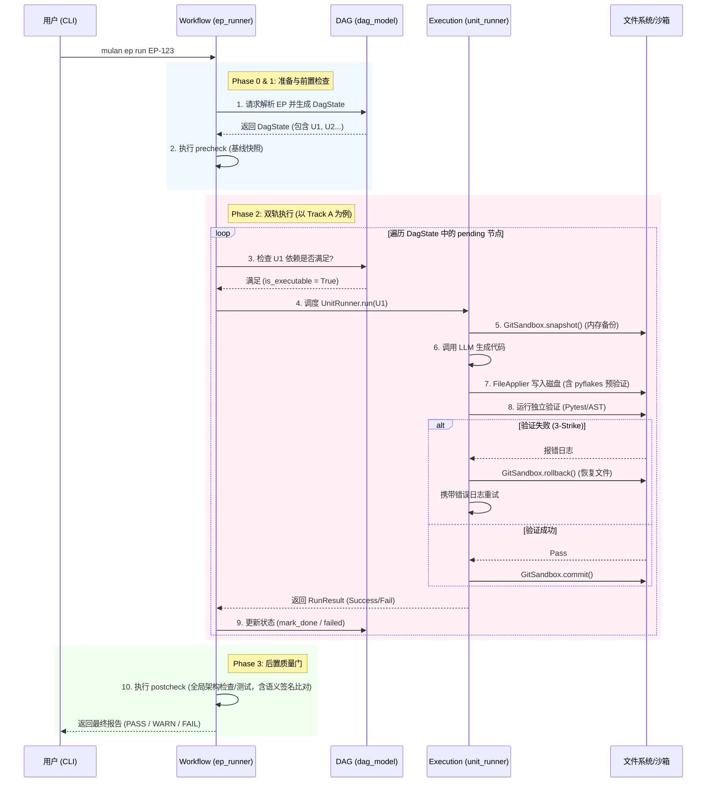

# 任务工程层 (Task Engineering Layer - Layer 1)

## 1. 架构定位

任务工程层位于木兰 (Mulan) AIOS 架构的 **Layer 1**。它是整个 AI 编码工具链的大脑和中枢神经，负责将自然语言描述的、模糊的业务需求，转化为机器可执行的、确定性的原子操作序列，并最终驱动底层大模型完成代码变更。

本层**不直接**与大模型交互生成代码，也**不直接**解析代码 AST。它通过调用 **Layer 2 (知识本体层)** 获取架构上下文，调用 **Layer 3 (代码生成层)** 执行具体的编码任务，并依赖 **Layer 4 (安全验证层)** 进行质量门控。

任务工程层由三个核心子模块组成，它们协同工作以实现“确定性约束下的全自动执行”：

1. **Workflow (生命周期编排)**：负责宏观流程控制、状态流转和全局安全门控。
2. **DAG (数据结构与拆解)**：负责将任务拆解为有向无环图，管理节点状态和依赖。
3. **Execution (动作执行器)**：负责在沙箱中驱动大模型生成代码、应用变更并执行验证。

---

## 2. 核心子模块详解

### 2.1 Workflow 模块 (生命周期编排)

**目录**: `src/mms/workflow/` | **详情**: 请参阅 `[workflow_readme.md](./workflow/workflow_readme.md)`

Workflow 模块是 Layer 1 的入口和总控。它负责：

- **意图合成 (`synthesizer.py`)**: 将用户输入转化为结构化的 EP (Execution Plan) Markdown。
- **EP 解析 (`ep_parser.py`)**: 将 EP 文本解析为内存数据结构，支持极强的容错降级策略。
- **全局门控 (`precheck.py`, `postcheck.py`)**: 在代码生成前后执行基线快照、架构合规检查和单元测试。近期引入了**语义签名 (Semantic Signature)** 技术，通过去除行号等信息来比较架构违规，有效解决了代码修改导致的“行号漂移”误报问题。
- **核心引擎 (`ep_runner.py`)**: 驱动状态机流转，支持断点续跑，并根据模型能力路由到 Track A 或 Track B。

> **最新架构升级 (2026-05)**：Workflow 模块已完成**全局路径解耦**。移除了所有硬编码的全局路径变量（如 `_ROOT`, `_EP_DIR` 等），全面采用 `project_root` 参数进行动态路径解析。这使得 Workflow 引擎完全环境无关，极大地提升了可移植性和可测试性。

### 2.2 DAG 模块 (数据结构与拆解)

**目录**: `src/mms/dag/` | **详情**: 请参阅 `[dag_readme.md](./dag/dag_readme.md)`

DAG 模块定义了任务的微观结构。它负责：

- **状态模型 (`dag_model.py`)**: 维护 `DagState` 和 `DagUnit`，管理 `pending` -> `in_progress` -> `done` 的状态变迁。支持基于 `project_root` 的动态持久化。
- **任务拆解 (`task_decomposer.py`)**: 将宏观的 EP 拆解为具有拓扑依赖关系的原子任务图。最新版本**恢复了稀疏依赖 (`depends_on`)** 的解析与保留，并加入了**循环依赖检测**，为未来的细粒度并发执行奠定了基础。
- **代价估算 (`aiu_cost_estimator.py`)**: 负责估算 AIU 执行的 Token 成本。已完成 **CBO (基于代价的优化器) 解耦**，允许动态注入历史成功率数据提供者 (`success_rate_provider`)，消除了对底层文件 I/O 的硬依赖。
- **原子意图单元 (`aiu_types.py`, `aiu_registry.py`)**: 定义了 9 族 43 种标准化的 AIU，确保大模型的每一步动作都有明确的 Schema 约束。

### 2.3 Execution 模块 (动作执行器)

**目录**: `src/mms/execution/` | **详情**: 请参阅 `[execution_readme.md](./execution/execution_readme.md)`

Execution 模块负责将 DAG 节点转化为实际的代码变更。它实现了双轨执行引擎：

- **Track A (`unit_runner.py`)**: 面向小模型的串行流水线。严格按照 DAG 顺序执行，包含上下文组装、代码生成、Diff 应用和 **3-Strike 失败重试**机制。已支持基于 `project_root` 的动态路径。
- **Track B (`autonomous_runner.py`)**: 面向顶级大模型的自治循环。基于 ReAct 模式，允许大模型自主调用工具完成任务，受限于最大轮次（Max Turns）安全边界。
- **沙箱与应用 (`sandbox.py`, `file_applier.py`)**: 提供基于内存快照的轻量级 GitSandbox。在修改文件前建立快照，一旦验证失败立即回滚。`file_applier.py` 最新集成了 **pyflakes 强化语法预验证**，在写入磁盘前进行深度的静态分析（如 NameError, ImportError 检测），将错误拦截在更早的阶段。

---

## 3. 模块间协同与状态流转 (The Big Picture)

Workflow, DAG, Execution 三者之间有着严格的调用规则和数据流转边界。

### 3.1 调用规则与边界

1. **Workflow 是唯一的主控节点**：用户通过 CLI (`mulan ep run`) 触发 Workflow。Workflow 负责调用 DAG 进行解析，调用 Execution 进行执行。DAG 和 Execution 之间**互不直接调用**。
2. **统一安全门控**：无论 Execution 层走哪条轨道（Track A 的流水线或 Track B 的自治），都必须在 Workflow 的 `precheck`（基线快照）之后、`postcheck`（全局验证）之前执行。
3. **状态机驱动**：Workflow 通过读取和更新 DAG 层的 `DagState` 来决定下一步动作，实现断点续跑和幂等跳过。

### 3.2 跨模块全链路流转图

## 4. 测试与覆盖率

Layer 1 拥有极高的测试标准，整体覆盖率达到 **65%+**。测试用例分布在 `tests/integration/` 目录下，涵盖了：

- 多语言（Java, Python, Go）的 E2E 流程验证。
- 状态机断点续跑、幂等跳过（Idempotency）的回归测试。
- 各种极端情况下的容错降级测试（如 Markdown 格式畸形、工具崩溃、依赖缺失）。
- **全局路径解耦后的全面回归测试**，确保在隔离的 `tmp_path` 环境中各项功能正常运行。

