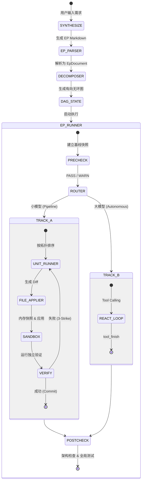

# 任务工程层 (Task Engineering Layer - Layer 1)

## 1. 架构定位

任务工程层位于木兰 (Mulan) AIOS 架构的 **Layer 1**。它是整个 AI 编码工具链的大脑和中枢神经，负责将自然语言描述的、模糊的业务需求，转化为机器可执行的、确定性的原子操作序列，并最终驱动底层大模型完成代码变更。

本层**不直接**与大模型交互生成代码，也**不直接**解析代码 AST。它通过调用 **Layer 2 (知识本体层)** 获取架构上下文，调用 **Layer 3 (代码生成层)** 执行具体的编码任务，并依赖 **Layer 4 (安全验证层)** 进行质量门控。

任务工程层由三个核心子模块组成，它们协同工作以实现“确定性约束下的全自动执行”：

1. **Workflow (生命周期编排)**：负责宏观流程控制、状态流转和全局安全门控。
2. **DAG (数据结构与拆解)**：负责将任务拆解为有向无环图，管理节点状态和依赖。
3. **Execution (动作执行器)**：负责在沙箱中驱动大模型生成代码、应用变更并执行验证。

---

## 2. Workflow 模块 (生命周期编排)

**目录**: `src/mms/workflow/`
**详情**: 请参阅 [`workflow_readme.md`](./workflow/workflow_readme.md)

Workflow 模块是 Layer 1 的入口和总控。它负责：
- **意图合成 (`synthesizer.py`)**: 将用户输入转化为结构化的 EP (Execution Plan) Markdown。
- **EP 解析 (`ep_parser.py`)**: 将 EP 文本解析为内存数据结构，支持极强的容错降级策略。
- **全局门控 (`precheck.py`, `postcheck.py`)**: 在代码生成前后执行基线快照、架构合规检查和单元测试。
- **核心引擎 (`ep_runner.py`)**: 驱动状态机流转，支持断点续跑，并根据模型能力路由到 Track A 或 Track B。

> **核心原则**：Track A 和 Track B 共享同一套全局安全门控（precheck/postcheck），确保无论大模型采取何种执行策略，底线安全不被击穿。

---

## 3. DAG 模块 (数据结构与拆解)

**目录**: `src/mms/dag/`
**详情**: 请参阅 [`dag_readme.md`](./dag/dag_readme.md)

DAG 模块定义了任务的微观结构。它负责：
- **状态模型 (`dag_model.py`)**: 维护 `DagState` 和 `DagUnit`，管理 `pending` -> `in_progress` -> `done` 的状态变迁。
- **任务拆解 (`task_decomposer.py`)**: 将宏观的 EP 拆解为具有拓扑依赖关系的原子任务图。
- **原子意图单元 (`aiu_types.py`, `aiu_registry.py`)**: 定义了 9 族 43 种标准化的 AIU（如 `SCHEMA_ADD_FIELD`），确保大模型的每一步动作都有明确的 Schema 约束。

---

## 4. Execution 模块 (动作执行器)

**目录**: `src/mms/execution/`
**详情**: 请参阅 [`execution_readme.md`](./execution/execution_readme.md)

Execution 模块负责将 DAG 节点转化为实际的代码变更。它实现了双轨执行引擎：
- **Track A (`unit_runner.py`)**: 面向小模型的串行流水线。严格按照 DAG 顺序执行，包含上下文组装、代码生成、Diff 应用和 **3-Strike 失败重试**机制。
- **Track B (`autonomous_runner.py`)**: 面向顶级大模型的自治循环。基于 ReAct 模式，允许大模型自主调用工具完成任务，受限于最大轮次（Max Turns）安全边界。
- **沙箱与应用 (`sandbox.py`, `file_applier.py`)**: 提供基于内存快照的轻量级 GitSandbox。在修改文件前建立快照，一旦验证失败立即回滚，确保工作区不被污染。

---

## 5. 整体执行流转图

## 6. 测试与覆盖率

Layer 1 拥有极高的测试标准，整体覆盖率达到 **65%+**。测试用例分布在 `tests/integration/` 目录下，涵盖了：
- 多语言（Java, Python, Go）的 E2E 流程验证。
- 状态机断点续跑、幂等跳过（Idempotency）的回归测试。
- 各种极端情况下的容错降级测试（如 Markdown 格式畸形、工具崩溃、依赖缺失）。