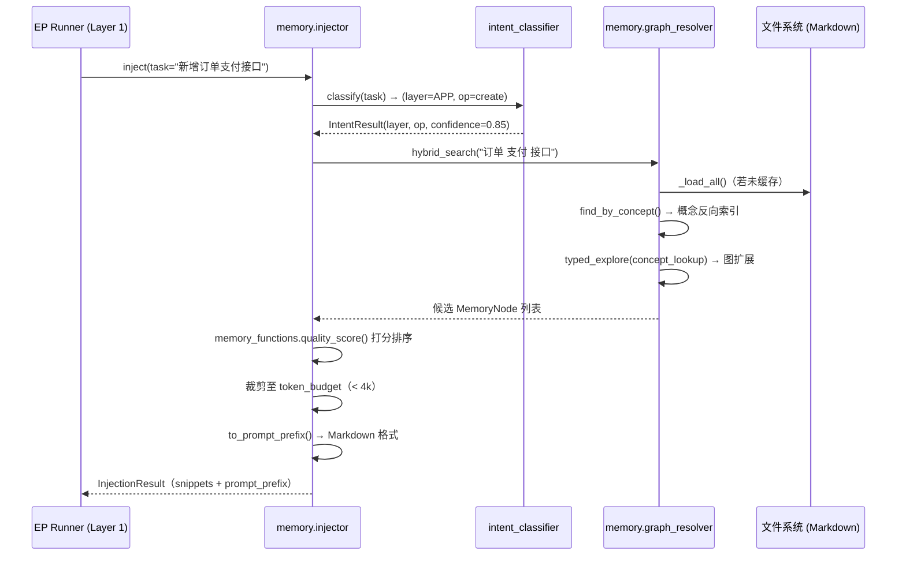
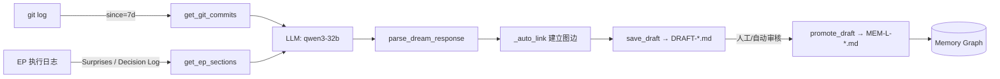
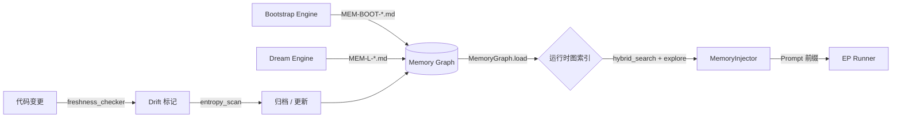

# MMS Memory 模块 (src/mms/memory)

> **最后更新**：2026-05-06 | Memory Engine v3.1（兼容 Schema v5.0）

## 1. 模块定位

`src/mms/memory` 是 MMS 系统的**记忆管理与知识图谱计算引擎（Memory Management & Knowledge Graph Engine）**。它是 Layer 2 的核心操作层，负责：

- 将分散的 Markdown 记忆文件解析为内存图结构
- 在 EP 执行前精准注入上下文（上下文窗口 < 4k tokens）
- 基于 EP 执行日志的知识自动萃取与沉淀（dream）
- 图谱健康度监控与腐化记忆检测（entropy_scan / freshness_checker）

**设计约束**：Memory Engine 不依赖任何外部数据库，所有数据持久化为纯文本 Markdown，通过 front-matter v4.0 标准格式与 Bootstrap Engine 解耦通信。

---

## 2. 模块清单（16 个文件）

| 文件 | 类/入口 | 职责 | 覆盖率 |
|------|---------|------|--------|
| `graph_resolver.py` | `MemoryGraph` | 核心图结构：加载 / 遍历 / 混合检索 | 72% |
| `injector.py` | `MemoryInjector` | EP 执行前上下文注入（Prompt 组装） | 76% |
| `intent_classifier.py` | `IntentClassifier` | 3 级意图漏斗（规则→本体→LLM） | 61% |
| `task_matcher.py` | `TaskMatcher` | 任务-记忆历史相关度匹配（Jaccard） | 85% |
| `memory_functions.py` | 纯函数 | quality_score / provenance / format_for_context | 99% |
| `memory_actions.py` | `ActionResult` | 有状态动作（写节点 / 矛盾检测 / archive） | 56% |
| `link_registry.py` | `LinkTypeRegistry` | LinkType YAML 注册表（8 种边类型） | 84% |
| `freshness_checker.py` | 函数集合 | 记忆新鲜度检测（`fn_detect_drift`） | 68% |
| `graph_health.py` | 函数集合 | 图健康监控（孤岛 / 高出度 / 低质量） | 83% |
| `dream.py` | 函数集合 | autoDream：git 历史 + EP 日志 → 知识草稿 | 63% |
| `entropy_scan.py` | 函数集合 | 熵扫描：孤儿 / 过时 / 重复标题检测 | 49% |
| `codemap.py` | 函数集合 | 代码目录树文本化（`generate_codemap`） | 29% |
| `funcmap.py` | 函数集合 | 后端函数列表生成（`generate_funcmap`） | 60% |
| `repo_map.py` | `RepoMap` | 仓库结构 token 预算上下文（`build_context`） | 76% |
| `template_lib.py` | `TemplateLib` | EP 模板库（只读数据，懒加载） | 78% |
| `private.py` | `PrivateWorkspace` | EP 私有工作区（草稿 / 历史记录） | — |

---

## 3. 核心组件详解

### `graph_resolver.py` — 知识图谱核心（`MemoryGraph`）

将散落的 Markdown 文件解析为内存中的有向图结构，提供混合检索能力。

**数据结构**：

```python
@dataclass
class MemoryNode:
    id: str
    layer: str        # v5.0 通用层 ID：ADAPTER/APP/DOMAIN/PLATFORM/CC/CC_testing 等
                      # （向后兼容旧版 L5_api/L4_service/L3_ontology 等）
    tier: str         # hot / warm / cold / archive
    tags: List[str]
    cites_files: List[str]
    about_concepts: List[str]
    related_to: List[str]
    impacts: List[str]
    derived_from: List[str]
    ast_pointer: dict   # file_path / class_name / drift
    provenance: dict    # trigger_type / generated_at / layer_confidence
    raw_content: str
```

**核心方法**：

- `load(memory_root)` / `_load_all()`: 遍历 `docs/memory/shared/`，解析所有记忆文件建立索引和反向概念索引。
- `hybrid_search(keywords, limit)`: 混合检索——优先 `find_by_concept()`（O(1) 概念反向索引），不足时 fallback 到 `_keyword_fallback()`（标题 + tags Jaccard 匹配）。
- `explore(start_id, depth)` / `typed_explore(start_id, path_intent)`: BFS 图遍历；`typed_explore` 沿可配置的 LinkType 有向边路径遍历（路径配置来自 `assets/ontology_schema/_config/traversal_paths.yaml`）。
- `find_by_file(file_path)`: 反查引用某代码文件的所有记忆节点。
- `build_context(files, memories, token_budget)`: 给定文件列表和记忆 ID，图扩展并裁剪至 token 预算。
- `stats()`: 统计节点数、Tier 分布、层分布。

**图遍历路径（可配置）**：

| 路径名 | 边序列 | 用途 |
|--------|--------|------|
| `concept_lookup` | `about → related_to` | 概念级知识查询 |
| `code_change_impact` | `cites → impacts` | 代码变更影响分析 |
| `knowledge_expand` | `related_to → derived_from` | 知识图谱扩展 |
| `drift_propagation` | `cites_reverse → about` | 新鲜度漂移传播 |

---

### `injector.py` — 上下文注入器（`MemoryInjector`）

在 EP 执行前，将记忆图谱检索结果组装为 Prompt 前缀，精准控制 token 预算。

**数据结构**：

```python
@dataclass
class InjectionResult:
    snippets: List[MemorySnippet]  # 注入的记忆片段列表
    total_tokens: int
    layers_covered: List[str]
    prompt_prefix: str             # 最终的 Markdown 格式前缀
```

**核心方法**：

- `inject(task_description, token_budget, layers)`: 主入口——分类任务意图 → 检索候选记忆 → 评分排序 → 裁剪至预算 → 返回 `InjectionResult`。
- `_classify_task(task)`: 分析任务描述，确定需优先检索的架构层（调用 `IntentClassifier`）。
- `to_prompt_prefix(result)`: 将注入结果格式化为 Markdown 上下文前缀（供 Cursor 使用）。

---

### `intent_classifier.py` — 3 级意图漏斗（`IntentClassifier`）

将自然语言任务描述映射为 `(layer, operation)` 坐标，驱动后续记忆检索策略。

**三级漏斗**：

```
Level 1：规则匹配（RBO）
  ├── 读取 docs/memory/_system/routing/intent_map.yaml
  ├── 关键词命中 + min_hit_ratio 过滤
  └── confidence_boost 加权

Level 2：本体匹配（Ontology）
  ├── 基于 layers.yaml 的层关键词扩展匹配
  └── 操作类型（operations.yaml）语义对齐

Level 3：LLM Fallback
  └── qwen3-32b 判断（仅在 Level 1/2 置信度 < 阈值时触发）
```

**核心方法**：

- `classify(task_description)`: 执行三级漏斗，返回 `IntentResult(layer, operation, confidence, matched_rule_id)`。
- `build_intent_plan_line(intent_result, unit_id)`: 生成 EP 中的意图计划行（用于 precheck 输出）。

---

### `task_matcher.py` — 任务-记忆匹配器（`TaskMatcher`）

基于历史任务执行记录，为新任务找到相似的历史记录和关联记忆。

**数据结构**：

```python
@dataclass
class TaskRecord:
    task_id: str
    description: str
    tags: List[str]        # extract_tags() 自动生成
    hit_memories: List[str]  # 该任务命中的记忆 ID 列表
    hit_files: List[str]

@dataclass
class MatchResult:
    record: TaskRecord
    similarity: float      # Jaccard 相似度（0.0 ~ 1.0）
    method: str            # "jaccard"
```

**核心方法**：

- `extract_tags(task_description)`: 从任务描述提取关键词 tag 集合。
- `build_record(task_description, hit_memories, hit_files)`: 构建 `TaskRecord`（标准化 tags）。
- `find_similar(query_task, k)`: 在历史记录中找最相似的 k 条（Jaccard 相似度）。
- `persist(record)`: 将 `TaskRecord` 写入磁盘（JSON Lines 格式）。

---

### `dream.py` — autoDream 知识萃取引擎

从 git 历史和 EP 完成日志中自动提取知识草稿。

**核心流程**：

```
git log（since=7d）→ get_git_commits()
                       ↓
EP 完成日志 → get_ep_sections()（Surprises / Decision Log 节）
                       ↓
LLM（qwen3-32b）→ parse_dream_response()
                       ↓
_auto_link()（自动建立 related_to / derived_from 边）
                       ↓
save_draft() → docs/memory/private/EP-NNN/DRAFT-*.md
                       ↓
promote_draft() → docs/memory/shared/{layer}/MEM-L-*.md
```

**核心函数**：

- `run_dream(ep_id, since, force_llm)`: 主入口，协调全流程。
- `save_draft(ep_id, draft)`: 保存知识草稿到私有工作区。
- `promote_draft(draft_path)`: 将已审核的草稿提升为正式记忆。
- `_auto_link(content, fm)`: 自动识别正文中引用的记忆 ID 并建立图边。

---

### `entropy_scan.py` — 熵扫描器

定期扫描图谱健康状态，识别需要清理的腐化记忆。

**核心函数**：

| 函数 | 检测对象 |
|------|---------|
| `scan_orphans(indexed)` | 在文件系统存在但未在索引中记录的"孤儿"文件 |
| `scan_ghost_entries(indexed)` | 在索引中记录但文件不存在的"幽灵"条目 |
| `scan_stale_hot(indexed)` | Hot tier 但超过 N 天未访问的记忆 |
| `scan_zero_access(indexed)` | 创建超过 M 天但从未被访问过的记忆 |
| `scan_duplicate_titles(indexed)` | 前 N 字符相同的重复标题 |
| `scan_stale_private()` | 私有草稿工作区中超期的 EP 临时文件 |

---

### `link_registry.py` — LinkType 注册表（`LinkTypeRegistry`）

从 `assets/ontology_schema/links/*.yaml` 加载 8 种边类型定义。

**8 种 LinkType**：`related_to`、`impacts`、`derived_from`、`cites`、`implements`、`depends_on`、`about`、`contradicts`

---

## 4. 业务流程图

### 4.1 上下文注入流程（Context Injection）



### 4.2 知识萃取流程（autoDream）



### 4.3 知识图谱整体数据流



---

## 5. 记忆节点 Front-matter 标准格式（v5.0）

v5.0 使用聚焦 ObjectType 代替通用 `MemoryNode`（God Object 拆分），`layer` 字段直接使用通用层 ID：

```yaml
---
id: PAT-001                  # Pattern: PAT-* / Decision: AD-* / AntiPattern: ANTI-* / BusinessFlow: BIZ-*
object_type: pattern         # pattern / decision / anti-pattern / business-flow
layer: DOMAIN                # v5.0 通用层 ID（ADAPTER/APP/DOMAIN/PLATFORM/CC/CC_testing...）
tier: warm                   # hot / warm / cold / archive
tags: [ddd, repository-pattern, domain]
cites_files:
  - backend/domain/user_repository.py
about_concepts:
  - repository
  - domain-driven-design
impacts: [AD-002]
derived_from: [AD-001]
ast_pointer:
  file_path: backend/domain/user_repository.py
  class_name: UserRepository
  fingerprint: sha256:abc123
  drift: false
provenance:
  trigger_type: bootstrap_v2   # bootstrap_v2 | ep_postcheck_passed | manual
  generated_at: 2026-05-06
  layer_confidence: 0.92
version: 1
created_at: 2026-05-06
---
# UserRepository — DDD Repository 模式

...（正文内容）
```

**v4.0 格式（向后兼容，仍受 validator 支持）**：

```yaml
---
id: MEM-L-021
type: pattern            # 旧版 type 字段（向后兼容）
layer: L3_ontology       # 旧版细粒度 ID（v4.x 向后兼容）
tier: warm
tags: [grpc, dto]
...
```

> 可通过 `scripts/migrate_layer_v4_to_v5.py --apply` 将 v4.x 格式升级为 v5.0。

---

## 6. 测试覆盖率（2026-05-06）

整体 Memory Engine 覆盖率：**~63%**（兼容 v5.0 通用层 ID）

**相关测试文件**：

| 测试文件 | 覆盖内容 | 用例数 |
|----------|----------|--------|
| `test_memory_engine_unit.py` | TaskMatcher / IntentClassifier / MemoryGraph / MemoryInjector / entropy_scan / memory_actions / codemap / funcmap | 81 |
| `test_memory_engine_integration.py` | Bootstrap→Graph→Injector→Matcher→Actions 端到端联动（6 条链路） | 21 |
| `test_memory_functions.py` | memory_functions 纯函数测试 | — |
| `test_dream.py` | autoDream 纯函数路径 | — |
| `test_link_registry.py` | LinkTypeRegistry YAML 加载 | — |
| `test_freshness_checker.py` | 新鲜度检测核心逻辑 | — |
| `test_template_lib.py` | 模板库懒加载 | — |

**v5.0 兼容性说明**：

`graph_resolver.py` 中的 `_normalize_layer()` 函数处理 v4.x / v5.0 双版本 layer ID：
- v5.0 通用层 ID（ADAPTER/APP/DOMAIN 等）直接使用
- v4.x 细粒度 ID（L5_api/L4_service/L3_ontology 等）自动归一化为通用层

**仍有缺口（待完善）**：

| 文件 | 覆盖率 | 缺口描述 |
|------|--------|---------|
| `codemap.py` | ~29% | `generate_codemap` 主体扫描逻辑，需真实目录 fixture |
| `entropy_scan.py` | ~49% | `run_full_scan` 高阶函数 |
| `memory_actions.py` | ~56% | 真实写入路径（依赖 `_layer_to_dir`） |
| `dream.py` | ~63% | EP 完整蒸馏流程（需 LLM mock） |
| `intent_classifier.py` | ~61% | Level 3 LLM fallback 路径 |
