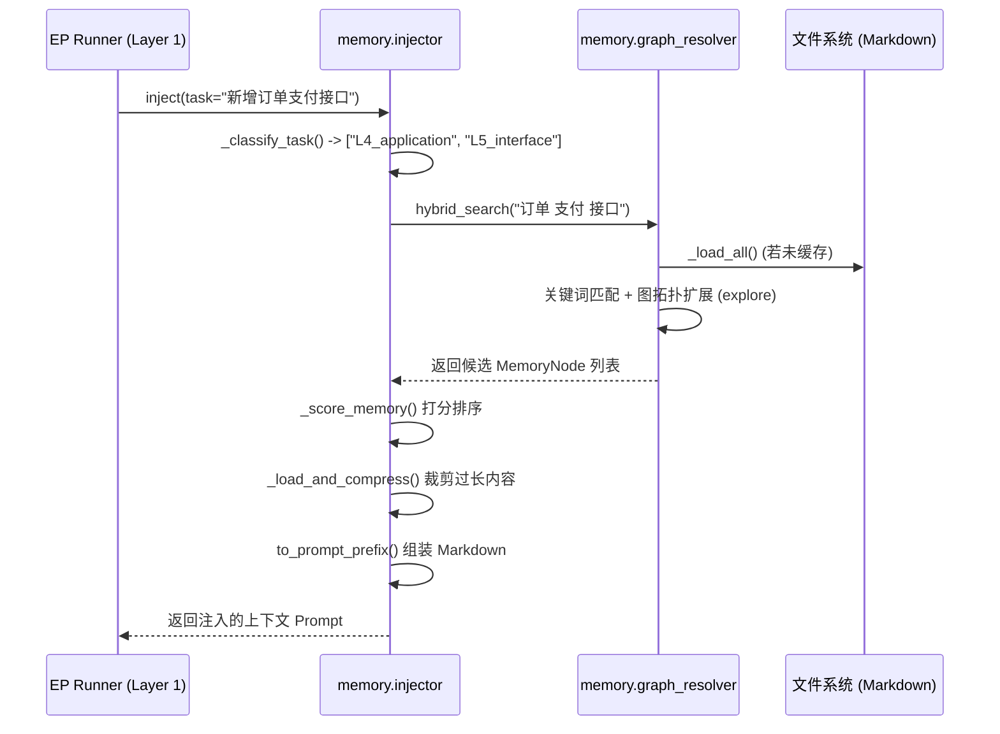
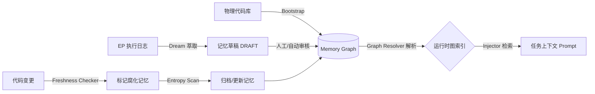

# MMS Memory 模块 (src/mms/memory)

## 1. 模块定位

`src/mms/memory` 是 MMS 系统的**记忆管理与图谱计算引擎 (Memory Management & Graph Compute Engine)**。它是 Layer 2 的核心操作层，负责记忆节点的生命周期管理、图谱关系解析、上下文注入以及知识的自动演化。

## 2. 核心代码文件与核心方法

### `graph_resolver.py`

将散落的 Markdown 文件解析为内存中的图结构。

- `**_parse_frontmatter(text)`**: 提取 Markdown 的 YAML 头部数据。
- `**_load_all()**`: 遍历 `docs/memory/shared/`，加载所有记忆节点建立索引。
- `**explore(start_id, depth)**`: 基于图关系的 BFS 遍历，寻找相关节点。
- `**hybrid_search(task_desc)**`: 结合关键词和图拓扑的混合检索。

### `injector.py`

负责在 EP 执行前，精准组装 Prompt 上下文。

- `**_classify_task(task)**`: 分析任务意图，确定需要检索的知识层级。
- `**_retrieve_memories(task)**`: 调用 `graph_resolver` 获取候选记忆。
- `**_score_memory(node, task)**`: 对候选记忆进行打分排序。
- `**inject(task)**`: 主入口，返回组装好的 Markdown 格式的上下文 Prompt。

### `dream.py`

自动知识萃取引擎（后台异步运行）。

- `**extract_from_ep(ep_id)**`: 从执行完毕的 EP 文件中提取 `Surprises` 和 `Decision Log`。
- `**generate_draft(knowledge_snippets)**`: 调用 LLM，将零散的知识片段总结为结构化的记忆草稿 (`DRAFT-*.md`)。

### `entropy_scan.py` & `freshness_checker.py`

记忆的垃圾回收与一致性检查。

- `**scan_stale_nodes()**`: 找出长时间未被访问或其引用的代码文件已发生变更的“腐化”记忆。

## 3. 业务流程图

### 3.1 上下文注入流程 (Context Injection)

### 3.2 知识图谱数据流图 (Data Flow)

