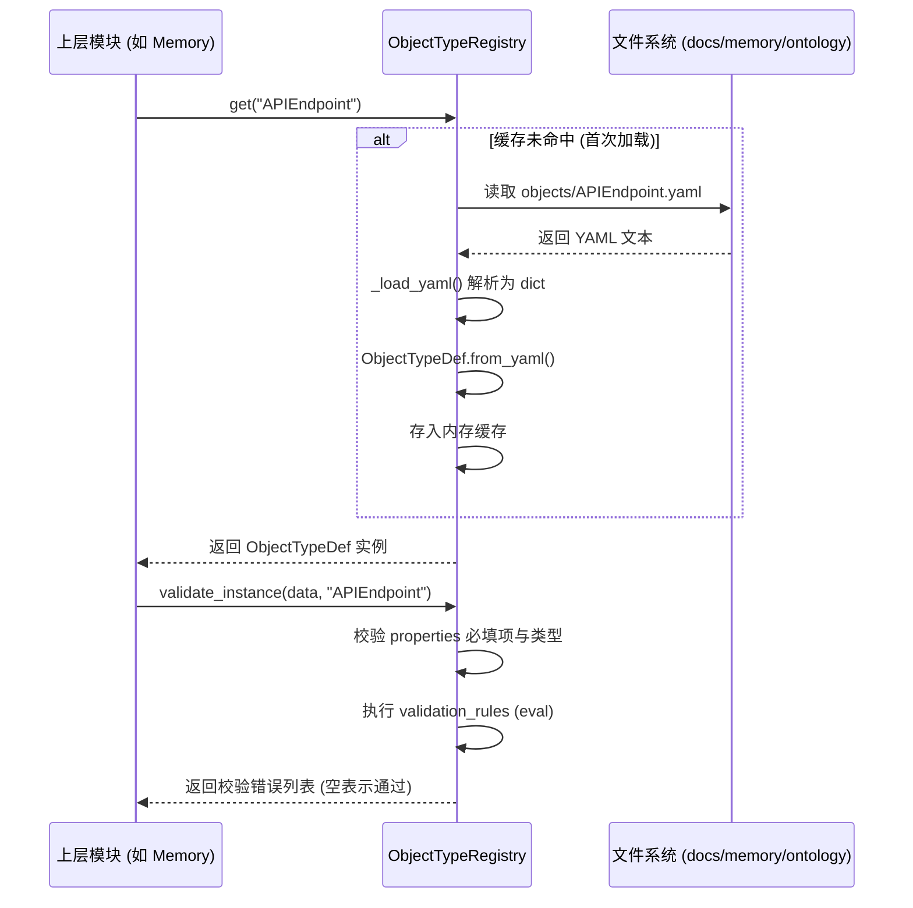

# MMS Ontology 模块 (src/mms/ontology)

## 1. 模块定位

`src/mms/ontology` 是 MMS 系统的**本体运行时引擎 (Ontology Runtime Engine)**。它负责将静态的、声明式的 YAML 本体定义（位于 `docs/memory/ontology/`）加载为 Python 内存对象，并提供统一的查询、校验和执行接口。

## 2. 核心代码文件与核心方法

### `registry.py`

这是本模块的核心实现文件，负责加载 YAML 并映射为 Python 数据类。

**核心类与数据结构**：

- `ObjectTypeDef`: 映射 YAML 中的 ObjectType 定义，包含 `properties`、`related_link_types` 等。
- `PropertyDef`: 定义属性的类型、是否必填、枚举值等约束。
- `ValidationRule`: 映射 YAML 中的 `validation_rules`，包含基于 Python 表达式的校验逻辑。

**核心方法**：

- `_load_yaml(path: Path) -> dict`: 底层 I/O 方法，安全加载 YAML 文件。
- `ObjectTypeDef.from_yaml(cls, data: dict) -> ObjectTypeDef`: 将 YAML 字典反序列化为强类型的 Python 对象。
- `ObjectTypeRegistry.get(type_id: str) -> ObjectTypeDef`: 懒加载并返回指定的 ObjectType 定义。
- `ObjectTypeRegistry.validate_instance(instance: dict, type_id: str) -> List[str]`: 根据 Schema 校验一个具体的实例数据是否合法。

## 3. 业务流程图

### 3.1 Schema 加载与校验流程 (Mermaid)

## 4. 设计哲学

- **零硬编码 (Zero Hardcoding)**：Python 代码中不硬编码任何具体的业务实体（如 `Order`, `User`），一切由 YAML 驱动。
- **懒加载 (Lazy Loading)**：在首次被调用时才进行磁盘 I/O 读取 YAML 文件，避免影响 CLI 启动速度。

