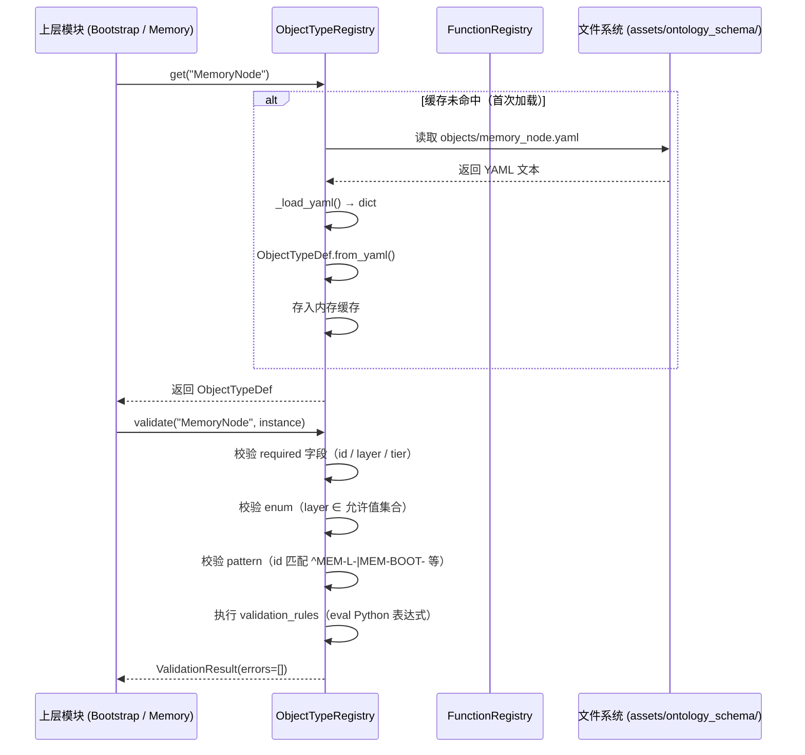
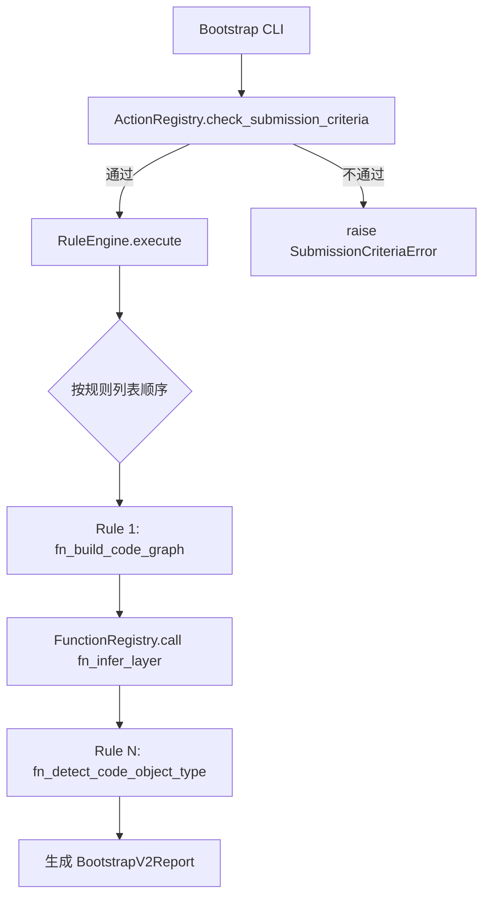

# MMS Ontology 模块 (src/mms/ontology)

> **最后更新**：2026-05-05 | Ontology Engine v3.0

## 1. 模块定位

`src/mms/ontology` 是 MMS 系统的**本体运行时引擎（Ontology Runtime Engine）**。它将位于 `assets/ontology_schema/` 的静态 YAML 本体定义加载为 Python 内存对象，并提供统一的查询、校验和执行接口。

**核心设计哲学**：

- **零硬编码（Zero Hardcoding）**：Python 代码中不硬编码任何具体的业务实体（如 `Order`, `User`），一切由 YAML 驱动。
- **懒加载（Lazy Loading）**：在首次被调用时才进行磁盘 I/O，不影响 CLI 启动速度。
- **单一职责**：`registry.py` 只做 Schema 加载与校验，不涉及记忆图谱的读写操作。

---

## 2. 资产目录结构（assets/ontology_schema/）

```text
assets/ontology_schema/
├── memory_schema.yaml          记忆节点 front-matter 规范（v4.0），通用 JSON Schema
├── ontology_schema_readme.md   Schema 设计文档
│
├── objects/                    ObjectType 定义（8 种）
│   ├── memory_node.yaml        记忆节点（id 前缀规范 / layer enum / tier enum）
│   ├── arch_decision.yaml      架构决策（ADR）
│   ├── code_class.yaml         代码类（AST 骨架中的 Class）
│   ├── code_file.yaml          代码文件
│   ├── code_module.yaml        代码模块
│   ├── domain_concept.yaml     领域概念（keywords / related_to 图节点）
│   ├── lesson.yaml             教训（ep_id / outcome / root_cause）
│   └── pattern.yaml            可复用模式（example_code / reusable）
│
├── links/                      LinkType 定义（8 种）
│   ├── about.yaml              关联领域概念
│   ├── cites.yaml              引用代码文件
│   ├── contains.yaml           包含关系
│   ├── contradicts.yaml        矛盾关系（触发矛盾检测）
│   ├── depends_on.yaml         依赖关系
│   ├── derived_from.yaml       派生关系
│   ├── impacts.yaml            影响关系（变更传播）
│   └── implements.yaml         实现关系
│
├── functions/                  Function 定义（9 种）
│   ├── fn_infer_layer.yaml     推断代码的架构层级
│   ├── fn_detect_code_object_type.yaml 推断代码对象类型
│   ├── fn_build_code_graph.yaml 构建代码依赖图
│   ├── fn_classify_intent.yaml  任务意图分类
│   ├── fn_detect_drift.yaml    检测记忆新鲜度漂移
│   ├── fn_extract_tags.yaml    提取关键词 tag
│   ├── fn_find_contradictions.yaml 发现矛盾记忆对
│   ├── fn_rank_memories.yaml   记忆质量排序
│   └── fn_resolve_paths.yaml   解析层 → 文件路径
│
├── actions/                    Action 定义（5 种）
│   ├── bootstrap.yaml          action_bootstrap（冷启动）
│   ├── distill.yaml            action_distill（EP 知识蒸馏）
│   ├── dream.yaml              action_dream（autoDream 知识萃取）
│   ├── promote_draft.yaml      action_promote_draft（草稿提升）
│   └── retire_memory.yaml      action_retire_memory（记忆归档）
│
└── _config/
    └── traversal_paths.yaml    图遍历路径配置（concept_lookup / code_change_impact 等）
```

---

## 3. 核心代码文件：`registry.py`

这是本模块唯一的实现文件，包含 7 个核心类。

### 数据结构

```python
@dataclass
class PropertyDef:
    name: str
    type: str                     # string / integer / float / boolean / list
    required: bool
    description: str
    enum: Optional[List]          # 枚举约束
    pattern: Optional[str]        # 正则约束
    default: Optional[Any]

@dataclass
class ValidationRule:
    name: str
    condition: str                # Python 表达式（eval 执行）
    message: str
    severity: str                 # error / warning
    skip_if: Optional[str]        # 跳过条件表达式

@dataclass
class ObjectTypeDef:
    id: str
    label: str
    description: str
    properties: List[PropertyDef]
    validation_rules: List[ValidationRule]
    related_link_types: List[str]

@dataclass
class FunctionDef:
    id: str
    label: str
    description: str
    input_schema: dict
    output_schema: dict
    signal_rules: Optional[dict]  # 信号规则（YAML 驱动的推断规则）

@dataclass
class ActionDef:
    id: str
    label: str
    description: str
    parameters: List[ActionParameterDef]
    submission_criteria: List[SubmissionCriterion]
    rules: List[ActionRule]       # 按顺序执行的规则列表
```

### 核心类与方法

**`ObjectTypeRegistry`**

| 方法 | 说明 |
|------|------|
| `get(type_id)` | 懒加载并返回 `ObjectTypeDef`（首次读取 YAML 后缓存） |
| `all_ids()` | 返回所有已注册的 ObjectType ID 列表 |
| `validate(type_id, instance)` | 校验实例数据：检查必填项、枚举约束、正则约束，执行 `validation_rules`，返回 `ValidationResult` |

**`FunctionRegistry`**

| 方法 | 说明 |
|------|------|
| `get(fn_id)` | 懒加载并返回 `FunctionDef` |
| `register_implementation(fn_id, py_fn)` | 将 Python 函数注册为某 Function 的实现 |
| `call(fn_id, **kwargs)` | 统一调用接口（校验入参 → 执行 → 校验出参） |
| `all_ids()` | 返回所有已注册的 Function ID 列表 |

**`ActionRegistry`**

| 方法 | 说明 |
|------|------|
| `get(action_id)` | 懒加载并返回 `ActionDef` |
| `check_submission_criteria(action_id, context)` | 检查 Action 的前置条件是否满足（eval 执行） |
| `all_ids()` | 返回所有已注册的 Action ID 列表 |

**`RuleEngine`**

| 方法 | 说明 |
|------|------|
| `execute(action_id, context)` | 按 `ActionDef.rules` 顺序执行：`skip_if` 判断 → `function_rule` 调用 → `validation` 校验 |

**`OntologyRegistry`**（统一入口）

| 方法 | 说明 |
|------|------|
| `validate_completeness()` | 启动时校验所有 ObjectType / Function / Action 中的跨引用（link_types / fn_id 等）是否可解析 |
| `summary()` | 打印已加载的 ObjectType / Function / Action 数量 |

**全局工厂函数**：

```python
registry = get_ontology_registry()  # 返回单例，懒加载所有子注册表
```

---

## 4. 业务流程图

### 4.1 Schema 加载与校验流程



### 4.2 Action 执行流程（以 action_bootstrap 为例）



---

## 5. ObjectType 全景（8 种）

| ObjectType | ID 前缀 | 典型 tier | 核心字段 |
|------------|---------|----------|---------|
| `MemoryNode` | `MEM-L-` / `MEM-BOOT-` / `AD-` / `BIZ-` | hot/warm | `layer`, `tier`, `tags`, `ast_pointer` |
| `ArchDecision` | `AD-` | hot | `status`, `alternatives`, `consequences` |
| `Lesson` | `LES-` | warm | `ep_id`, `outcome`, `root_cause` |
| `Pattern` | `PAT-` | hot | `reusable`, `example_code` |
| `CodeFile` | — | — | `file_path`, `lang`, `fingerprint`, `inferred_layer` |
| `CodeClass` | — | — | `class_fqn`, `bases`, `annotations`, `methods` |
| `CodeModule` | — | — | `module_path`, `lang`, `file_count` |
| `DomainConcept` | — | — | `concept_id`, `keywords`, `related_to` |

---

## 6. 测试覆盖率（2026-05-05）

`registry.py` 当前覆盖率：**83%**

**相关测试文件**：

| 测试文件 | 覆盖内容 | 用例数 |
|----------|----------|--------|
| `test_ontology_registry.py` | ObjectTypeRegistry / FunctionRegistry / ActionRegistry / RuleEngine / OntologyRegistry 全面单测 | 41 |
| `test_bootstrap_populator.py` | Action `action_bootstrap` 端到端执行（通过 ActionRegistry 路由） | — |

**覆盖缺口（17%）**：

- `RuleEngine` 复杂嵌套规则链（多个 `function_rule` + `validation` 混合场景）
- `FunctionRegistry.call` 出参校验路径
- `OntologyRegistry.validate_completeness()` 的边缘异常处理（引用缺失时的错误报告）
