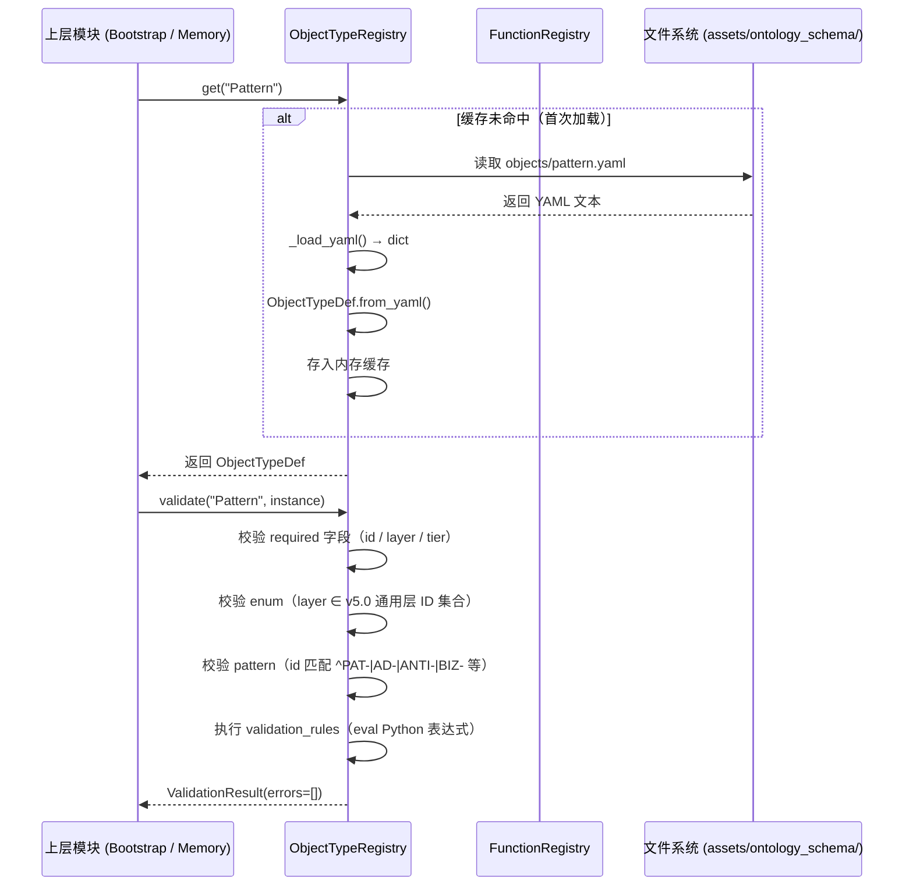
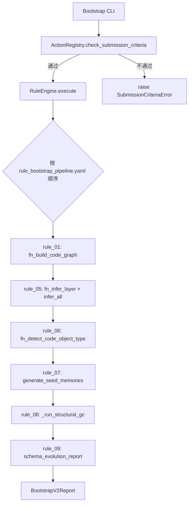

# MMS Ontology 模块 (src/mms/ontology)

> **最后更新**：2026-05-06 | Ontology Engine v3.1（Schema v5.0）

## 1. 模块定位

`src/mms/ontology` 是 MMS 系统的**本体运行时引擎（Ontology Runtime Engine）**。它将位于 `assets/ontology_schema/` 的静态 YAML 本体定义加载为 Python 内存对象，并提供统一的查询、校验和执行接口。

**核心设计哲学**：

- **零硬编码（Zero Hardcoding）**：Python 代码中不硬编码任何具体的业务实体，一切由 YAML 驱动。
- **懒加载（Lazy Loading）**：在首次被调用时才进行磁盘 I/O，不影响 CLI 启动速度。
- **单一职责**：`registry.py` 只做 Schema 加载与校验，不涉及记忆图谱的读写操作。
- **通用 Schema（P3 原则）**：Schema 定义跨项目通用，项目特化配置通过 `.mms/bootstrap_config.yaml` 注入。

---

## 2. 资产目录结构（assets/ontology_schema/）

```text
assets/ontology_schema/
├── memory_schema.yaml          记忆节点 front-matter 规范（兼容 v4.0/v5.0）
├── ontology_schema_readme.md   Schema 设计文档
│
├── objects/                    ObjectType 定义（10 种，v5.0）
│   ├── _memory_base.yaml       ★ 共享基础 Schema（模拟 Palantir Interface，v5.0 新增）
│   ├── pattern.yaml            ★ 可复用架构模式（前缀: PAT-*）
│   ├── decision.yaml           ★ 架构决策 ADR（前缀: AD-*）
│   ├── anti_pattern.yaml       ★ 反模式警告（前缀: ANTI-*）
│   ├── business_flow.yaml      ★ 跨层业务流程（前缀: BIZ-*）
│   ├── memory_node.yaml        通用记忆节点（向后兼容，id 前缀规范 / layer enum）
│   ├── arch_decision.yaml      旧版架构决策（向后兼容）
│   ├── code_class.yaml         代码类（AST 骨架中的 Class）
│   ├── code_file.yaml          代码文件
│   ├── code_module.yaml        代码模块
│   └── domain_concept.yaml     领域概念（keywords / related_to 图节点）
│
├── links/                      LinkType 定义（9 种）
│   ├── about.yaml              关联领域概念
│   ├── cites.yaml              引用代码文件
│   ├── contains.yaml           包含关系
│   ├── contradicts.yaml        矛盾关系（触发矛盾检测）
│   ├── depends_on.yaml         依赖关系
│   ├── derived_from.yaml       派生关系
│   ├── impacts.yaml            影响关系（变更传播）
│   ├── implements.yaml         实现关系
│   └── related_to.yaml         语义关联
│
├── functions/                  Function 定义（9 种）
│   ├── fn_infer_layer.yaml     推断代码的架构层级
│   ├── fn_detect_code_object_type.yaml 推断代码对象类型
│   ├── fn_build_code_graph.yaml 构建代码依赖图
│   ├── fn_classify_intent.yaml  任务意图分类
│   ├── fn_detect_drift.yaml    检测记忆新鲜度漂移
│   ├── fn_extract_tags.yaml    提取关键词 tag
│   ├── fn_find_contradictions.yaml 发现矛盾记忆对
│   ├── fn_rank_memories.yaml   记忆质量排序
│   └── fn_resolve_paths.yaml   解析层 → 文件路径
│
├── actions/                    Action 定义（5 种）
│   ├── bootstrap.yaml          action_bootstrap（冷启动）
│   ├── distill.yaml            action_distill（EP 知识蒸馏）
│   ├── dream.yaml              action_dream（autoDream 知识萃取）
│   ├── promote_draft.yaml      action_promote_draft（草稿提升）
│   └── retire_memory.yaml      action_retire_memory（记忆归档）
│
├── rules/                      ★ 独立 Rule 定义（v5.0 新增）
│   ├── rule_bootstrap_pipeline.yaml      Bootstrap 9 条执行规则（含 Structural GC）
│   ├── rule_memory_quality.yaml          记忆质量 7 条治理规则
│   └── rule_post_apply_incremental.yaml  增量后置 7 条规则（action_apply 完成后）
│
└── _config/                    ★ 约束与配置（v5.0 新增）
    ├── universal_layers.yaml          9 个通用层 ID 定义（替代 _SCHEMA_LAYER_MAP）
    ├── ontology_design_principles.yaml 5 条本体设计原则（CI 强制执行）
    ├── inference_rules.yaml           Evaluation DAG 规则（Short-circuit + Conflict Detection）
    └── traversal_paths.yaml           图遍历路径配置
```

---

## 3. 核心代码文件：`registry.py`

这是本模块唯一的实现文件，包含 7 个核心类。

### 数据结构

```python
@dataclass
class PropertyDef:
    name: str
    type: str                     # string / integer / float / boolean / list
    required: bool
    description: str
    enum: Optional[List]          # 枚举约束
    pattern: Optional[str]        # 正则约束
    default: Optional[Any]

@dataclass
class ValidationRule:
    name: str
    condition: str                # Python 表达式（eval 执行）
    message: str
    severity: str                 # error / warning
    skip_if: Optional[str]        # 跳过条件表达式

@dataclass
class ObjectTypeDef:
    id: str
    label: str
    description: str
    properties: List[PropertyDef]
    validation_rules: List[ValidationRule]
    related_link_types: List[str]

@dataclass
class FunctionDef:
    id: str
    label: str
    description: str
    input_schema: dict
    output_schema: dict
    signal_rules: Optional[dict]  # 信号规则（YAML 驱动的推断规则）

@dataclass
class ActionDef:
    id: str
    label: str
    description: str
    parameters: List[ActionParameterDef]
    submission_criteria: List[SubmissionCriterion]
    rules: List[ActionRule]       # 按顺序执行的规则列表
```

### 核心类与方法

**`ObjectTypeRegistry`**

| 方法 | 说明 |
|------|------|
| `get(type_id)` | 懒加载并返回 `ObjectTypeDef`（首次读取 YAML 后缓存） |
| `all_ids()` | 返回所有已注册的 ObjectType ID 列表 |
| `validate(type_id, instance)` | 校验实例数据：必填项、枚举约束、正则约束、`validation_rules`，返回 `ValidationResult` |

**`FunctionRegistry`**

| 方法 | 说明 |
|------|------|
| `get(fn_id)` | 懒加载并返回 `FunctionDef` |
| `register_implementation(fn_id, py_fn)` | 将 Python 函数注册为某 Function 的实现 |
| `call(fn_id, **kwargs)` | 统一调用接口（校验入参 → 执行 → 校验出参） |
| `all_ids()` | 返回所有已注册的 Function ID 列表 |

**`ActionRegistry`**

| 方法 | 说明 |
|------|------|
| `get(action_id)` | 懒加载并返回 `ActionDef` |
| `check_submission_criteria(action_id, context)` | 检查 Action 的前置条件是否满足 |
| `all_ids()` | 返回所有已注册的 Action ID 列表 |

**`RuleEngine`**

| 方法 | 说明 |
|------|------|
| `execute(action_id, context)` | 按 `ActionDef.rules` 顺序执行：`skip_if` → `function_rule` → `validation` |

**`OntologyRegistry`**（统一入口）

| 方法 | 说明 |
|------|------|
| `validate_completeness()` | 启动时校验所有跨引用（link_types / fn_id）是否可解析 |
| `summary()` | 打印已加载的 ObjectType / Function / Action 数量 |

**全局工厂函数**：

```python
registry = get_ontology_registry()  # 返回单例，懒加载所有子注册表
```

---

## 4. 业务流程图

### 4.1 Schema 加载与校验流程



### 4.2 Action 执行流程（以 action_bootstrap 为例）



---

## 5. ObjectType 全景（v5.0，10 种）

### 5.1 v5.0 新增 ObjectType（共享 _memory_base.yaml）

| ObjectType | ID 前缀 | 典型 tier | 核心字段 | 语义 |
|------------|---------|----------|---------|------|
| `Pattern` | `PAT-*` | hot | `pattern_category`, `applicability`, `code_example`, `anti_pattern_risk` | 正向可复用架构模式 |
| `Decision` | `AD-*` | hot | `status`(proposed/accepted/deprecated), `context`, `decision`, `consequences`, `alternatives` | 架构决策 ADR |
| `AntiPattern` | `ANTI-*` | warm | `symptoms`, `causes`, `consequences`, `refactoring_path` | 反模式警告 |
| `BusinessFlow` | `BIZ-*` | warm | `steps_summary`, `involves_layers`, `actors` | 跨层业务流程 |

### 5.2 向后兼容 ObjectType

| ObjectType | ID 前缀 | 典型 tier | 核心字段 |
|------------|---------|----------|---------|
| `MemoryNode` | `MEM-L-` / `MEM-BOOT-` | hot/warm | `type`(pattern/decision/anti-pattern/business-flow), `layer`, `tier`, `tags`, `ast_pointer` |
| `ArchDecision` | `AD-` | hot | `decision_context`, `rationale`, `decision_status`, `alternatives_considered` |

### 5.3 代码结构 ObjectType

| ObjectType | 核心字段 |
|------------|---------|
| `CodeFile` | `file_path`, `lang`, `fingerprint`, `inferred_layer`, `layer_confidence`, `drift_suspected` |
| `CodeClass` | `class_fqn`, `bases`, `annotations`, `methods`, `signal_breakdown`, `linked_memory_id` |
| `CodeModule` | `module_path`, `lang`, `file_count`, `dominant_object_type` |
| `DomainConcept` | `concept_id`, `label`, `keywords`, `aliases`, `is_auto_generated` |

### 5.4 v5.0 通用层 ID 枚举

```yaml
# assets/ontology_schema/_config/universal_layers.yaml
layers:
  - id: ADAPTER      # 接口/适配层（REST / gRPC / MQ）
  - id: APP          # 应用服务层（用例编排 / CQRS）
  - id: DOMAIN       # 领域层（实体 / 聚合根 / 业务规则）
  - id: PLATFORM     # 平台基础设施层（DB / Cache / 配置）
  - id: CC           # 横切关注点（架构 ADR / 工具）
  - id: CC_testing   # 测试横切
  - id: CC_governance # 治理横切
  - id: BIZ          # 跨层业务流程文档
  - id: Ops          # 运维/部署层
```

---

## 6. 本体设计原则（v5.0，CI 强制执行）

定义于 `assets/ontology_schema/_config/ontology_design_principles.yaml`，由 `tests/test_ontology_principles.py` 在 CI 中检查所有 ObjectType 和 Action YAML 的合规性。

| ID | 原则 | 违反时的操作 |
|----|------|------------|
| `P1_density_over_completeness` | 空值率 > 30% 的字段必须重构或移除 | CI 告警 |
| `P2_typed_relations_over_text` | 使用 LinkType 代替自由文本描述关系 | 设计审查 |
| `P3_universal_schema_per_project_config` | 通用 Schema 与项目配置严格分离 | CI 拒绝 |
| `P4_focused_object_types` | 每个 ObjectType 代表单一实体（禁止 type 字段切换语义） | 设计审查 |
| `P5_schema_evolvable_with_migration` | Schema 变更必须附迁移脚本（幂等） | CI 拒绝 |

---

## 7. 测试覆盖率（2026-05-06）

`registry.py` 当前覆盖率：**~83%**

**相关测试文件**：

| 测试文件 | 覆盖内容 | 用例数 |
|----------|----------|--------|
| `test_ontology_registry.py` | ObjectTypeRegistry / FunctionRegistry / ActionRegistry / RuleEngine / OntologyRegistry 全面单测 | 41 |
| `test_ontology_principles.py` | ★ 5 条本体设计原则 CI 合规检查（ObjectType/Action YAML 校验） | — |
| `test_bootstrap_populator.py` | Action `action_bootstrap` 端到端执行 | — |

**覆盖缺口（~17%）**：

- `RuleEngine` 复杂嵌套规则链（多个 `function_rule` + `validation` 混合场景）
- `FunctionRegistry.call` 出参校验路径
- `OntologyRegistry.validate_completeness()` 的边缘异常处理
