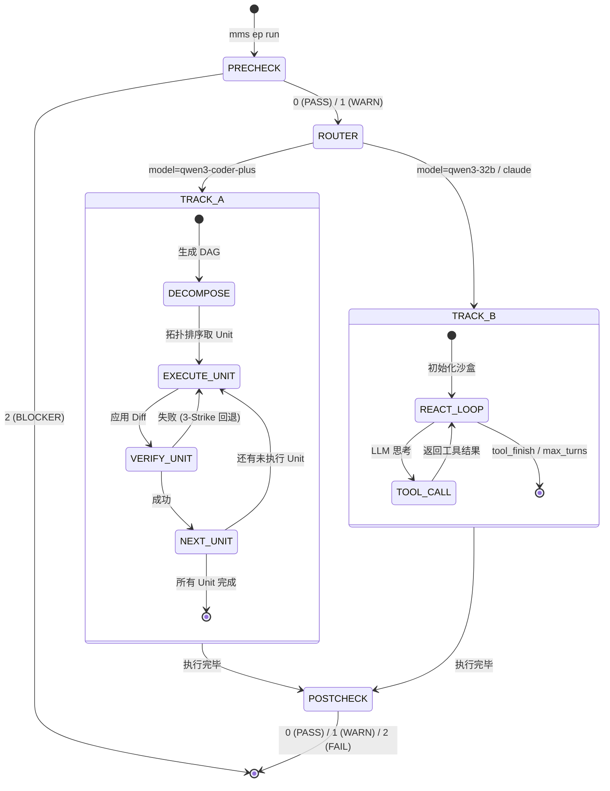

# 任务工程层 (Task Engineering Layer)

## 1. 架构定位

任务工程层位于木兰 (Mulan) AIOS 架构的 **Layer 1**。它是整个 AI 编码工具链的大脑和中枢神经，负责将自然语言描述的、模糊的业务需求，转化为机器可执行的、确定性的原子操作序列，并最终驱动底层大模型完成代码变更。

本层**不直接**与大模型交互生成代码，也**不直接**解析代码 AST。它通过调用 **Layer 2 (知识本体层)** 获取架构上下文，调用 **Layer 3 (代码生成层)** 执行具体的编码任务，并依赖 **Layer 4 (安全验证层)** 进行质量门控。

## 2. 核心概念

- **EP (Execution Plan, 执行计划)**：
  - 任务的最高层级抽象。一个 EP 对应一个完整的用户需求（如“新增批量导出 API”）。
  - EP 以 Markdown 格式存储在 `docs/execution_plans/` 中，包含任务描述、架构约束、验收标准等。
- **DAG (Directed Acyclic Graph, 有向无环图)**：
  - EP 被分解后的数据结构。将复杂的 EP 拆解为具有依赖关系的多个子任务节点。
- **AIU (Atomic Intent Unit, 原子意图单元)**：
  - DAG 中的最小执行节点。它是高度结构化的、不可再分的编码动作（如 `SCHEMA_ADD_FIELD`, `ENDPOINT_ADD`）。
  - 木兰预定义了 9 族 43 种 AIU 类型，每种类型都有严格的输入输出 Schema 和验证规则。

## 3. 双轨执行引擎 (Capability Router)

为了兼顾执行效率与大模型能力的差异，任务工程层设计了“双轨执行”架构，由 `ep_runner.py` 中的 Capability Router 动态路由：

- **Track A: UnitRunner 串行流水线 (Pipeline Mode)**
  - **适用场景**：能力较弱但速度快、成本低的小模型（如 `qwen3-coder-plus`）。
  - **机制**：高度确定性的流水线。`task_decomposer` 将 EP 拆解为严格的 DAG，`unit_runner` 按照拓扑排序逐个执行 AIU。每个 AIU 执行前组装极度压缩的上下文，执行后进行严格的独立验证（3-Strike 回退机制）。
  - **特点**：低智商模型的高可靠性保障。
- **Track B: Autonomous ReAct 循环 (Autonomous Mode)**
  - **适用场景**：具备强大推理和 Tool-Calling 能力的顶级大模型（如 `claude-opus-4`, `qwen3-32b`）。
  - **机制**：大模型自治。系统仅提供顶层 EP 描述和一组标准化工具（`ToolRegistry`），大模型在沙盒中自主决定调用哪些工具（如查本体、看 AST、跑测试），直到任务完成 (`tool_finish`)。
  - **特点**：高智商模型的高自由度探索，受限于 `max_turns` 和 `token_budget` 安全边界。

## 4. 核心文件与方法签名

### `src/mms/workflow/` (生命周期编排)

#### 1. `synthesizer.py` (意图合成器)

将用户的一句话需求，结合模板，扩充为结构化的 EP Markdown 文件。

- `def synthesize_intent(user_input: str, template: str = "default") -> str`

#### 2. `ep_parser.py` (EP 解析器)

将 EP Markdown 文件解析为内存中的数据结构。

- `def parse_ep_file(ep_path: Path) -> EpDocument`
- `def extract_scope_and_testing(ep_doc: EpDocument) -> Tuple[List[str], List[str]]`

#### 3. `precheck.py` (前置基线检查)

在生成代码前，快照当前 AST，并进行初步的架构合规性检查。

- `def run_precheck(ep_id: str, strict: bool = False) -> int`
- `def run_arch_check_baseline(scope_files: List[str]) -> Dict`
- `def save_checkpoint(ep_id: str, data: Dict) -> Path`

#### 4. `ep_runner.py` (核心引擎)

全自动 Pipeline 编排，包含 Capability Router，负责触发 precheck、路由到 Track A/B、以及触发 postcheck。

- `class EpRunPipeline:`
  - `def run(self, ep_id: str, dry_run: bool = False, model: str = "capable", ...) -> EpRunResult`
  - `def _run_autonomous(self, ep_id: str, ...) -> EpRunResult`
  - `def _run_pipeline(self, ep_id: str, ...) -> EpRunResult`

#### 5. `postcheck.py` (后置质量门)

在代码生成后，运行全局测试 (`pytest`)、架构约束 (`arch_check`) 和 DB 迁移门控 (`migration_gate`)。

- `def run_postcheck(ep_id: str, skip_tests: bool = False, ...) -> int`
- `def run_arch_check_post(baseline_violations: List[Dict]) -> Tuple[bool, int, List[Dict]]`

## 5. 状态机流转图 (Pipeline Mode)

## 6. 测试覆盖率基线 (2026-05-03)

当前任务工程层整体测试覆盖率已提升至 **65%**（包含多语言 E2E 测试和各模块独立集成测试）。

| 模块               | 覆盖率 | 备注                                         |
| ---------------- | --- | ------------------------------------------ |
| `ep_parser.py`   | 83% | 解析逻辑已通过 Java/Python/Go 虚拟 EP 样本验证。         |
| `ep_runner.py`   | 79% | 核心流转逻辑（Track A/B、断点续跑）已通过多语言测试覆盖。          |
| `precheck.py`    | 68% | 已通过多语言测试覆盖核心快照逻辑和异常（缺 EP/Scope）处理。         |
| `postcheck.py`   | 53% | 已覆盖多语言架构拦截、容错跳过、以及测试失败阻断逻辑。                |
| `synthesizer.py` | 48% | 已通过真实调用百炼 API，验证 Java/Python/Go 项目的意图识别能力。 |

## 7. 自动化执行理念

本层设计遵循**“确定性约束下的全自动执行”**原则。
从 `mulan ep run` 启动开始，系统将自动完成前置检查、路由、分解、生成、验证、后置检查的全流程，期间**不需要任何人工交互确认**。人工干预仅发生在任务结束后的代码 Review 阶段。